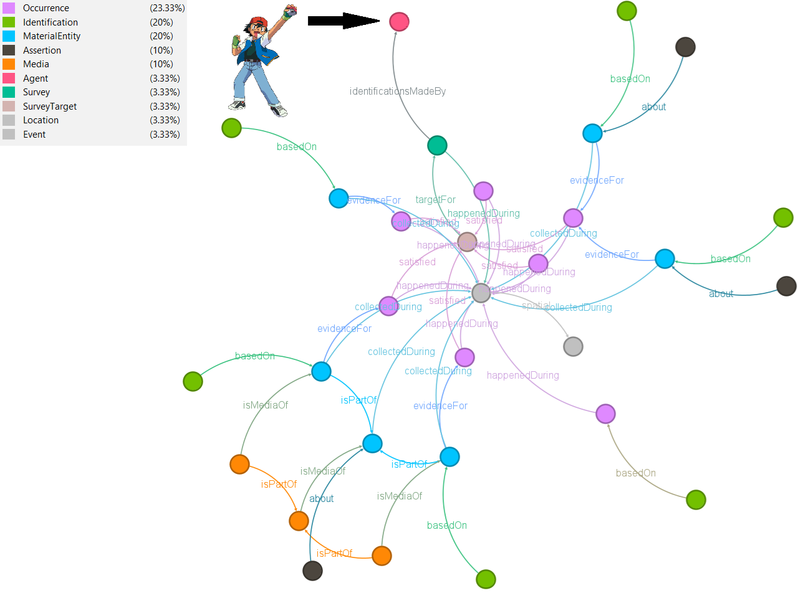
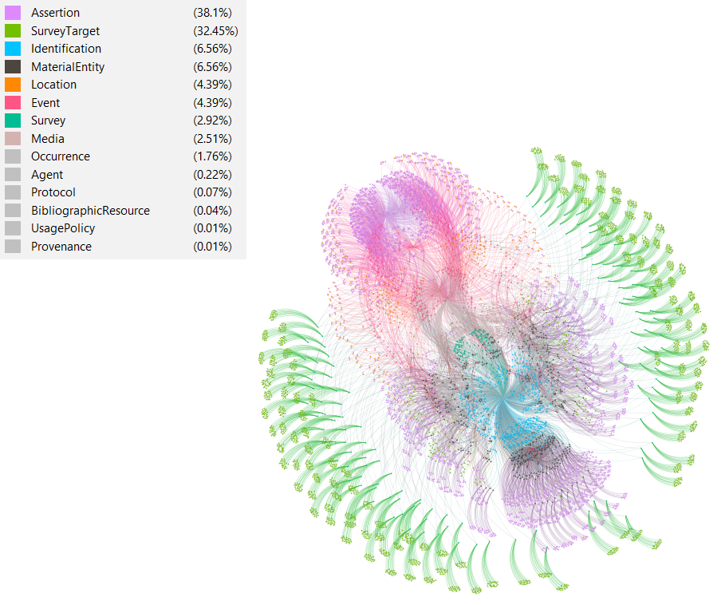
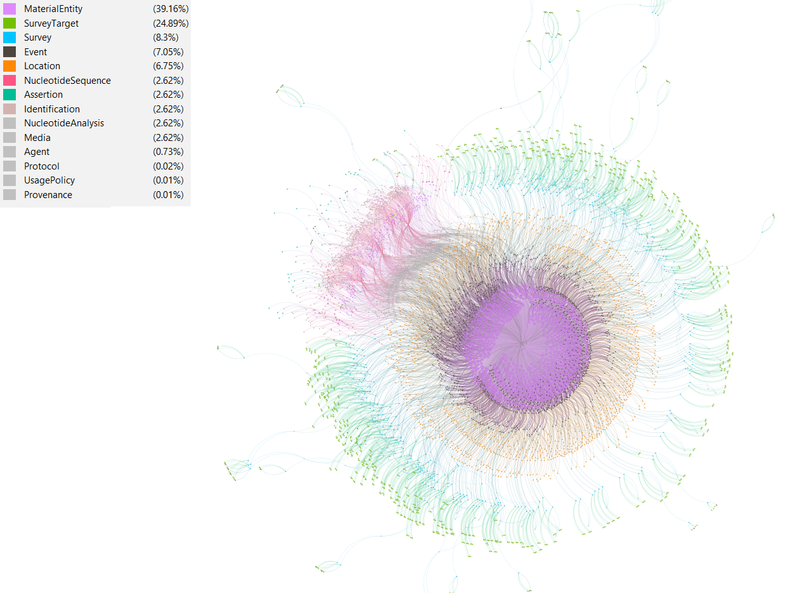
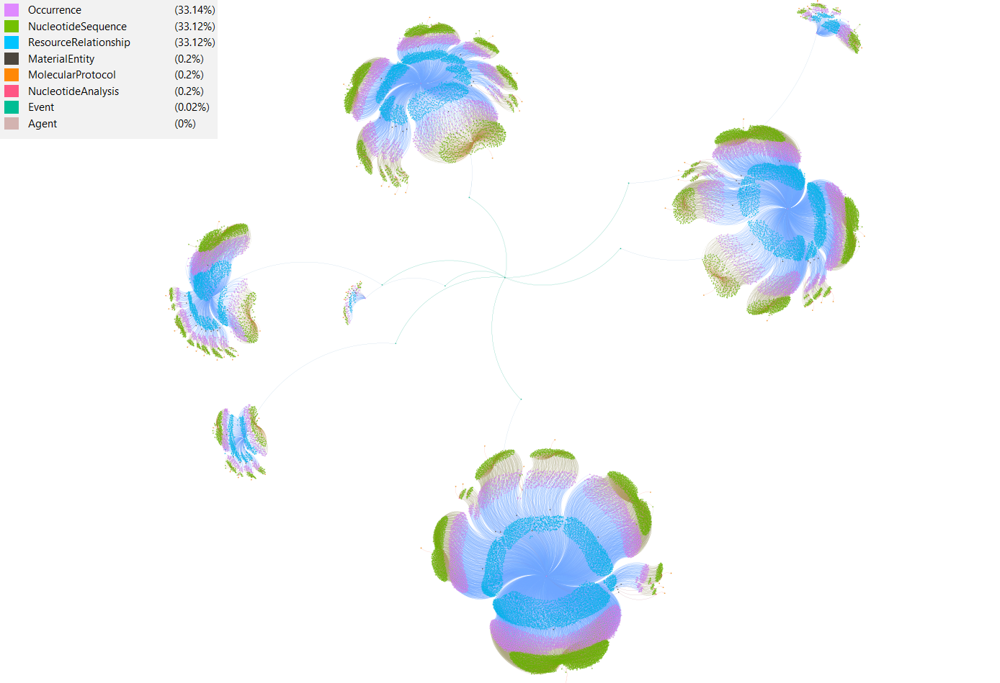
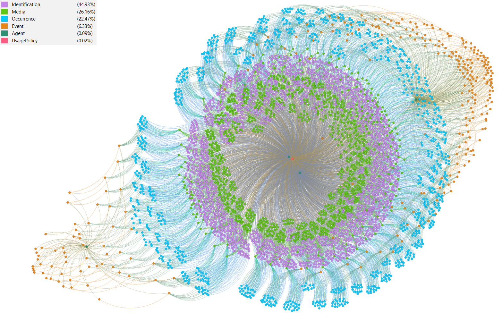
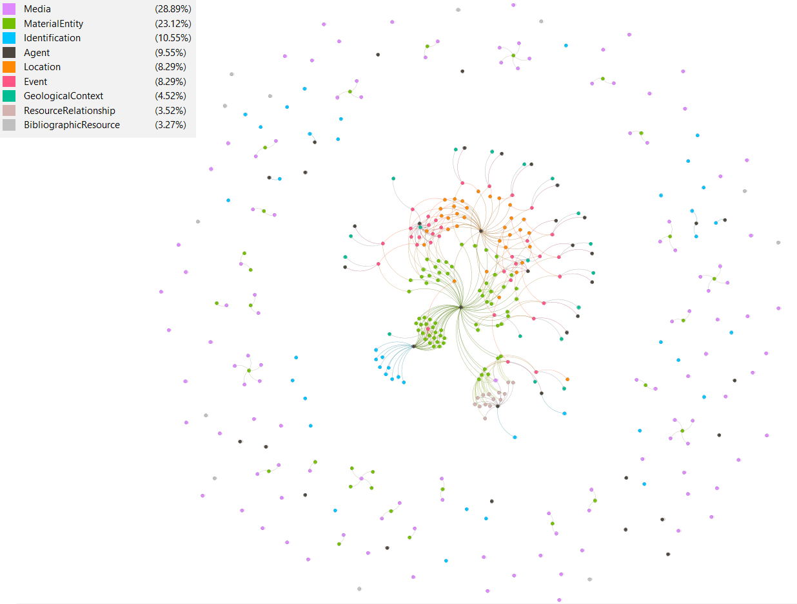
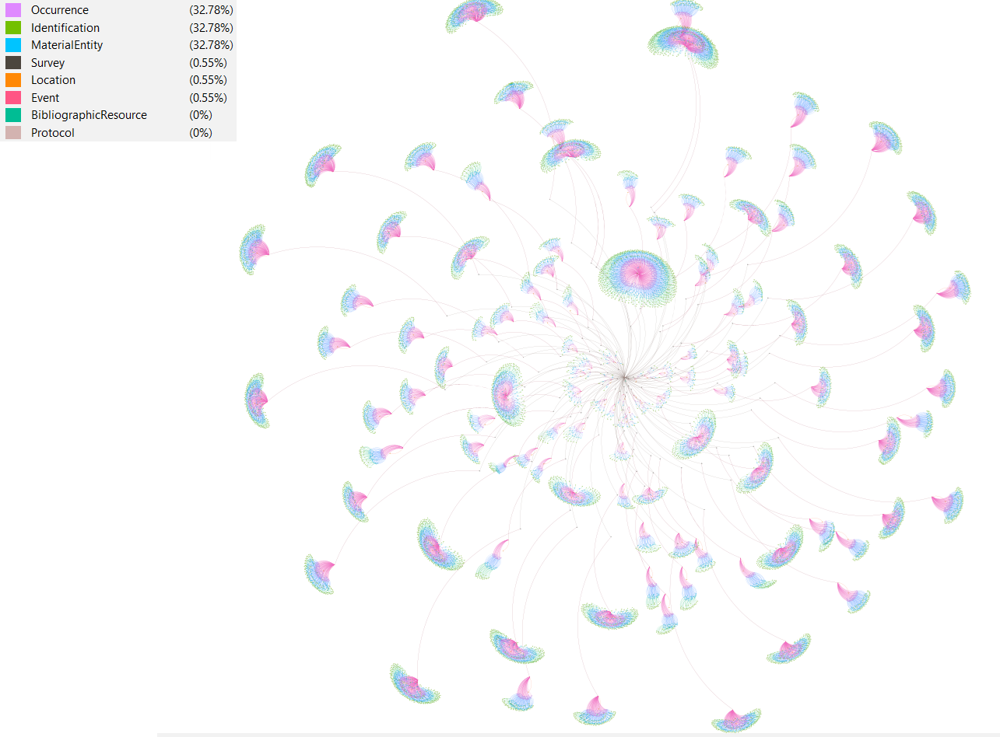
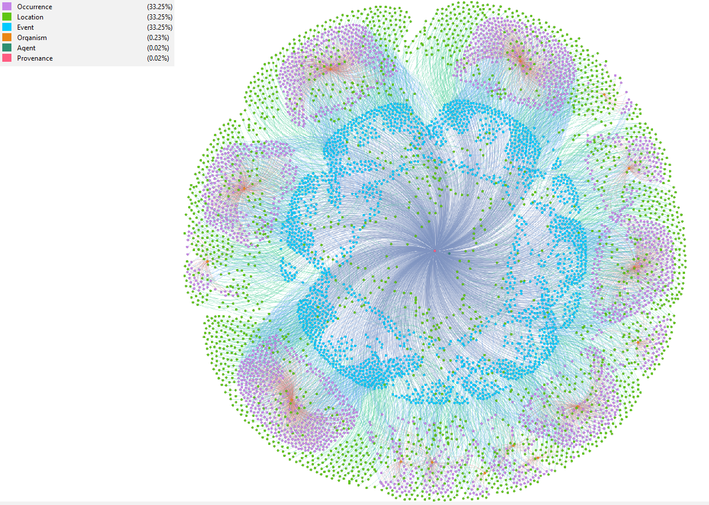
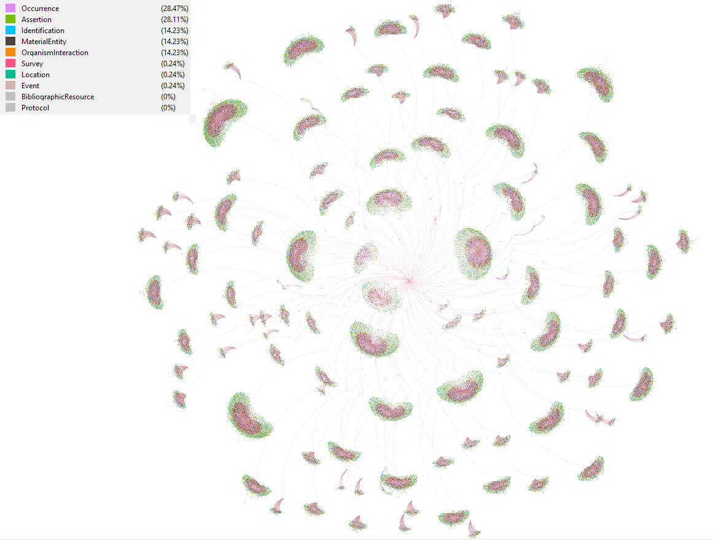

# DWC-OWL-RDF

An effort to use terms from [an ontology that is based on Darwin Core terms](https://github.com/aminem0/dwc-owl) in order to semantically describe biodiversity datasets.

Given that this project is developped in conjunction with the ontology, any modifications to the ontology will be reflected in these examples.

## Test datasets

- **Broke-West fish campaign**: the Darwin Core DataPackage was downloaded [from the test IPT](https://dwcdp-ipt.gbif-test.org/resource?r=broke-west-fish).
- **Crop flower visit**: A dataset of visits of insects to flowering plants in a Japanese orchard. The dataset, as a sampling event Darwin Core Archive was downloaded [from the GBIF website](https://www.gbif.org/dataset/bbaca86c-f703-41fc-800a-fa301c0661fd).
- **Insektmobilen**: The files were obtained from the Darwin Core DataPackage examples [GitHub repository](https://github.com/gbif/dwc-dp-examples/tree/master/survey/insektmobilen/output_data). The data were arranged so as to be csv files with utf-8 encoding as if they were in a DataPackage file. Also, some additional classes were considered, such as dwc:Agent and dwc:UsagePolicy.
- **Lanternfish gut metabarcoding**: A DNA metabarcoding analysis of lanternfish gut content. The dataset, as a Darwin Core Archive with a DNA derived extension was downloaded [from the marine CSIRO IPT website](https://www.marine.csiro.au/ipt/resource?r=in2019_v03_edna_nanopore).
- **Luna & Mothra AMI traps**: A dataset of AI identified moths from an autonomous moth or insect traps set up in Vermont. Identifications were performed using AI models trained to recognize lepidoptera species from images. The data were obtained by querying [the demo API of the Antenna webpage](https://demo.antenna.insectai.org/projects/3/summary).
- **NMNH paleobiology specimen**: The Darwin Core DataPackage was downloaded [from the test IPT](https://dwcdp-ipt.gbif-test.org/resource?r=paleo-test-a).
- **Turtle movement dataset**: A dataset of geographically tracked sea turtles. The dataset was downloaded in pieces (one .csv file per individual) from the Movebank [through the Tracking Data Map](https://www.movebank.org/cms/webapp/map).
- **Viridian forest survey**: The dataset consists of a forest survey for bug and flying Pokémon done by Ash Ketchum in Viridian forest. The Darwin Core DataPackage was obtained [from the test IPT](https://dwcdp-ipt.gbif-test.org/resource?r=viridian-forest-survey).

## Importance of the ontology

The Viridian forest survey is exceptionally good, because it is small enough to let us view the labelled edges.



As can be seen, the graph reads like a book, and tells exactly the story researchers want it to say. This is crucial, as if biodiversity data is to be shared and reused among fellow researchers, first and foremost it needs to be fully understood. The set of terms in Darwin Core and the recently proposed Darwin Core DataPackage allow for the articulation of how the data are meant to be understood. To that end, the ontology in DWC-OWL allows for complex linking and eventually querying of these entities, maximizing reuse potential.

## Real-world datasets

Whereas the Viridian forest survey dataset contained `251` triples, the Broke-West fish dataset contains `173 062` triples and considers more classes. Despite this, the same underlying logic can be applied to obtain a directional graph as well, which faithfully describes the dataset.



The Insektmobilen dataset produced an extremely high number of triples, due to its identification related to barcoding. Indeed, graphical representation of a subset produced `425 018` triples. The clusterings of `dwc:Identifications` correspond to successful BLAST query matches against the BOLD database. As identifications were based on dwc:NucleotideSequences, this clustering is logical and desired from a semantic point of view.



For the lanternfish dataset, the entire DNA-derived dataset table was remapped onto Darwin Core DataPackage terms and needed the newly-defined classes of `dwc:NucleotideAnalysis`, `dwc:NucleotideSequence` and `dwc:MolecularProtocol`. Graphical representation of the dataset showed  of a subset produced showed that the data group relating to each fish, which follows the sampling program.



For the AMI dataset, none of `dcterms:Agents` were human, being either instruments or AI models. However, they allowed separation of the data into well-defined groups. Indeed, graphical representation of a subset produced showed that all captures done by Luna were on the left and those by Mothra were on the right. Both AI models used for image recognition and identification are in the center of the graph.



The NMNH paleobiology dataset, when expressed as a (somewhat) direct RDF translation of the relational tables in the DataPackage, produced a disconnected graph. The main graph is evident, with around it several subgraphs or even single nodes. Note that this is not an issue for RDF, as these resources are still queryable. Nonetheless, some additional relating of data, such as relating `dwc:Identification` to the `dwc:MaterialEntity` on which they are based would connect the isolated subgraphs to the main graph.



The crop-flower-visit dataset, when expressed as a direct translation of the star-schema based Darwin Core Archive, produced isolated small islands of entities. In each case, there was a central `dwc:Event`, from which several `dwc:MaterialEntities` were collected and `dwc:Identifications` were done on these preserved individuals. Accordingly, these dwc:Identifications form the basis of evidence for the dwc:Occurrence of the taxa at said site. This is what gives rise to the flower-like pattern seen in the graph. To connect these islands of entities, and to do so in a meaningful manner, a dwc:Protocol instance was created and pointed to the original paper of the study.



In the case of the turtle-remote-sensing dataset, every `dwc:Event` is a signal from the radio transmitter. Each of these represent a geolocalized occurrence of a particular individual `dwc:Organism`, whose path can be followed across space and time. This type of data will become particularly important, especially when considering networks that accumulate, study and share this data, such as [Move BON](https://geobon.org/move-bon/).



## Value of revisiting datasets

The crop-flower-visit dataset was originally published as an sampling event dataset on GBIF, and was registered on September 1st 2023. As it is, the dataset has information not only on insect visitors, but also on several other entities, such as the plants they visited, `dwc:Assertions` about these plants (the sex of the plant), and the nature of the relationship itself, which is a type of `dwc:OrganismInteraction`. However, the entirety of this information is provided as free-form text in the data property such as `dwc:OccurrenceRemarks`.



Extraction of this information and updating of the dataset using DwCDP terms and the DWC-OWL ontology leads to a richer and more expressive dataset. It also leads itself more readily to analyses and querying. For example, a SPARQL query can now target occurrences of insects but only on male Japanese persimmon trees (*Diospyros kaki*). Before, this would have required laborious regexing of the text. Consequently, the use of DwCDP terms and the DWC-OWL ontology should not be seen only as something that should be used from now on, but also as something that researchers can use to make previously published datasets more expressive.

## Smarter querying

Furthermore, suppose we had the crop dataset stored in a triplestore and that it was exposed through a SPARQL endpoint. The following SPARQL query allows for extraction of the desired data (i.e. occurrences of insects but only on male Japanese persimmon trees):

```sparql
PREFIX dwc: <http://rs.tdwg.org/dwc/terms/>
PREFIX dwcdp: <http://rs.tdwg.org/dwcdp/terms/>

SELECT ?occPol ?occSci WHERE {
  ?occPol a dwc:Occurrence ;
          dwc:scientificName ?occSci ;
          dwc:occurrenceRemarks ?occRem .

  FILTER regex(?occRem, "Diospyros kaki")
  FILTER regex(?occRem, "\\bmale\\b", "i")
}
```

The query is a simple SPARQL query with regex-based pattern searching of the `dwc:occurrenceRemarks` entry. However, given that the study occurred in Japan, it is entirely possible that the researchers could have chosen the term `雄花` instead of `male` to define the sex of the flower. In this case, regexing becomes much more complicated for additional reasons. For example, would the researcher consider the kanji `雄花` or hiragana `ゆうか`? Would he consider the literal term `male` or a symbol such as `♂`?

On the other hand, the SPARQL query that is based on the DWC-OWL ontology is a bit more verbose, but is much more concise and consists of:

```sparql
PREFIX dwc: <http://rs.tdwg.org/dwc/terms/>
PREFIX dwcdp: <http://rs.tdwg.org/dwcdp/terms/>

SELECT ?occPol ?occSci WHERE {
  ?occPol a dwc:Occurrence ;
          dwc:scientificName ?occSci .
  
  ?inter a dwc:OrganismInteraction ;
         dwcdp:interactionBy ?occPol ;
         dwcdp:interactionWith ?occPlant .
  
  ?occPlant a dwc:Occurrence ;
            dwc:scientificName "Diospyros kaki" .
  
  ?plantAss a dwc:Assertion ;
            dwcdp:about ?occPlant ;
            dwc:assertionValueIRI <http://purl.obolibrary.org/obo/PATO_0000384> .
}
```

Where http://purl.obolibrary.org/obo/PATO_0000384 is an IRI that corresponds to a specific PATO (Phenotype And Trait Ontology) term, in this case `male`. Consideration of a persistent IRI safegards against the previously mentionned issues, as it is a language-independent way to refer to the same concept.

Furthermore, the regex-based query has a glaring problem that can potentially slip by unnoticed. The pattern `\\bmale\\b` will blindly look for the word `male`, anywhere in the occurrence remarks. Therefore, the WRONG results can be returned for reasons other than what the researcher intended. For example, the following `dwc:occurrenceRemarks` will still be a match: `occurrence of a male Lasioglossus on a female Diosporus kaki`. This is because the regex just blindly looks for the string `male` in the string, regardless of whether it relates to the pollinator or to the plant. In contrast, the semantically-aware query will successfully retrieve the desired data, because it has connected the data in a semantically meaningful way.

This illustrates an important point: while RDF provides a flexible framework for representing data, it alone is not enough to significantly advance data-sharing and reuse. Only when RDF is backed with a robust ontological foundation that it can enables truly meaningful, semantically precise data-sharing and reuse.
