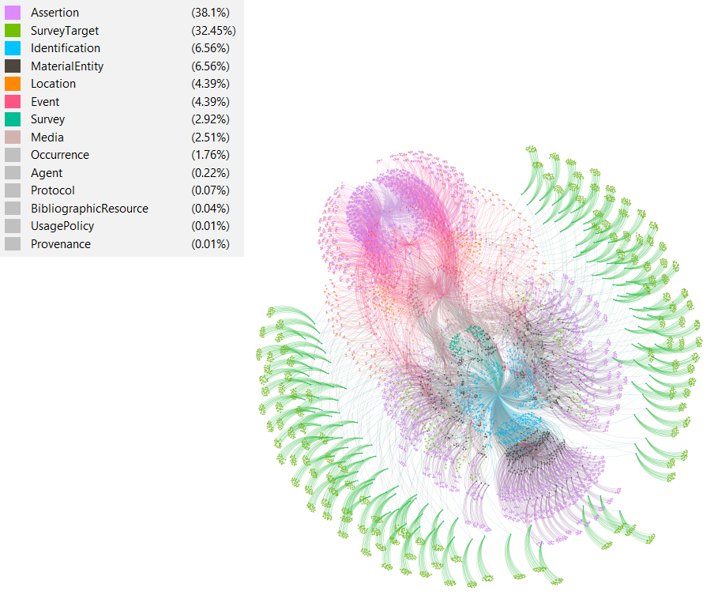
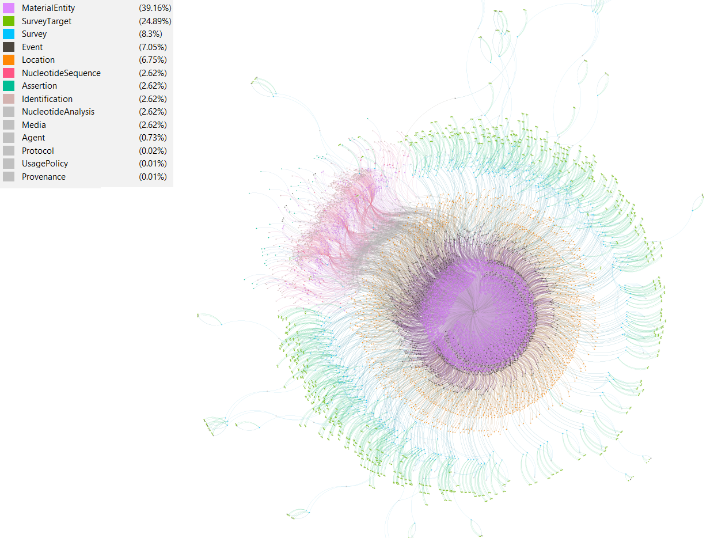
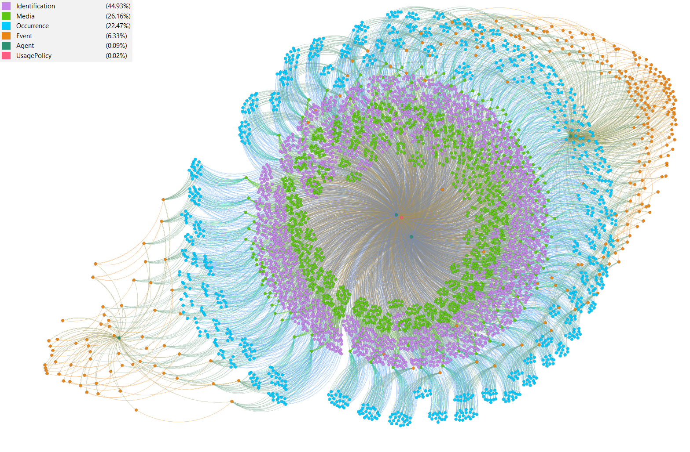
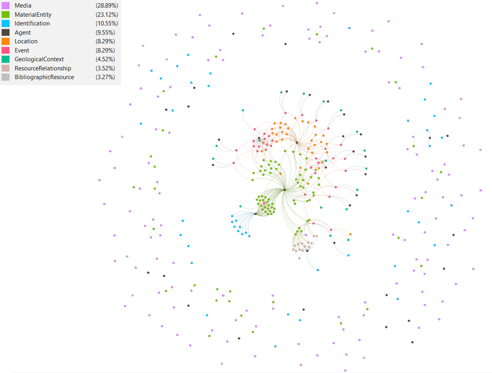
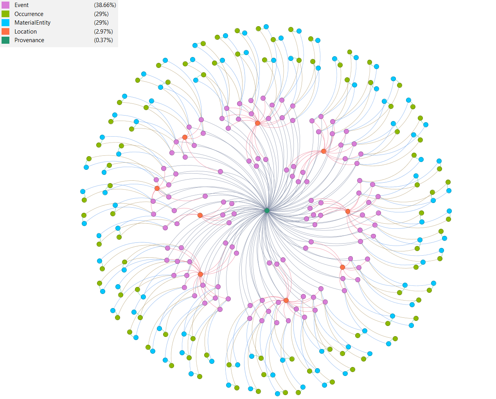

# DwC-OWL-RDF

An effort to use terms from [an ontology that is based on Darwin Core terms](https://github.com/aminem0/dwc-owl) in order to semantically describe biodiversity datasets.

Given that this project is developped in conjunction with the ontology, any modifications to the ontology will be reflected in these examples.

## Importance of the ontology

The Viridian forest survey is exceptionally good, because even though it is semantically and ecologically complex, considering several relationship between entities, it is small enough to let us view the labelled edges.


As can be seen, the graph reads like a book, and tells exactly the story researchers want it to say. This is crucial, as if biodiversity data is to be shared and reused among fellow researchers, first and foremost it needs to be fully understood. The set of terms in Darwin Core and the recently proposed Darwin Core DataPackage allow for the articulation of how the data are meant to be understood. To that end, the ontology in DWC-OWL allows for complex linking and eventually querying of these entities, maximizing reuse potential.

In the following section, each dataset is accompanied by a brief description of its structure, the modelling choices used to represent it in RDF, as well as a summary discussion of what worked well (and what did not). This work also serves as a series of real-world test cases against which the ontology can be evaluated and refined.

## Modelling process

Each dataset was obtained from a specific location on the web. In accordance with the FAIR principles, and to ensure proper attribution, the sources and creators of each dataset will be explicitly identified.

All datasets will be modelled using RDF and terms drawn from the DwC-OWL ontology. A Turtle serialization will be provided for each dataset, enabling loading and exploration in any RDF-compatible programming language. To the best of my knowledge, libraries for handling RDF data exist in all major programming languages (e.g., Python, JavaScript, Ruby).

Every resource will be assigned a unique Uniform Resource Identifier (URI). When possible, the URI supplied by the original dataset, preferably a Uniform Resource Name (URN), will be reused. If no stable identifier is available, a URI will be constructed using an example or placeholder namespace (e.g., http://example.org/). URIs built from this fictitious namespace will follow the convention http://bioboum.ca/{resource-class}/{resource-id}. When feasible, a persistent and resolvable Uniform Resource Locator (URL) from the web will be adopted.

Sometimes, in order to disentangle entities, URIs for resources will be built from each other. For example, an occurrence might have a URN-based URI like `<urn:catalog:{institution}:{project}:{occurrenceID}>` and a URN for its associated event would be built as `<urn:catalog:{institution}:{project}:{occurrenceID}-event>`.

The careful selection and construction of URIs is an important aspect of RDF modelling. A dedicated discussion of these considerations, particularly the distinctions and implications of URNs and URLs, and when both can be considered, will be provided separately.

Because datasets may be revisited and refined over time, the current modelling approaches should be considered provisional rather than definitive.

## Dataset outline

More than fifteen datasets have now been successfully represented in RDF following substantial modelling work. Rather than simply publishing the resulting RDF files and associated visualizations, each dataset will be accompanied by structured documentation to support interpretation by the research community. This approach also invites constructive critique regarding the modelling strategies employed.

Each dataset will therefore be described according to the following structure:

- **Dataset definition**: An overview of the dataset, including its geographic, temporal, and taxonomic scope. These set the ecological context of the dataset.

- **Dataset organization**: A description of the dataset’s structure and provenance, including where it was obtained. Direct links to where and how to obtain the dataset will be provided. The organization of the files will be presented here as well.

- **Modelling considerations**: An explanation of the modelling decisions applied to the dataset. This section will discuss how the data, usually in tabular form, was mapped onto the classes and object properties considered.

- **Ontology subset considered**: Although the DwC-OWL ontology contains a substantial number of classes and properties, only a subset is typically required. This section will outline the subset used for modelling the dataset. This will give a clearer idea of how the RDF data is structured.

- **Additions made**: Documentation of any supplemental data or interpretive additions introduced during the modelling process, clearly distinguished from the original dataset.

- **Difficulties encountered**: A discussion of challenges encountered during modelling, ranging from computational issues to conceptual questions about how best to represent certain entities.

- **Graph-based representation**: A visual representation of the dataset, in which nodes correspond to entities and edges correspond to the relations connecting them. A brief discussion will be provided to explain the resulting graph structure.

- **Lessons learned**: Reflections on insights gained through modelling the dataset and how these informed subsequent refinements to the DwC-OWL ontology. This section may also suggest directions for future modelling work.

## Real-world datasets

### Colombia bird ringing

- **Dataset definition**: As part of SELVA's Migration Ecology research program to study the ecology of migratory birds across ten departments in Colombia, a set of mist nets were set up across Colombia to study wild birds. This study would enable a better understanding of bird patterns, especially at stopover sites and for key conservation species such as the cerulean warbler (*Setophaga cerulea*) and the blackpoll warbler (*Setophaga striata*). Between 2018 and 2023, a total of 5 581 birds were recorded, banded and had measurements taken before being released into the wild.

- **Dataset organization**: The dataset can be downloaded [from GBIF](https://www.gbif.org/dataset/9407c83f-8690-4965-b4fb-48e8911d9430)
The dataset contains the the standard `occurrence.txt` table that contains information about the bird occurrences and an `extendedmeasurementorfact.txt` table that contains information about the bird traits. In addition, it also includes a `permit.txt` file that contains information about a collecting permit that allowed for the project to take place.

- **Modelling considerations**: Each ringed bird was modelled as an individual `dwc:Organism`. The ring inscription was recorded as the organism’s identifier. Individual morphological and biometrical measurements (mass, wing length, etc.) were modelled as `dwc:Assertion` instances associated with the `dwc:Organism`. Taxonomic identifications were modelled using `dwc:Identification` which also targeted the individual.

  The permit metadata are represented as a `dwc:Permit` class, which links to the sampling events that it authorises. Permit properties from the GGBN Permit Extension, `ggbn:permitStatus` and `ggbn:permitType`, were used to record controlled-vocabulary values, as these should be represented as URIs drawn from the GGBN vocabularies.

- **Ontology subset considered**: The core classes of `dwc:Organism`, `dwc:Occurrence`, `dwc:Event`, `dcterms:Location` and `dwc:Assertion` were used to model the bird captures and their measured traits. In this case the permit issuing authority is modeled as a `dcterms:Agent`.

Permit-related modelling introduces `dwc:Permit` class, together with additional classes of `dwc:PermitStatus` and `dwc:PermitType` that aggregate the GGBN permit vocabulary terms, represented as SKOS concepts.


- **Additions made**: In the `permit.txt` file, the entry for `ggbn:permitText` is `ANLA:01102:2022:SELVA`. This identifier seems to be referring to the permit that is considered in the study. It would be valid to assume that `ANLA` would stand for [Autoridad Nacional de Licencias Ambientales](https://www.anla.gov.co/), being the body that issued the permit. Consequently, the ANLA was modeled as a `dcterms:Agent` that issued the permit.

The permit extension allows the addition of legal status of material (specimen, tissue, DNA, etc.). However, the vocabulary is made up mainly of `skos:Concepts`, which even though they have their applications, are difficult to frame within an ontology. This is partly due to the fact that `skos:Concepts` have no inherent hierarchy, as they are all instances of the class `skos:Concept` and are linked together through `skos:broader` and `skos:narrower` relationships and are grouped into `skos:ConceptSchemes`. Nonetheless, they are useful ways to organise sets of terms that do not require strong hierarchical structure.

Semantically, it requires the creation of a new class, `dwc:Permit`, which can be linked to these these properties. Accordingly, two new object properties are created `dwcdp:allowsFor` and `dwcdp:issuedBy`. The first, `dwcdp:allowsFor`, links the `dwc:Permit` instance to the `dwc:Events` it allows for. This relationship is one-to-many, as one permit is valid for carrying out several sampling events. The second, `dwcdp:issuedBy`, relates the `dwc:Permit` to the `dcterms:Agent` that issued it. This `dcterms:Agent` is usually a governmental organization, responsible for evaluating, granting, and monitoring environmental licenses and permits, such as ANLA in Colombia.

- **Difficulties encountered**: The main issue encountered with the modeling of this dataset was with regards to the `permit.txt` extension, most notably, how the enties are handled. Each row in this table is identified by the occurrence identifier, and therefore relates each occurrence to the permit. Consider the following line:

| id                         | permitType                                                   | permitStatus    | permitText            |
|----------------------------|--------------------------------------------------------------|-----------------|-----------------------|
| SELVA:anillamiento:BB05234 | Permiso de recolección de especímenes de especies silvestres | Permiso vigente | ANLA:01102:2022:SELVA |

This entry presents several difficulties which make its translation into RDF difficult. Therefore, the following modifications were considered:
  
  1. The value of `ANLA:01102:2022:SELVA` was not considered as a valid entry for `ggbn:permitText`, it was used instead as the URI for the `dwc:Permit`.
  2. The free-form text of `"Permiso de recolección de especímenes de especies silvestres"@es` was used as the value of `ggbn:permitText`.
  3. The value of `ggbn:permitType` needs to be a URI, and one from a controlled vocabulary, the one established by the GGBN Permit Type Vocabulary. Given the Spanish description of the permit, the URI for Collecting Permit, `<http://data.ggbn.org/schemas/GGBN/terms/vocabulary/permit_type/Collection_Permit>`, was chosen.
  4. The value of `ggbn:permitStatus` needs to be a URI, and one from a controlled vocabulary, the one established by the GGBN Permit Status Vocabulary. Given the Spanish description of the permit, the URI for Collecting Permit, there seems to be no exact match. The closest that could be found is the URI for Permit Available `<http://data.ggbn.org/schemas/ggbn/terms/Permit_available>`, which was chosen.
  5. In the `id` column is the value of a `dwc:Occurrence`. However, from a semantic point of view it does not make sense for a permit to allow for an occurrence to take place. A `dwc:Permit` would be best described as a document allowing for the conduction of an activity. In this case.
  Note that the range of the object 
  
  Note that these terms are instances of `skos:Concepts` so though they represent valid URIs, they do not fit directly within an ontology. To accomodate their usage in DwC-OWL, OWL classes, which are subclasses of `skos:Concept` were created. Doing so allows all the terms in the vocabulary to be collected and enumerated under one class, something that cannot be done with a `skos:ConceptScheme`. Furthermore, by proceeding in this manner, all instances of this subclass remain valid `skos:Concepts`, which does not change their semantic interpretation.

  Note also, that row 11078 in the `extendedmeasurementorfact.txt` will cause a breakage in the parser, as the weight of the bird is given as `12,7` g, which is not a valid number.

- **Graph-based representation**: At the center of the graph are two entities, the single `dwc:Permit` and the set of `dcterms:Locations`. The single permit is related to all `dwc:Events` as it allowed for them. The fact that there are so few `dcterms:Locations` is due to the fixed nature of the mist nets. Several bird captures, modeled as `dwc:Events` can happen, but they will be at the same geographic spot, which is where the mist nets are positioned. The `dwc:Events`, representing the capture of each bird cluster around these points.

  These events are linked to information about each individual `dwc:Organism`, representing each individual bird. Each bird has a `dwc:Occurrence`, which represents its capture; a `dwc:Identification`, which represents its taxonomic assignment; and a set of `dwc:Assertions` which provide information about each measurement taken on it.


- **Lessons learned**: The original consideration in this dataset is the consideration of a novel `dwc:Permit` class and its associated classes for the controlled. This class has not been proposed in the DwC-DP model, so it should not be considered authoritative. However, its consideration might prove necessary in cases like this, where permit information is available and can be added. Nonetheless, it will offer an example of how permit information can be supplied in biodiversity datasets. This can be especially important when dealing with sensitive species, or species for which handling requires particular governmental accreditation.

  One main point of contention would be whether or not the permit vocabulary is applicable to events and occurrences. The permit vocabulary is mentionned as having `a 1:many relation for 1 specimen, tissue, or DNA record` and that it `has to be used with the new defined Material Sample Core (not the Occurrence Core)`. However, there is evidently interest, as there is a published occurrence dataset that makes use of the extension (albeit without respecting the controlled vocabulary aspect).

  Though the terms seem independent, they are semantically linked. For example, a preserved specimen in a collection or in a herbarium may represent a material sample, but has an associated occurrence when it was taken. Likewise, a soil or water sample may be a material entity, but from it several occurrences can be derived through either taxonomic analysis or genomic sequencing.

### Crop pollinisator visits

- **Dataset definition**: Between 2017 and 2021, the National Agriculture and Food Research Organization (NARO) of Japan conducted a series of monitoring activities focusing on insects visiting crop flowers across the country. At multiple farms, wild insects visiting crop production trees were captured and preserved in plastic vials. These preserved organisms were later identified to assess the abundance and diversity of pollinators contributing to crop production.

- **Dataset organization**: The dataset, published as a Sampling event Darwin Core Archive, was downloaded [from GBIF](https://www.gbif.org/dataset/bbaca86c-f703-41fc-800a-fa301c0661fd). It includes two tab-delimited text files: `occurrence.txt`, which contains records of individual insect occurrences; and `event.txt`, which provides information about each sampling event—typically a single day, or occasionally a series of days, during which crop trees were monitored for flower-visiting insects.

- **Modelling considerations**: In `occurrence.txt`, each row corresponds to an insect that visited a flower, was captured, and later identified. This single row therefore conflates several distinct entities that must be separated in RDF. Specifically:
  
  1. The `dwc:Occurrence` describing the insect's presence
  2. The `dwc:MaterialEntity` representing the preserved specimen
  3. The `dwc:Identification` assigned to that specimen

  In the same way, the `event.txt` file also conflates two conceptual entities: the `dwc:Event` itself and the `eco:Survey` conducted within that event. This has proven to be a recurring pattern when converting Darwin Core Archives to RDF: multiple conceptual layers are often represented within the same row and must be disentangled.

- **Ontology subset considered**: Six classes were required to model this dataset: `dwc:Occurrence`, `dwc:MaterialEntity`, `dwc:Identification`, `dwc:Event`, `dcterms:Location`, and `eco:Survey`. Their relationships are tightly interwoven: the material entity, the occurrence, and the event form a closed loop. This is because both the occurrence and the material entity connect to the event, but the material entity also connects to the occurrence as well, as it is the evidence for this occurrence. Note that the object property `dwcdp:happenedDuring` is used twice, once to relate each `dwc:Occurrence` to its `dwc:Event`, and again to relate the `eco:Survey` to the same `dwc:Event`. Altogether, the graph faithfully represents both the data-collection process and the intended interpretation of the dataset.


- **Additions made**: The survey followed a documented scientific protocol referenced in a published article. This was modelled using instances of `dwc:Protocol` and `dcterms:BibliographicResource`. The authors of the publication were modeled as `dcterms:Agents` and linked accordingly.

- **Difficulties encountered**: As noted earlier, one of the principal challenges when modelling Darwin Core Archives in RDF is separating the distinct entities implied by each table row. Although the DwC-OWL ontology provides domains and ranges for each property, difficulties may also arise from the identifiers used in the dataset.

  In this case, each `dwc:occurrenceID` is a URN, such as `urn:catalog:NIAES:Pollinators:AK17-16`. While such URNs can be treated as URIs, they almost certainly represent the identifier of the preserved specimen rather than of the occurrence itself. For this reason, the URN was assigned to the `dwc:MaterialEntity` rather than to the occurrence.

  Since the dataset is already published on GBIF, both events and occurrences have stable URLs. Events follow the pattern https://www.gbif.org/dataset/{dataset-key}/event/{eventID}, which for this dataset will be https://www.gbif.org/dataset/bbaca86c-f703-41fc-800a-fa301c0661fd/event/{eventID}. Occurrence URLs are a different matter, but can be retrieved via the GBIF API. A small Python script will be used to demonstrate how to incorporate both URLs and URNs in RDF serialization.

- **Graph-based representation**: The `dwc:Protocol` instance functions as a central hub within the graph. All `eco:Survey` instances radiate outward, representing surveys conducted under the same protocol. Each survey is linked to its corresponding `dwc:Event`. The multiple `dwc:Occurrences` associated with each event create the characteristic "flower-like" appearance of the directed graph.


- **Lessons learned**: The fact that the dataset was published as a sampling event dataset greatly facilitated modelling. However, a recurring ambiguity remains: determining the appropriate number of `dwc:Event` levels to model. In this dataset, each `dwc:Event` corresponds to a day (or series of days) during which observations took place. One could argue that each individual insect visit could itself be modeled as a `dwc:Event`, with the day acting as a parent event. This would allow finer annotation—such as time of visit, behavioural notes, or observer remarks.

  This approach can be easily done, but was not for two reasons:

  1. No information exists about individual visit events. Indeed, the entry for `dwc:eventID` in `occurrence.txt` refers only to the day event.
  2. In DwC-OWL, the object property `dwcdp:happenedDuring` is a transitive property. Therefore, even if visit-level events were modelled, a reasoner would automatically infer the occurrence's relationship to the parent event, meaning the coarser model remains semantically valid.

  These questions illustrate ongoing challenges in event granularity and highlight the need for careful consideration when modelling hierarchical sampling structures in RDF.

### Jiulongfeng Nature Reserve camtrap

- **Dataset definition**: Within the Jiulongfeng Nature Reserve (九龙峰自然保护区) in Huangshan, eastern China, a set of 32 camera traps was deployed to document the diversity and distribution of mammals. Cameras were installed at different locations and operated for periods ranging from 43 to 252 days (typically around 100 days). Every mammal detection was identified, and an occurrence dataset was produced.

- **Dataset organization**: The dataset, published as a sampling event dataset, can be downloaded [from GBIF](https://www.gbif.org/dataset/d5fc33c5-e514-45ea-8655-d1c6dc934d35). Although it originates from camera trap data, no multimedia extension is included. The dataset comprises of two files: `occurrence.txt`, which contains information about each occurrence, such as the date and identification details; as well as `event.txt`, which describes each camera deployment event, including geographic coordinates and deployment duration for each camera.

- **Modelling considerations**: As with other biodiversity datasets, the primary classes used were `dwc:Occurrence`, `dwc:Event`, and `dwc:Identification`. Even though no explicit media references are provided in the download, media evidence was inferred and modeled as `ac:Media` instances. The exact modeling details are discussed later.

  Two types of agents were considered. These are a a human agent, responsible for reviewing the media and performing the identification; and a set of camera agents (one for each camera), responsible for recording the occurrences and recording the media.

- **Ontology subset considered**: The ontology subset used here parallels the structure of the Ryukyu Islands media dataset. The following classes were used: `ac:Media`, `dwc:Occurrence`, `dwc:Identification`, `dwc:Event`, `dcterms:Location`, and `dcterms:Agent`.

  A key difference lies in the separation of agent roles. In the graph below, the same agent node may appear at the end of three object properties: `dwcdp:conductedBy`, `dwcdp:recordedBy`, and `dwcdp:identifiedBy`. However, these roles need not refer to the same entity. In this case they do not, as the human agent is responsible for the identifications and the cameras are responsible for taking the media and recording the occurrences.

  The self-relationship of `dwc:Event` via `dwcdp:happenedDuring` enables nested event structures, which are required for camera-trap data where each detection event occurs within a parent deployment event.


- **Additions made**: Each camera was modeled as a separate `dcterms:Agent`. Since the cameras were all deployed at different sites in early 2022, assigning each location its own camera agent is reasonable.

  Although Wei Zhao (the human agent) is listed as the value for all `dwc:recordedBy` entries in the published dataset, this is misleading. The camera is the entity that records occurrences, whereas the human identifies the organism. The model was therefore corrected to reflect this protocol.

- **Difficulties encountered**: A recurring issue is that the identifiers for `dwc:Occurrence` instances are actually filenames of the images they are based on. For example, an occurrence of Reeves's muntjac (*Muntiacus reevesi*) uses the identifier `HNK-C0CZQ-JLF06-IMAG1391.JPG` which is evidently the image file the occurrence was based on and not the occurrence itself.

  Additionally, every `dwc:eventID` entry for occurrences corresponds to the name of the deployment event, not the individual detection. In camera-trap workflows, every time the sensor triggers, a new `dwc:Event` occurs, nested within the parent deployment event. Because timestamps exist for each trigger event, this hierarchy should be modeled explicitly.

- **Graph-based representation**: To visualize the data, only the first 25 000 occurrences (of about 51 000) were included in the graph for visual representation.

  At the center is the human agent, Wei Zhao, who is credited with all `dwc:Identifications`. Each identification is based on a `ac:Media` instance that provides evidence for a `dwc:Occurrence`.

  Convergence was noted at multiple levels do to the fact that several entities connected to particular nodes. Indeed, all occurrences were recorded by the same type of agent, the deployed camera. Likewise, all events occur at fixed physical locations, the cameras being fixed. These explain why the number of distinct `dcterms:Agent` and `dcterms:Location` nodes is small.


- **Lessons learned**: This dataset was chosen specifically because it should contain media information but does not.
One could create a dummy URL such as http://bioboum.ca/media/hnk-c0czq-jlf06-imag0004-avi, but doing so falsely implies the existence of a persistent, resolvable link. Instead, this modeling exercise explored the use of blank nodes for representing media entities that are known to exist but have no retrievable identifier.

  While one could theoretically avoid modeling media altogether, placing the filename and its existence in `dwc:occurrenceRemarks` or `dwc:identificationRemarks`, this would be semantically incorrect. The existence of media evidence is a real fact about the observation and should be represented explicitly in RDF.

  Blank nodes are common in ontology design (e.g., for OWL restrictions), where they allow the representation of entities that are logically important but not metaphysically important. However, they can also serve as proxies for real-world entities without stable identifiers, as in this dataset. They represent something known to exist, necessary to the logic of the graph, but not externally referenceable.

  For example, the following SPARQL DESCRIBE output illustrates how a media object might be modeled using a blank node:

  ```turtle
  @prefix ac: <http://rs.tdwg.org/ac/terms/> .
  @prefix dc: <http://purl.org/dc/elements/1.1/> .
  @prefix dcterms: <http://purl.org/dc/terms/> .
  @prefix dwc: <http://rs.tdwg.org/dwc/terms/> .
  @prefix dwcdp: <http://rs.tdwg.org/dwcdp/terms/> .

  <https://www.gbif.org/occurrence/5893170344-ident> a dwc:Identification ;
      dwc:class "Mammalia" ;
      dwc:family "Mustelidae" ;
      dwc:kingdom "Animalia" ;
      dwc:order "Carnivora" ;
      dwc:phylum "Chordata" ;
      dwc:scientificName "Arctonyx collaris" ;
      dwcdp:basedOn [ a ac:Media ;
              dc:format "image/jpeg" ;
              dcterms:title "HNK-C0CZQ-JLF06-IMAG0444.JPG" ;
              dwcdp:evidenceFor <https://www.gbif.org/occurrence/5893170344> ] ;
      dwcdp:identifiedBy <https://scholar.google.com/citations?user=JPHTcaIAAAAJ> .
  ```

  This correctly states that the identification is based on a `ac:Media` instance called `"HNK-C0CZQ-JLF06-IMAG0444.JPG"`, even though no external identifier exists for the image.

  This contrasts sharply with datasets like the Ryukyu reef images, where media files have actionable URLs. In the Jiulongfeng dataset, the media is only meaningful within the graph itself.

  The same logic applies to modeling cameras, where the snippet:

  ```turtle
  @prefix ac: <http://rs.tdwg.org/ac/terms/> .
  @prefix dcterms: <http://purl.org/dc/terms/> .
  @prefix dwc: <http://rs.tdwg.org/dwc/terms/> .
  @prefix dwcdp: <http://rs.tdwg.org/dwcdp/terms/> .

  <https://www.gbif.org/occurrence/5893170486> a dwc:Occurrence ;
      dwc:class "Mammalia" ;
      dwc:family "Mustelidae" ;
      dwc:kingdom "Animalia" ;
      dwc:order "Carnivora" ;
      dwc:phylum "Chordata" ;
      dwc:scientificName "Martes flavigula" ;
      dwcdp:happenedDuring <https://www.gbif.org/occurrence/5893170486-event> ;
      dwcdp:recordedBy [ a dcterms:Agent,
              dwc:agentType "camera trap" ;
              dwc:preferredAgentName "camera trap JLF06" ] .
  ```

  This states that the occurrence was recorded by a specific camera agent, but the agent is a blank node without a global identifier.

  Blank nodes should be used sparingly because they limit interoperability, as they cannot be referred to outside of the considered graph. However, in cases like this, where the existence of an entity without a persistent ID is necessary to the correct interpretation of the data, they are appropriate and semantically meaningful.

### Kalimantan odonata survey

- **Dataset definition**: To characterize Odonata communities across mixed-mosaic heath (kerangas) forests, a survey was conducted in the habitats of the Mungku Baru Education Forest in Central Kalimantan, Indonesia. Fieldwork occurred between November 2019 and February 2020 as part of a broader biodiversity conservation program. The sampling design consisted of 250-m line transects surveyed across three habitat types: kerangas, low pole peat swamp, and mixed swamp forest. Each habitat contained two transects, and each transect was assessed eight times.

- **Dataset organization**: The dataset, published as a Darwin Core Archive, can be downloaded [from GBIF](https://www.gbif.org/dataset/861c1ecb-764b-4d89-864b-b913a58fae0a).

  The archive contains a single file, `occurrence.txt`, which amalgamates all information relating to the project. No extensions are provided. As discussed below, this has consequences for data modelling, as multiple types of entities are embedded within the same table and sometimes condensed into JSON strings.

- **Modelling considerations**: Because all content is folded into a single table, including several JSON-encoded fields, individual instances of the relevant classes had to be explicitly created to distinguish the different types of information.

  The hierarchical structure of the sampling design was preserved using three levels of `dwc:Event`. The topmost level is the habitat, within which the transect level assessments happen. The second level is that of the assessments of the line-transects. This is what is explicitely stated in the documentation.

  However, it is implied that each Odonata sighting represents an event as well, with its own associated assertions. Consequently, a third level of `dwc:Event` was modelled to take into account this hierarchy.

- **Ontology subset considered**: The standard classes and their relationships relationships between `dwc:Occurrence`, `dwc:Identification`, `dwc:Event` and `dcterms:Location` were considered. Note that, in this case, the three levels of `dwc:Events` are considered by the self-referencing arrow of the object property `dwcdp:happenedDuring`.

  The two different types of `dwc:Assertions`, those that target `dwc:Occurrences` and those that target `dwc:Events` use the same object property `dwcdp:about` and are distinguished only by their range. This is shown by the two different arrows stemming from `dwc:Assertions`.

  The sampling survey brings terms from the `eco:` namespace, so as to detail how the survey was carried out and what were its targets. The `eco:Survey` and `eco:SurveyTarget` allow for a detailed definition of the events and the survey that was carried out, and separates the considered entities.


- **Additions made**: To detail how the sampling was carried out and the target taxonomic scope considered, instances of `eco:Survey` and `eco:SurveyTarget` were created to represent the sampling methodology. In this case, the survey target is quite simple, as it is a definition of `all adult Odonata`.

- **Difficulties encountered**: Though the data were well detailed and provided in a machine-readable JSON format, there were a few points that proved to be challenges

  1. Theoretically, it provided a challenge regarding how to model `dwc:Events`. The main reason is that a value of `dwc:eventID` is provided, following the pattern `<bnf:odo:khdtk:transect:{parent-event}:event:{event-number}>` and defines a survey along a transect line. Also provided is a value for `dwc:parentEventID`, which is of the pattern `<bnf:odo:khdtk:parvent:{habitat-code}{number}>`, where the habitat code is `K` for kerangas, `LP` for low pole peat swamps and `R` for riverine mixed peat swamp. This value is essentially information about the habitat and transect number.

  The issue is that, in the methodology, it is stated that `[e]nvironmental data [...] were recorded at each capture location within a 5 m diameter of the sight of capture`. These environmental data are what make up the `dwc:dynamicProperties` values. However, this means that there should be another layer that should be considered, as every Odonata that entered the line of sight of the researcher should represent a `dwc:Event`, which has `dwc:Assertions` about it, being the `dwc:dynamicProperties`. Therefore, there should be three levels of event: Odonata visual sighting - survey - habitat.

  2. Everything is mixed in one file conflation. The dataset is published using the occurrence core. However, there are no extensions and everything is contained in the `occurrence.txt` file. Thankfully, the information is in a machine-readable JSON format, which facilitates the creation of `dwc:Assertions`. However, both the environmental data and the organism measurements would have been better provided as an `extendedmeasurementorfact.txt` file.
  
  3. As a consequence of the last point, the information is sometimes supplied in different entries than would be expected. For example, environmental variables measured at each sighting of an Odonata are provided in `dwc:dynamicProperties`, whereas `dwc:eventRemarks` also contains free-form text reporting the weather at each event. Likewise, measurements about each occurrence are provided in the `dwc:taxonRemarks` instead of `dwc:occurrenceRemarks`, which is where they should be. Instead `dwc:occurrenceRemarks` contains free-form text about the behavior of the organism at the time of sighting and `dwc:OrganismRemarks` contains morphological, rather than morphometric, information about the occurrence. From the latter, possibly more `dwc:Assertions` could be extracted.

  4. Given the fact that only an `occurrence.txt` file was used, only information about occurrences can be entered. However, looking at the `dwc:eventID` values, one finds 43 individual values, whereas 48 are to be expected (3 habitats, 3 line transects, 8 assessments). There is the possibility that the events could not take place due to weather events, as there is an entry of `As a result of heavy rains transect could not be continued`. However, it is also quite likely that these events actually did take place, but that no Odonata were recorded. This information could have been conveyed by using an `event.txt` extension.

- **Graph-based representation**: The center of the graph is made up of the only `eco:SurveyTarget`, which defines the adult Odonata that were targeted by the study. As it is the target for all `eco:Surveys` conducted and that all `dwc:Occurrences` satisfy this target, these are drawn to it and close to the center. As all occurrences are around the center, the first ring of `dwc:Assertions` are occurrence assertions about these occurrences, and are the measurements of each Odonata.

  The `dwc:Events` are connected to the occurrences and the surveys, placing them further from the center. This is also why the assertions that make up the outer ring of `dwc:Assetions` are event assertions about these events, and are the environmental variables measured after making visual contact with each Odonata.


- **Lessons learned**: This dataset illustrates the challenges of representing complex hierarchical sampling designs in a flat tabular format. Although the use of parseable JSON is commendable, RDF provides a much clearer and more explicit representation, separating entities cleanly and enabling correct nesting of events.

  The study also highlights the practical difficulties of encoding rich methodological detail within the constraints of a single file. In contrast, graph-based modelling naturally separates entities and accommodates more complex sampling considerations, such as multi-level event hierarchies.

### Lake Mburo Park rodents

- **Dataset definition**: In 2005, an experimental setup was conducted to assess the factors affecting small mammal communities in African savannahs in Lake Mburo National Park, Uganda. Four treatments were considered based on two factors. The first factor is whether the plot showed large vegetated *Macrotermes* termite mounds or was in adjacent savannah areas. The second factor is the presence or absence of large-herbivore grazing. Large grazing mammals were excluded by erecting a 2-m high fence to prevent their entry and grazing. Each combination was replicated three times. Rodents were trapped using live traps placed in the plots, captured individuals were identified, sexed, and measured.

- **Dataset organization**: The dataset, as a Darwin Core Archive can be downloaded [from GBIF](https://www.gbif.org/dataset/9e54a9c3-98cf-438d-bdf2-89358b647ffa). The archive contains an `occurrence.txt` table that records each rodent capture and an `extendedmeasurementorfact.txt` table that records each measurement taken on the individual rodents.

- **Ontology subset considered**: The relationships between classes in this dataset are relatively straightforward. Every captured rodent is modelled as a dwc:Occurrence of a `dwc:Organism`. Every measurement was modelled as a `dwc:Assertion` targeting the individual rodent.

  Each rodent capture represents a separate `dwc:Event`. However, as traps were left at the same spot, all captures in that trap share the same `dcterms:Location`.


- **Additions made**: Each measurement was described more thoroughly by providing IRIs for the type of measurement, the value (if non-numeric), and the units considered. This approach enables entirely machine-readable data. For these cases, the Ontology of Biological Attributes (OBA), the Phenotype And Trait Ontology (PATO), and the Unit Ontology (UO) were used.

  According to the research paper, identifications were based on the book `The Rodents of Uganda`. Consequently, as for the Ryukyu media dataset, the book was modelled as a `dcterms:BibliographicResource` using its ISBN-13 number as an identifier.

- **Difficulties encountered**: The paper mentions that recaptures occurred and that individuals were marked with paint upon capture to allow identification of recaptures. Table 1 in the paper also shows that some individuals were indeed recaptured. However, the UUIDs in the Darwin Core Archive are provided per `dwc:Occurrence` only, and there is no organism-level identifier in either table. Consequently, unless recapture information was preserved in another file, it is lost.

  Six records of the woodland dormouse (*Graphiurus murinus*) have their `dwc:scientificName` incorrectly entered as *Graohiurus murinus*. This leads to incorrect total counts for this species.

  It should be noted that, even after these corrections, there are slight discrepancies between the values reported in the paper and those in the Darwin Core Archive. For a few rarer species, counts do not match perfectly. Additional reidentifications might have been carried out after the publication of the research paper.

  String casing proved to be an issue for several of the entries. Some nodes received multiple entries for a term simply because it was written with different casings. This is especially important, as the replicate and treatement factor are used for the `dwc:localID` in the pattern `{replicate}-{vegetation level} {grazing level}`. Consequently, values of `dwc:localID` were lowercased and values of `dwc:locality` were title-cased to avoid considering `Mound fenced` and `Mound Fenced` as different levels or `Sanga Gate` and `Sanga gate` as separate localities.

- **Graph-based representation**: At the center of the graph are two entities: the `dcterms:Location` nodes representing trap locations and the `dcterms:BibliographicResource` representing the identification reference. The identification reference aggregates all `dwc:Identification` nodes and the set of locations aggregates the `dwc:Event` nodes, creating the compact core.

  Surrounding the core is an outer ring of `dwc:Occurrence` nodes, which are related to events via `dwcdp:happenedDuring` and to identifications via `dwcdp:basedOn`. This forms the first outer ring.

  Finally, every occurrence is an occurrence of an individual `dwc:Organism` that has a set of `dwc:Assertion` instances about it. This produces the more diffuse outer ring, since each individual has multiple assertions.


- **Lessons learned**: The end goal of data annotation is not only archival but also reuse. This dataset was used to evaluate how easily information can be extracted once the data are loaded into a triplestore.

As a starting point, the following SPARQL query returns all body masses in the dataset that are expressed in grams:

  ```sparql
  PREFIX dwc: <http://rs.tdwg.org/dwc/terms/>

  SELECT ?bodyMass

  WHERE {
    ?trait a dwc:Assertion ;
           dwc:assertionTypeIRI <http://purl.obolibrary.org/obo/OBA_VT0001259> ;
           dwc:assertionUnitIRI <http://purl.obolibrary.org/obo/UO_0000021> ;
           dwc:assertionValueNumeric ?bodyMass .
  }
  ```

  The query is deliberately simple, as it uses a single namespace and a single entity. The use of IRIs for assertion types and units prevents textual variation issues due to how the term is expressed (e.g., `body mass`, `bmass`, `b. mass`, `bodyMass`).

  The SPARQL query may be refined to include the species of the organism on which the measurement was made. This requires the use of object properties and introduces ontological considerations. To obtain body mass values in grams together with the scientific name of the organism on which it was measured, the following query can be executed:
  
  ```sparql
  PREFIX dwc: <http://rs.tdwg.org/dwc/terms/>
  PREFIX dwcdp: <http://rs.tdwg.org/dwcdp/terms/>

  SELECT ?species ?bodyMass

  WHERE {
    ?trait a dwc:Assertion ;
           dwc:assertionTypeIRI <http://purl.obolibrary.org/obo/OBA_VT0001259> ;
           dwc:assertionUnitIRI <http://purl.obolibrary.org/obo/UO_0000021> ;
           dwc:assertionValueNumeric ?bodyMass ;
           dwcdp:about ?org .

    ?org a dwc:Organism ;
         ^dwcdp:occurrenceOf ?occ .

    ?occ a dwc:Occurrence ;
         dwcdp:happenedDuring ?event .

    ?ident a dwc:Identification ;
           dwcdp:basedOn ?occ ;
           dwc:scientificName ?species .
  }
```

  Note the addition of the `dwcdp:` prefix to reference object properties and the use of the inverse property `^dwcdp:occurrenceOf` to navigate from a `dwc:Organism` to its `dwc:Occurrence`. Equivalent formulations include moving the `dwcdp:occurrenceOf` triple into the occurrence block (and keeping the original directionality as `?occ dwcdp:occurrenceOf ?org`) or defining explicit inverse properties (as in Darwin-SW, which uses the pair `dsw:occurrenceOf` and `dsw:hasOccurrence`). Each option has merits and requires further discussion.

  Finally, the SPARQL query can be expanded to compute the average body mass and the number of observations within each treatment group. This requires aggregate functions `AVG()` and `COUNT()` to get the values, as well `GROUP BY` and `ORDER BY` to arrange results. The following query computes these values for the two most frequent species, Kaiser's rock rat (*Aethomys kaiseri*) and the African pygmy mouse (*Mus minutoides*):

  ```sparql
  PREFIX dcterms: <http://purl.org/dc/terms/>
  PREFIX dwc: <http://rs.tdwg.org/dwc/terms/>
  PREFIX dwcdp: <http://rs.tdwg.org/dwcdp/terms/>

  SELECT ?species ?treatmentType (AVG(?bodyMass) AS ?meanBodyMass) (COUNT(?bodyMass) AS ?nObs)

  WHERE {
    ?trait a dwc:Assertion ;
           dwc:assertionTypeIRI <http://purl.obolibrary.org/obo/OBA_VT0001259> ;
           dwc:assertionUnitIRI <http://purl.obolibrary.org/obo/UO_0000021> ;
           dwc:assertionValueNumeric ?bodyMass ;
           dwcdp:about ?org .

    ?org a dwc:Organism ;
         ^dwcdp:occurrenceOf ?occ .

    VALUES ?species { "Aethomys kaiseri" "Mus minutoides" }

    ?ident a dwc:Identification ;
           dwcdp:basedOn ?occ ;
           dwc:scientificName ?species .

    ?occ a dwc:Occurrence ;
         dwcdp:happenedDuring ?event .

    ?event a dwc:Event ;
           dwcdp:spatialLocation ?location .

    ?location a dcterms:Location ;
              dwc:locationID ?locationID .

    BIND(STRAFTER(?locationID, "-") AS ?treatmentType)
  }

  GROUP BY ?species ?treatmentType
  ORDER BY ?species DESC(?meanBodyMass)
```

  The `VALUES ?species { "Aethomys kaiseri" "Mus minutoides" }` block restricts the query to those two species. Omitting it would compute aggregates for all species. The `STRAFTER()` function extracts the treatment type from the location identifier (e.g., yielding `mound unfenced` from `2-mound unfenced`).

  The query produces the following table:

| species            | treatementType    | meanBodyMass         | nObs |
|--------------------|-------------------|----------------------|------|
| *Aethomys kaiseri* | savannah fenced   | "90.31"^^xsd:decimal | 29   |
| *Aethomys kaiseri* | mound unfenced    | "85.38"^^xsd:decimal | 106  |
| *Aethomys kaiseri* | mound fenced      | "84.46"^^xsd:decimal | 197  |
| *Aethomys kaiseri* | savannah unfenced | "65.50"^^xsd:decimal | 6    |
| *Mus minutoides*   | mound unfenced    | "7.62"^^xsd:decimal  | 107  |
| *Mus minutoides*   | savannah fenced   | "7.31"^^xsd:decimal  | 132  |
| *Mus minutoides*   | savannah unfenced | "7.12"^^xsd:decimal  | 71   |
| *Mus minutoides*   | mound fenced      | "7.03"^^xsd:decimal  | 170  |

  Several results can be derived from this output:

  1. Kaiser's rock rat exhibits a substantially higher body mass than the African pygmy mouse, being approximately an order of magnitude heavier.
  2. The effect of treatment differs by species. For Kaiser's rock rat there are notable differences in body mass among treatments, whereas for the African pygmy mouse differences are minor.
  3. Treatment effects are not uniform. For example, in savannah environments the exclusion of large herbivores is associated with a substantial increase in body mass for Kaiser's rock rat. However, no noticeable difference can be seen in the mound environments.

  In conclusion, ontological construction is a challenging process. It requires consideration of how best to express entities and their relationships while facilitating querying and reuse.

### Lanternfish gut metabarcoding

- **Dataset definition**: During the 2nd International Indian Ocean Expedition (May–June 2019), aboard the RV Investigator, juvenile lanternfish (*Hygophum*) were sampled in the Indian Ocean. Their gut contents and gut lining were analyzed using DNA metabarcoding following several protocols. The protocols compared included the Nanopore MinION and Illumina MiSeq sequencing platforms, as well as three primer sets: COI "Leray", 18S rRNA V4 "Zhan", and COI "Lobo". The resulting nucleotide sequences were submitted to BLASTN (blastn 2.12.0, e-value cutoff = 0.001, percent identity ≥ 80%) to evaluate the diet of these fishes.

- **Dataset organization**: The dataset, published as a Darwin Core Archive, was downloaded [from OBIS](https://obis.org/dataset/5d206e57-370c-453f-a882-b54d517294e7). It contains the standard `occurrence.txt` table, as well as a `dnaderiveddata.txt` table describing molecular analyses and their resulting sequences, and a `resourcerelationship.txt` table describing relationships between each fish and its gut content.

- **Modelling considerations**: The content of the `resourcerelationship.txt` table is relatively straightforward: each fish occurrence is related to gut-content occurrences using a predator–prey relationship, expressed as `hasEaten`. This can be modelled as an instance of `dwc:OrganismRelationship` (a subclass of `dwc:ResourceRelationship`) connecting the fish occurrence and the prey occurrence. The specific nature of the relationship is described using an instance of `dwc:OrganismRelationshipAssertion`.

  The `dnaderiveddata.txt` table requires more substantial modelling effort, because its rows combine information about:

  1. The molecular protocol followed, modelled as an instance of `dwc:MolecularProtocol`, with datatype properties in the `mixs:` and `gbif:` namespaces.
  2. The sequencing analysis performed, modelled as an instance of `dwc:NucleotideAnalysis`, which links the protocol followed, the material being sequenced, and the sequences produced.
  3. The nucleotide sequences generated, modelled as instances of `dwc:NucleotideSequence`, which serve as evidence for the prey occurrences inferred from BLAST results.

  The occurrences of fish themselves represent actual organisms collected during the cruise. In contrast, the occurrences of prey items represent taxa inferred from nucleotide sequences, and therefore use the `dwc:NucleotideSequence` as their evidence.

- **Ontology subset considered**: The relationships between classes in this dataset are relatively complex. To distinguish between the fish occurrences and the prey occurrences, separate nodes were created even though both are instances of `dwc:Occurrence`.

  Each fish occurrence was associated with the `dwc:Event` representing the cruise, which is when the captures took place, conducted by a `dcterms:Agent`. Two `dwc:MaterialEntity` instances, gut content and gut lining, were derived from each fish. Because all fish were captured during the cruise (i.e. the same `dwc:Event`), an additional property `dwcdp:derivedFrom` was required to relate each material entity to the corresponding fish occurrence.

  The metabarcoding workflow produced instances of `dwc:NucleotideSequence` via instances of `dwc:NucleotideAnalysis`, each linked to a `dwc:MolecularProtocol`. Given the nature of the process, each analyses produced a large number of sequences. Because prey occurrences are inferred from these sequences, they are not observed occurrences but evidence-based, inferred on the basis of the nucleotide sequences.

  Finally, each prey occurrence participates in a predator–prey interaction with the corresponding fish occurrence. This relationship is modelled using `dwc:OrganismInteraction` that links the two occurrences.


- **Additions made**: The fish occurrences themselves are present in the Darwin Core Archive. However, the detail that the sampling took place aboard the RV Investigator during the 2nd International Indian Ocean Expedition is provided only in the accompanying documentation and publication. To represent this, the vessel was modelled as a `dcterms:Agent` that conducted the sampling, using a web page describing the vessel as its identifier. Similarly, a web page describing the cruise was used as the identified of the `dwc:Event`.

- **Difficulties encountered**: The DNA-Derived Data extension for Darwin Core is very helpful for describing genetic and molecular information. However, because each row is represented with a single identifier, separating different conceptual entities requires careful parsing. In the lanternfish dataset, identifiers in the `dnaderiveddata.txt` file follow patterns such as `<urn:edna:in2019_v03_edna_nanopore_{fish-id}_{platform}_{primers}_{material}-{uuid}>`. Note that the `dwc:occurrenceID` of each fish in `occurrence.txt` is of the form `<urn:edna:in2019_v03_edna_nanopore_{fish-id}-1>`. I have not yet uncovered the meaning of this 1.

  Additionally, it should be noted that the `dnaderiveddata.txt` file contains human-reable entry names, which requires an additional conversion step. Indeed, human-readable terms like `target_gene` or `otu_db` allow quick lookup, but require an additional step to convert to but the MIxS property URIs, which are identified using numbers like `0000044` and `0000087`. Though the matter can be easily resolved by building a Python dictionary and using it as a lookup table.

- **Graph-based representation**: At the center of the graph is the `dwc:Event` corresponding to the 2nd International Indian Ocean Expedition. The fish occurrences connect directly to this event. Each fish serves as the origin point for a branching structure resembling a butterfly (or a starfish or a jellyfish): its predator-prey relationship, as `dwc:OrganismInteraction` entities connect them to the clusters of prey occurrences. This connection thickens the "arms", as each fish consumed a fair amount of prey.

  All prey occurrences connect to `dwc:NucleotideSequence` instances, which converge at the `dwc:NucleotideAnalysis` node that produced them. As groups, nucleotide sequences are produced by the same nucleotide analysis, this causes a tightening at the extremities. Though it is difficult to see, the `dwc:MolecularProtocol` instances act as thin threads linking analyses that used the same protocol, producing cross-connections within and across fish.


- **Lessons learned**: Although the DNA-Derived Data extension mixes multiple types of information in a single row, its overall structure is extremely helpful when representing genetic workflows. The newer classes (`dwc:NucleotideAnalysis`, `dwc:NucleotideSequence`, and `dwc:MolecularProtocol`) enable clear distinctions between different components of the sequencing workflow.

  This modelling approach supports richer biodiversity knowledge graphs: occurrences can be queried based on the material they were derived from, the molecular protocol used, or the sequencing results themselves. As a result, metabarcoding datasets become more reusable, interoperable, and semantically expressive.

### Liloan reef monitoring

- **Dataset definition**: To provide a baseline for the evaluation and implementation of reef conservation and management, a sampling campaign was conducted between 2015 and 2016 on Poblacion and Kadurong Reefs (Liloan, Philippines). The survey recorded multiple types of measurements, including physico-chemical variables (e.g., water quality), percent cover of benthic reef components, and occurrences of several biological communities. Sampled communities comprised phytoplankton, zooplankton, and fish.

- **Dataset organization**: The dataset is available both [from GBIF](https://www.gbif.org/dataset/788eaed9-c607-4510-bd28-5db2ea598dc4) and [from OBIS](https://obis.org/dataset/16cbef75-11a1-47c7-84a8-172470203a68). Both endpoints deliver the same content.

  The archive contains two tables: `occurrence.txt`, which documents species occurrences across all sampled communities, and `extendedmeasurementorfact.txt`, which records environmental variables measured at each site.

- **Modelling considerations**: At first glance the modelling appears straightforward: site visits can be modelled as `dwc:Event` instances, species detections as `dwc:Occurrence` instances, and environmental variables as `dwc:Assertion` instances targeting events.

  However, some practical questions arise due to how the sampling design is laid out:

  - First, sampling sites differ by campaign. Phytoplankton and zooplankton were sampled with different net sizes but at the same points (S01–S20 for phytoplankton; and S01–S03 and S07–S09 for zooplankton), which correspond to the physico-chemical measurement points. Fish communities, however, were assessed at eight different transect points (T01–T08), which are a subset of transects used for benthic variables (T01–T10). Thus, planktonic and fish campaigns are distinct in sampling design and locations.

  -  Second, the relationship between campaigns and events requires careful modelling. Although phytoplankton and zooplankton sampling overlapped at six sites, these campaigns are methodologically different and should not be naïvely modelled as simple sub-events of a single event. It would be preferable to represent each campaign as an `eco:Survey` that happened during the parent `dwc:Event`. This preserves conceptual coherence and avoids conflating sampling methods.

  Modelling campaigns as `eco:Survey` instances also enables the use of `eco:SurveyTarget`, which provides a more detailed description of the campaign's scope and targets.

- **Ontology subset considered**: The standard relationships among `dwc:Occurrence`, `dwc:Identification`, `dwc:Event`, and `dcterms:Location` are used. All environmental measurements are represented as `dwc:Assertion` instances targeting the relevant `dwc:Event`.

  The main addition in this dataset is `eco:Survey`, which occurs within a `dwc:Event`. Each survey has an associated procedure and target definitions, modelled via `eco:SurveyTarget`. Every occurrence recorded in a survey can, usually, be interpreted as satisfying the survey's targets.


- **Additions made**: The `eco:Survey` and `eco:SurveyTarget` classes were introduced to represent the distinct sampling campaigns for each community. These were populated using methodological details from the dataset description and methodology.

  A `dwc:Provenance` instance was created to capture data provenance and project metadata. The ASEAN Centre for Biodiversity, which published the dataset, was modelled as a `dcterms:Agent`.

- **Difficulties encountered**: Despite the title `Sampling-event dataset of short-term monitoring of Poblacion and Kadurong Reefs in Liloan, Cebu, Philippines`, the archive functions as an occurrence dataset rather than an explicit sampling-event dataset. Events therefore had to be reconstructed from the informations in `occurrence.txt` and `extendedmeasurementorfact.txt`.

  This reconstruction was facilitated by consistent occurrence identifiers of the form `{project}:{site}:{date}:{community}`, which can be parsed to recover events and targeted communities.

  Another difficulty was present in `extendedmeasurementorfact.txt`. In this file, `dwc:measurementID` column does not provide unique identifiers for individual measurements but instead classifies measurements into the categories of `benthic` or `physicochemical`. The actual measurement identifiers were placed in `dwc:occurrenceID`, which in should link to `occurrence.txt` but in this case does not.

- **Graph-based representation**: As expected from the modelling choices and the sampling outline, fish and plankton campaigns form distinct clusters. Fish assemblages and their transects are shown on the right side of the graph, whereas plankton assemblages and their sites appear on the left side of the graph. The two isolated clusters of `dwc:Assertion` nodes in the middle correspond to the two transect points where benthic variables were measured but no underwater visual census for fish was conducted (T09-T10).

  Within each community cluster, `eco:SurveyTarget` nodes form the core, as all observed `dwc:Occurrence` instances satisfy these targets. The `eco:Survey` instances surround the targets because they are targets of said survey targets. The `dwc:Identification` nodes lie on the periphery, as they attach to specific occurrences.

  The six `dwc:Event` instances where both phytoplankton and zooplankton were sampled create a bridge connecting the respective phytoplankton and zooplankton clusters.


- **Lessons learned**: For well-designed field programs that deliberately include or exclude particular taxa or methods, `eco:Survey` and `eco:SurveyTarget` are valuable modelling primitives. They enable precise expression of the sampling plan and support interpretation of absences. That is to say whether a taxon was absent because it was truly absent or simply because it was outside of the considered scope.

  When comparing campaigns across communities, these classes provide a clean mechanism to relate each campaign to its sampled sites and to document methodological differences.

### Ryukyu Islands reef media

- **Dataset definition**: Along the coral reefs of the Ryukyu Islands (Japan), the Global Oceanographic Data Center (GODAC) collected images and videos of marine organisms using a remotely operated underwater vehicle. Organisms visible in these media were later identified, and biological occurrence records were generated based on the geographic location at which each photograph or video was captured. Identifications were based on Japanese vernacular names and, when identifications required additional clarification, relevant taxonomic literature was consulted.

- **Dataset organization**: This dataset has an unusual characteristic: it has two independent download endpoints with partially mismatched content. It can be downloaded either [from GBIF](https://www.gbif.org/dataset/ffd03c32-a7ca-4fae-adc8-6f81cddbe43b) or [from OBIS](https://obis.org/dataset/61a0fac8-6bba-4c30-986b-248bc12da62c). Despite the GBIF version being labelled 1.2 and the OBIS version 1.1, the OBIS archive is more recent, containing a few additional fields that are not present in the GBIF version.

  Crucially, the OBIS archive contains valid media URLs that resolve to the actual media files, whereas all media links in the GBIF archive are dead. Anyone relying on the GBIF version alone would be unable to resolve or download the associated media objects.

- **Modelling considerations**: The modelling process relies primarily on the core biodiversity classes, which are `dwc:Occurrence`, `dwc:Identification` and `dwc:Event`. Several records also include biological statements about an organism (e.g., sex or life stage), which required the use of the `dwc:Assertion` class.

  Because this dataset consists of image and video files, the class `ac:Media` was also considered. Each media file was modelled as an instance of `ac:Media` and identified using the working (non-404) URLs obtained from OBIS. The `dwc:Identifications` were related to the media object, not to the organism directly, because the identification is based on inspecting the media.

  The object properties `dwcdp:evidenceFor` and `dwcdp:isMediaOf` naturally form many-to-many relationships. A single organism may be represented in several media items, and a single media item may depict multiple organisms. In the Darwin Core Archive, this is done by using the `dwc:associatedMedia` field with values separated by the pipe character (` | `). The RDF conversion therefore had to support repeated values and generate multiple triples for the cell entry.

  Because vernacular names and almost all identification references are provided in Japanese, this dataset also offered a good opportunity to use language-tagged literals, such as `"ハナビラクマノミ"@ja` or `"オオアカホシサンゴガニ"@ja`, to indicate that the literal value is in Japanese.

- **Ontology subset considered**: It can be seen that part of the entities center around the `dwc:Occurrence` and describe the context around it such as the event and the agent that recorded it; whereas another part considers the `ac:Media` and describe to the identification and rights around it. The object property `dwcdp:evidenceFor` acts as a bridge between the two, linking the fact that the occurrence report is based on the media depicting the organism.


- **Additions made**: A dataset-level rights object was created as an instance of `dwc:UsagePolicy`, populated with information about the usage terms for the media. The original literal value `"ccbync"` in `dcterms:license` is not appropriate for a `dcterms:` property, which expects an IRI. The correct form should be something like `<https://creativecommons.org/licenses/by-nc/4.0/>`. Also, the remotely operated vehicle was also modelled as a `dcterms:Agent`, representing the agent responsible for conducting all events.

- **Difficulties encountered**: A recurring difficulty, also present in other datasets, was the ambiguity of identifiers.
Values in the `dwc:occurrenceID` column follow the form `urn:catalog:JAMSTEC:godac_coralreef_web:1011`. However, these URNs appear to refer to the media items, not to occurrences themselves. Assigning them directly to `dwc:Occurrence` would therefore be misleading, and they were instead used for the corresponding `ac:Media`.

  Because identification references are provided as Japanese book titles, they cannot be reliably turned into URIs without facing some difficulties. To resolve this, ISBN-13 identifiers were used as URNs after confirming the bibliographic information from Japanese online bookstores. For example, the book `日本産魚類検索全種の同定第三版` was instead identified as `urn:isbn:9780306406157`. This provides a globally stable, unambiguous identifier, unlike a literal string title.

  Some occurrences in the dataset include organism-level assertions directly as datatype properties. For example, four occurrences contain values for `dwc:sex` and thirteen contain values for `dwc:lifeStage`. While this approach is permissible, it raises an important modeling question given the existence of the `dwc:Assertion` class. Specifically: should these values be captured directly as datatype properties of `dwc:Occurrence`, or should they instead be represented as full `dwc:Assertion` records linked to the occurrence?

  A number of Darwin Core terms fall into this ambiguous category, properties that can be interpreted either as simple annotations or as observational assertions. These include: `dwc:behavior`, `dwc:caste`, `dwc:lifeStage`, `dwc:reproductiveCondition`, `dwc:sex`, and `dwc:vitality`.

  My current view is that these would be better modeled as instances of `dwc:Assertion`, each providing a structured description of the observed property. The datatype properties, if kepts, would be more appropriately used as datatype properties of specific subclasses of `dwc:Assertion`, as is done in DwC-OWL, where the domain of terms like `dwc:sex` and `dwc:lifeStage` is defined as the union of `dwc:OccurrenceAssertion` and `dwc:OrganismAssertion`. In description logic, this would use the existential restriction as `dwc:OccurrenceAssertion` ⊑ `dwc:Assertion` ⊓ ∃`dwcdp:about`.`dwc:Occurrence`.

  A comparable design decision appears in the mineralogy extension, where mineral-related descriptive terms (e.g., `minext:cleavage`, `minext:luster`, `minext:crystalForm`, etc.) are declared as datatype properties to be used with the class `dwc:MaterialEntityAssertion`. This ensures that domain semantics are respected while still allowing fine-grained descriptive assertions.

  Some additional information could be modelled, but only with manual interpretation. For several entries, `dwc:occurrenceRemarks` indicate that some measurements were taken, remarks such as `"Body length: ca. 10 cm"` or `"ca. 7 cm"`. However, , without explicit information stating what was measured, it is difficult to assess what the value of `"ca. 7 cm"` relates to.

- **Graph-based representation**: The submersible vehicle, modelled as a `dcterms:Agent` pulls all `dwc:Event` around it, they all link to this agent. Likewise, the `dwc:UsagePolicy` instance pulls all `ac:Media` media instances around it, as it is the rights under which they are distributed. Together, these two nodes produce the double-ring structure visible in the graph. The outer rings consist of the `dwc:Identification` instances associated with each media file, as well as the `dwc:Occurrences` and `dcterms:Locations` associated with each event.


- **Lessons learned**: Media resources are an increasingly important component of biodiversity datasets. Because images and videos can be shared online, the annotation of media, including rights metadata, controlled vocabulary values, and links between organisms, identifications, and media objects—should be treated as a crucial element of dataset modelling.

  Controlled vocabularies such as the TDWG subject orientation and subject part vocabularies can enrich media annotations. For example, the following SPARQL DESCRIBE output illustrates how a media object might be annotated:

```turtle
@prefix ac: <http://rs.tdwg.org/ac/terms/> .
@prefix dc: <http://purl.org/dc/elements/1.1/> .
@prefix dwc: <http://rs.tdwg.org/dwc/terms/> .
@prefix dwcdp: <http://rs.tdwg.org/dwcdp/terms/> .

<https://dbarchive.biosciencedbc.jp/data/jam-coral-img/LATEST/img/1011/20110714_4.jpg> a ac:Media ;
    dc:format "image/jpeg" ;
    dwcdp:evidenceFor <https://www.gbif.org/occurrence/5105831354> ;
    dwcdp:hasUsagePolicy <http://bioboum.ca/usage_policy/ryukyu_islands_usage_policy> ;
    ac:subjectOrientationLiteral "left" ;
    ac:subjectPartLiteral "entireOrganism" ;
    dwcdp:hasSubjectOrientation <http://rs.tdwg.org/acorient/values/r0005> ;
    dwcdp:hasSubjectPart <http://rs.tdwg.org/acpart/values/p0001> .
```

In this case, the object properties `dwcdp:hasSubjectOrientation` and `dwcdp:hasSubjectPart` play a role similar to `ac:subjectOrientationIRI` and `ac:subjectPartIRI`. However, the difference is that the `dwcdp:` bridges the gap between the OWL ontology and the SKOS vocabulary, by creating a subclass of `skos:Concept`. This allows for the creation an enumerated range for the object property and the consideration of various vocabularies.

### *Solidobalanus fallax* records publication

- **Dataset definition**: In 2004, the `Journal of the Marine Biological Association of the United Kingdom` (volume 84) published a paper titled `Habitat and distribution of the warm-water barnacle Solidobalanus fallax (Crustacea: Cirripedia) records`. The paper compiles occurrence records for the barnacle *Solidobalanus fallax* in the Plymouth area (south-west England). Records derive from a variety of sources, including trawl surveys on the Plymouth inshore grounds (since 1994), SCUBA observations (since 2000), and personal communications. The species is noted as having the potential to become a pest of aquaculture infrastructure south of Britain.

- **Dataset organization**: The dataset can be downloaded either [from OBIS](https://obis.org/dataset/2218a192-6760-4718-bb1f-0f9d827fa291) or [from GBIF](https://www.gbif.org/dataset/29e95cd7-4759-4aa7-bde0-8463118c873a). Both endpoints give the same dataset. Within the Darwin Core Archive are three files, `occurrence.txt` which provides information the occurrences and one absence of the barnacle, `events.txt` which provides information about every record and finally `extendedmeasurementorfact.txt` which provides information about the abundance of each occurrence.

- **Modelling considerations**: Because the dataset documents occurrences of a single species, a compact modelling approach is enough to capture the information. The classes used are `dwc:Occurrence`, `dwc:Event`, and `dcterms:Location`. These classes capture the spatial, temporal, and taxonomic aspects of the records without introducing unnecessary complexity.

- **Ontology subset considered**: The ontology subset used to model this dataset comprised of `dwc:Occurrence`, `dwc:Event`, and `dcterms:Location`. The publication that collated the records was modelled as a `dcterms:BibliographicResource` and linked to occurrences and events using the object property `dwcdp:mentionedIn`.


- **Additions made**: The dataset, despite having three files, has less content than the original paper. The original paper provides textual descriptions of the locations, sometimes providing the event type. These were added back as `dwc:locationRemarks` values.

Likewise, the paper also provided information about the substrate or the animals on which the barnacles were recorded. This information can be important to inform possible vectors of this barnacle, and were added back as `dwc:occurrenceRemarks`.

- **Difficulties encountered**: As mentionned, the information contained in the `extendedmeasurementorfact.txt` table is simply the numeric values of the count of the barnacles at each event, when the values are not semiquantitative. Note that subevents are pooled to produce the final count value. The only thing added is the IRI from the NERC vocabulary for the concept of `count of individuals`, which is `<http://vocab.nerc.ac.uk/collection/P01/current/OCOUNT01>`.

  I hesitated between whether to model this count value as a `dwc:Assertion` or not. The hesitancy was in large part to the fact that datatype properties, `dwc:organismQuantity` and `dwc:organismQuantityType`, to do this already exist. This means that providing the values `5` for `dwc:organismQuantity` and `individuals` for `dwc:organismQuantityType` would fill the same role as creating an instance of a `dwc:Assertion` for that same purpose.

  However, I point out that there might be a valid reason to use this term, by pointing to the Broke-West fish dataset. Looking through the turtle file reveals this snippet:

  ```turtle
  <https://www.bioboum.ca/assertion/aav3ff-00248-stomach-136-rhincalanus-gigas-count> a dwc:Assertion ;
    dwcdp:about <https://www.bioboum.ca/material/aav3ff-00248-stomach-136-rhincalanus-gigas> ;
    dwcdp:assertionID "AAV3FF_00248_stomach_136_Rhincalanus gigas_count" ;
    dwcdp:assertionType "individual count" ;
    dwcdp:assertionValueNumeric 1.0 ;
    dwcdp:materialEntityID "AAV3FF_00248_stomach_136_Rhincalanus gigas" .
  ```

  Which is a `dwc:Assertion` used to define the number of individuals of the copepod *Rhincalanus gigas*. However, in this case, it is allowed and necessary. The reason being that this `dwc:Assertion` is used here to describe the individual counts of organisms in a `dwc:MaterialEntity`, in this case the stomach content of an Antactic fish *Electrona antarctica*, and not a `dwc:Occurrence` as in the *Solidobalanus* dataset.

- **Graph-based representation**: Given the small number of classes considered and their simple organization, the interpretation of the graph is straightforward. At the center of the graph is the scientific paper. The first ring around it are the `dwc:Occurrences` which are drawn to it because they are mentionned in the paper. The second ring consists of the `dwc:Events`, which despite being mentioned in the paper and drawn to it, are slightly more distant due to the fact that each event is connected to a `dcterms:Location`.


- **Lessons learned**: When the barnacle was noted as being present on another organism and not on a substrate, an occurrence could have been created and linked to the barnacle occurrence through a `dwc:OrganismInteraction` instance. For example, consider the following line:

| Date       | Location                | Number of *Solidobalanus* | Notes                         |
|------------|-------------------------|---------------------------|-------------------------------|
| 26-Jul-95  | trawl Bigbury Bay, 33 m | 4                         | 2 each on two *Maia squinado* |

  This row could have converted into 2 separate instances of *Solidobalanus fallax*, each with `2` for `dwc:organismQuantity` and `individuals` for `dwc:organismQuantityType`, and two separate instances of spider crabs (*Maia squinado*), each with `1` for `dwc:organismQuantity` and `individuals` for `dwc:organismQuantityType`. The pairs of occurrences would be related through a `dwc:OrganismInteraction`, relating the fact that the barnacle was an epibiont on the spider crab.
  
  Though enticing, this becomes impossible for some rows such as:

| Date       | Location             | Number of *Solidobalanus*  | Notes                                         |
|------------|----------------------|----------------------------|-----------------------------------------------|
| 29-Jun-95  | trawl off West Rutts | 14                         | on *Buccinum* shells inhabited by *Eupagurus* |
  
  In this case, we are incapable of doing the same exercise, as we do not know neither how many hermit crabs there are nor how the barnacles are spread.

  However, the actual interest in this dataset was the following entry in table 1 of the paper that is quite original:

| Date       | Location                           | Number of *Solidobalanus* | Notes                                  |
|------------|------------------------------------|---------------------------|----------------------------------------|
| 08-Nov-95  | dredge off Hillsea ('Stoke') Point | 1                         | on *Scalpellum* growing on *Eunicella* |

Based on this entry, a single individual of *Solidobalanus* was observed on a goose barnacle (*Scalpellum*). However, this goose barnacle is itself noted as growing on a sea-fan (*Eunicella*). This means that there were two interactions between these three individuals. These types of interactions can represent an interesting modelling excercise.

As suggested in the Darwin Core DataPackage explanations, `pairwise interactions must be used to represent multi-organism interactions`. As an exercise, this approach was taken, leading to the graph below:


In this case, the barnacle is on the bottom-left, the goose barnacle in the middle and the sea-fan on the top left. The pairs of `dwc:OrganismInteractions` describe successively the relationship between the three individuals.

This exercise can be extended to consider a graph-based representation of the statement `In the scientific paper, it was mentionned that, during a dredge off Hillsea Point on the 8th of November 1995, 1 individual of Solidobalanus fallax was on Scalpellum growing on Eunicella`. This produced the graph below:


  Using, whenever possible real URLs, the statement can be encoded and shared as the following turtle file:

```turtle
@prefix bibo: <http://purl.org/ontology/bibo/> .
@prefix dc: <http://purl.org/dc/elements/1.1/> .
@prefix dcterms: <http://purl.org/dc/terms/> .
@prefix dwc: <http://rs.tdwg.org/dwc/terms/> .
@prefix dwcdp: <http://rs.tdwg.org/dwcdp/terms/> .
@prefix xsd: <http://www.w3.org/2001/XMLSchema#> .

<https://www.gbif.org/occurrence/4153002329> a dwc:Occurrence ;
    dwc:occurrenceRemarks "on Scalpellum growing on Eunicella" ;
    dwc:scientificName "Solidobalanus fallax" ;
    dwcdp:mentionedIn <https://doi.org/10.1017/S0025315404010616h> ;
    dwcdp:organismQuantity 1 ;
    dwcdp:organismQuantityType "individuals" .

<https://www.gbif.org/occurrence/4153002329-host1> a dwc:Occurrence ;
    dwc:genus "Scalpellum" ;
    dwcdp:mentionedIn <https://doi.org/10.1017/S0025315404010616h> .

<https://www.gbif.org/occurrence/4153002329-host2> a dwc:Occurrence ;
    dwc:genus "Eunicella" ;
    dwcdp:mentionedIn <https://doi.org/10.1017/S0025315404010616h> .

<http://bioboum.ca/organism-interaction/solidobalanus-on-scalpellum> a dwc:OrganismInteraction ;
    dwc:organismInteractionType "was attached to" ;
    dwcdp:happenedDuring <https://www.gbif.org/dataset/29e95cd7-4759-4aa7-bde0-8463118c873a/event/dasshdt00000144_013> ;
    dwcdp:interactionBy <https://www.gbif.org/occurrence/4153002329> ;
    dwcdp:interactionWith <https://www.gbif.org/occurrence/4153002329-host1> ;
    dwcdp:mentionedIn <https://doi.org/10.1017/S0025315404010616h> .

<http://bioboum.ca/organism-interaction/scalpellum-on-eunicella> a dwc:OrganismInteraction ;
    dwc:organismInteractionType "was growing on" ;
    dwcdp:happenedDuring <https://www.gbif.org/dataset/29e95cd7-4759-4aa7-bde0-8463118c873a/event/dasshdt00000144_013> ;
    dwcdp:interactionBy <https://www.gbif.org/occurrence/4153002329-host1> ;
    dwcdp:interactionWith <https://www.gbif.org/occurrence/4153002329-host2> ;
    dwcdp:mentionedIn <https://doi.org/10.1017/S0025315404010616h> .

<https://www.gbif.org/dataset/29e95cd7-4759-4aa7-bde0-8463118c873a/event/dasshdt00000144_013> a dwc:Event ;
    dwc:eventDate "1995-11-08"^^xsd:date ;
    dwc:eventType "dredge" ;
    dwcdp:mentionedIn <https://doi.org/10.1017/S0025315404010616h> ;
    dwcdp:spatialLocation <https://www.gbif.org/dataset/29e95cd7-4759-4aa7-bde0-8463118c873a/event/dasshdt00000144_013-loc> .

<https://www.gbif.org/dataset/29e95cd7-4759-4aa7-bde0-8463118c873a/event/dasshdt00000144_013-loc> a dcterms:Location ;
    dwc:coordinateUncertaintyInMeters 500.0 ;
    dwc:decimalLatitude 50.288617 ;
    dwc:decimalLongitude -4.045 ;
    dwc:geodeticDatum "EPSG:4326" ;
    dwc:locationRemarks "dredge off Hillsea ('Stoke') Point" .

<https://doi.org/10.1017/S0025315404010616h> a dcterms:BibliographicResource ;
    dc:title "Habitat and distribution of the warm-water barnacle Solidobalanus fallax (Crustacea: Cirripedia) records" ;
    dcterms:issued "2004"^^xsd:gYear ;
    bibo:pages "1169-1177" ;
    bibo:volume "84" .
```

### Turtle remote sensing dataset

- **Dataset definition**: As part of the Marine Bioresource Conservation and Restoration Research project, a marine conservation initiative aimed at restoring ecosystem health through the protection and recovery of marine species, fifteen sea turtles were equipped with radio-transmitters. Their movements throughout the Western Pacific Ocean were monitored to inform species protection and habitat management strategies. The dataset spans October 2015 to October 2022. Although most tracks fall within the waters of South Korea and Japan, some individuals traveled as far as China and Vietnam.

- **Dataset organization**: The dataset was obtained from Movebank [through the Tracking Data Map](https://www.movebank.org/cms/webapp/map). Each tracked sea turtle had an individual .csv file associated to it. Each .csv file contains georeferenced records from the radio-transmitter, including timestamps and coordinates. Additional metadata include the scientific name and a local identifier associated with each individual.

- **Modelling considerations**: In each .csv file, every row represents a `dwc:Event` corresponding to a recorded radio-transmitter signal. Each signal implicitly indicates a `dwc:Occurrence` of the animal at a given time and place. To ensure that all occurrences from a given file are correctly associated with the same tracked individual, a corresponding instance of `dwc:Organism` was created. All occurrence records were linked to this organism using the property `dwcdp:occurrenceOf`.

- **Ontology subset considered**: Only four classes were required to model this dataset: `dwc:Organism`, `dwc:Occurrence`, `dwc:Event`, and `dcterms:Location`. Their relationships are conceptually straightforward: occurrences are occurrences of an individual organism, which happen during an event, and each event is associated with a specific location.


- **Additions made**: Although not strictly necessary, all `dwc:Event` instances were linked to a shared instance of `dwc:Provenance`, representing the project. This instance was enriched with metadata such as the project name, the funding agencies (the Marine Biodiversity Institute of Korea, MABIK, and the Ministry of Oceans and Fisheries of Korea, MOF), as well as the project’s principal investigator, Prof. Yong-Rock An. The latter three were modelled as `dcterms:Agents`.

- **Difficulties encountered**: Processing data exported from Movebank was generally straightforward due to the clear correspondence between their column structure and Darwin Core terms. The distribution of data across individual .csv files also posed no difficulty, as the same parsing function could be applied iteratively.

  One oddity was the .csv file for individual `KOR-001`. The transmitter appeared to place the turtle in the Arctic Ocean for 21 consecutive points. Closer inspection revealed that the latitude and longitude columns were reversed. Correcting this inversion showed that the turtle had in fact remained around Dolsan Island (돌산도) for approximately one month. The RDF serializations correct this fact, but the data is left as is.

  A more conceptual challenge involved determining how to model the role of the principal investigator, Prof. Yong-Rock An. Although his exact involvement in data collection is not specified, he is the principal investigator of the project and therefore has a clear link. However, most object properties considered relate directly to biodiversity data acquisition and treatment. For now, he is represented as a creator and linked to the `dwc:Provenance` instance using `dcterms:creator`, consistent with the practice in Darwin Core Archives where dataset contributors are treated as creators in the EML metadata.

- **Graph-based representation**: The `dwc:Provenance` instance forms the central node of the graph. All `dwc:Event` instances connect outward from it. Each event is linked to its corresponding `dcterms:Location`, which captures its geospatial coordinates, and to the `dwc:Occurrence` of the sea turtle. All occurrences, in turn, converge on the single `dwc:Organism` instance representing the tracked individual.


- **Lessons learned**: Individual movement data map naturally to the DwC-OWL ontology when each tracked animal is represented as its own instance of `dwc:Organism`. These data will become increasingly important as global networks, such as [Move-BON](https://geobon.org/move-bon/), expand efforts to standardize, aggregate, and share animal tracking information.


### Broke-West fish

Whereas the Viridian forest survey dataset contained `251` triples, the Broke-West fish dataset contains `173 062` triples and considers more classes. Despite this, the same underlying logic can be applied to obtain a directional graph as well, which faithfully describes the dataset.



### Insektmobilen

The Insektmobilen dataset produced an extremely high number of triples, due to its identification related to barcoding. Indeed, graphical representation of a subset produced `425 018` triples. The clusterings of `dwc:Identifications` correspond to successful BLAST query matches against the BOLD database. As identifications were based on dwc:NucleotideSequences, this clustering is logical and desired from a semantic point of view.



### Moth AMI

For the AMI dataset, none of `dcterms:Agents` were human, being either instruments or AI models. However, they allowed separation of the data into well-defined groups. Indeed, graphical representation of a subset produced showed that all captures done by Luna were on the left and those by Mothra were on the right. Both AI models used for image recognition and identification are in the center of the graph.



### NMNH paleobiology

The NMNH paleobiology dataset, when expressed as a (somewhat) direct RDF translation of the relational tables in the DataPackage, produced a disconnected graph. The main graph is evident, with around it several subgraphs or even single nodes. Note that this is not an issue for RDF, as these resources are still queryable. Nonetheless, some additional relating of data, such as relating `dwc:Identification` to the `dwc:MaterialEntity` on which they are based would connect the isolated subgraphs to the main graph.



### Aulavik lemming nests

In the case of the lemming nests dataset, consideration of a `dcterms:Location` entity was crucial, as it was the element tying all the yearly visits to the same plot. The data were modeled with a yearly count of nests being a `dwc:Event` and the nests themselves being `dwc:MaterialEntity` collected during said event. On that note, I would possibly like to consider an additional subproperty of `dwcdp:collectedDuring` to relate `dwc:MaterialEntities` to `dwc:Events`, possibly something like `dwcdp:notedDuring`, of which the former being a subproperty of the latter, indicating that the material entity was not only noted, but actually collected. If this material entity is present, then its instance is created and it becomes support for a `dwc:Occurrence` of lemmings on the parcel. The taxa considered here is lemmings, but such yearly visits are also considered for birds.



### Joseph Rock herbarium

Both [the GBIF endpoint](https://serv.biokic.asu.edu/pacific/portal/content/dwca/HAW_DwC-A.zip) and [the alternative identifier link](https://serv.biokic.asu.edu/pacific/portal/collections/misc/collprofiles.php?collid=1) are dead. The collection's [link on iDigBio](https://portal.idigbio.org/portal/recordsets/959c0dc4-fcf3-477e-af63-c00a005dbc0a) shows a collection with a differing amount of occurrences. Likewise, visiting [the University of Hawaiʻi at Mānoa webpage](https://manoa.hawaii.edu/herbarium/) gives no link to visit the digitized collection. Consequently, there seems to be no direct way to obtain the dataset than through the method described above.

## Value of revisiting datasets

The crop-flower-visit dataset was originally published as an sampling event dataset on GBIF, and was registered on September 1st 2023. As it is, the dataset has information not only on insect visitors, but also on several other entities, such as the plants they visited, `dwc:Assertions` about these plants (the sex of the plant), and the nature of the relationship itself, which is a type of `dwc:OrganismInteraction`. However, the entirety of this information is provided as free-form text in the data property such as `dwc:OccurrenceRemarks`.


Extraction of this information and updating of the dataset using DwCDP terms and the DWC-OWL ontology leads to a richer and more expressive dataset. It also leads itself more readily to analyses and querying. For example, a SPARQL query can now target occurrences of insects but only on male Japanese persimmon trees (*Diospyros kaki*). Before, this would have required laborious regexing of the text. Consequently, the use of DwCDP terms and the DWC-OWL ontology should not be seen only as something that should be used from now on, but also as something that researchers can use to make previously published datasets more expressive.

## Smarter querying

Furthermore, suppose we had the crop dataset stored in a triplestore and that it was exposed through a SPARQL endpoint. The following SPARQL query allows for extraction of the desired data (i.e. occurrences of insects but only on male Japanese persimmon trees):

```sparql
PREFIX dwc: <http://rs.tdwg.org/dwc/terms/>
PREFIX dwcdp: <http://rs.tdwg.org/dwcdp/terms/>

SELECT ?occPol ?occSci

WHERE {
  ?occPol a dwc:Occurrence ;
          dwc:scientificName ?occSci ;
          dwc:occurrenceRemarks ?occRem .

  FILTER regex(?occRem, "Diospyros kaki")
  FILTER regex(?occRem, "\\bmale\\b", "i")
}
```

The query is a simple SPARQL query with regex-based pattern searching of the `dwc:occurrenceRemarks` entry. However, given that the study occurred in Japan, it is entirely possible that the researchers could have chosen the term `雄花` instead of `male` to define the sex of the flower. In this case, regexing becomes much more complicated for additional reasons. For example, would the researcher consider the kanji `雄花` or hiragana `ゆうか`? Would he consider the literal term `male` or a symbol such as `♂`?

Note that this notion is quite real, as the previously seen Colombia bird ring dataset provided bird sex as the Spanish `Macho` and `Hembra`. Likewise, the capitalization of `Macho` means that unless come form of string manipulation is employed, `Macho` will not be considered the same as `macho`.

On the other hand, the SPARQL query that is based on the DWC-OWL ontology is a bit more verbose, but is much more concise and consists of:

```sparql
PREFIX dwc: <http://rs.tdwg.org/dwc/terms/>
PREFIX dwcdp: <http://rs.tdwg.org/dwcdp/terms/>

SELECT ?occPol ?occSci

WHERE {
  ?occPol a dwc:Occurrence ;
          dwc:scientificName ?occSci .
  
  ?inter a dwc:OrganismInteraction ;
         dwcdp:interactionBy ?occPol ;
         dwcdp:interactionWith ?occPlant .
  
  ?occPlant a dwc:Occurrence ;
            dwc:scientificName "Diospyros kaki" .
  
  ?plantAss a dwc:Assertion ;
            dwcdp:about ?occPlant ;
            dwc:assertionValueIRI <http://purl.obolibrary.org/obo/PATO_0000384> .
}
```

Where http://purl.obolibrary.org/obo/PATO_0000384 is an IRI that corresponds to a specific PATO (Phenotype And Trait Ontology) term, in this case `male`. Consideration of a persistent IRI safegards against the previously mentionned issues, as it is a language-independent way to refer to the same concept.

Furthermore, the regex-based query has a glaring problem that can potentially slip by unnoticed. The pattern `\\bmale\\b` will blindly look for the word `male`, anywhere in the occurrence remarks. Therefore, the WRONG results can be returned for reasons other than what the researcher intended. For example, the following `dwc:occurrenceRemarks` will still be a match: `occurrence of a male Lasioglossus on a female Diosporus kaki`. This is because the regex just blindly looks for the string `male` in the string, regardless of whether it relates to the pollinator or to the plant. In contrast, the semantically-aware query will successfully retrieve the desired data, because it has connected the data in a semantically meaningful way.

This illustrates an important point: while RDF provides a flexible framework for representing data, it alone is not enough to significantly advance data-sharing and reuse. Only when RDF is backed with a robust ontological foundation that it can enables truly meaningful, semantically precise data-sharing and reuse.
