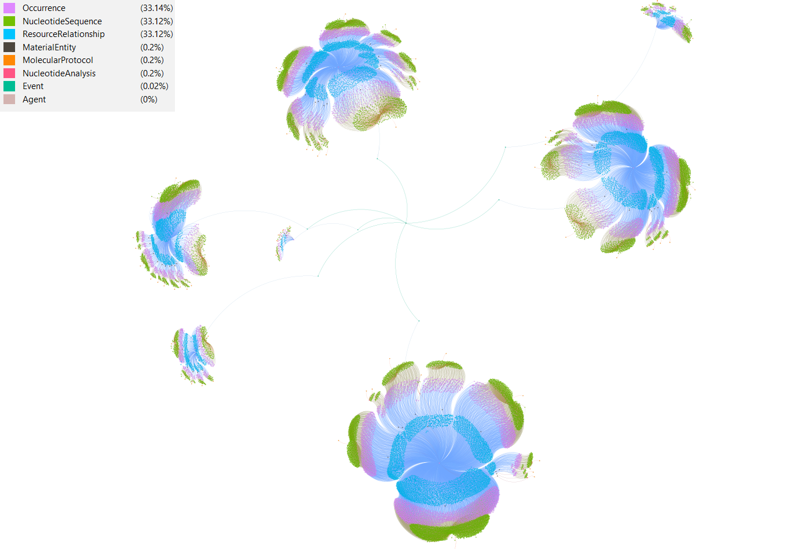

# DwC-OWL-RDF

An effort to use terms from [an ontology that is based on Darwin Core terms](https://github.com/aminem0/dwc-owl) in order to semantically describe biodiversity datasets.

Given that this project is developped in conjunction with the ontology, any modifications to the ontology will be reflected in these examples.

## Importance of the ontology

The Viridian forest survey is exceptionally good, because even though it is semantically and ecologically complex, considering several relationship between entities, it is small enough to let us view the labelled edges.


As can be seen, the graph reads like a book, and tells exactly the story researchers want it to say. This is crucial, as if biodiversity data is to be shared and reused among fellow researchers, first and foremost it needs to be fully understood. The set of terms in Darwin Core and the recently proposed Darwin Core DataPackage allow for the articulation of how the data are meant to be understood. To that end, the ontology in DWC-OWL allows for complex linking and eventually querying of these entities, maximizing reuse potential.

In the following section, each dataset is accompanied by a brief description of its structure, the modelling choices used to represent it in RDF, as well as a summary discussion of what worked well (and what did not). This work also serves as a series of real-world test cases against which the ontology can be evaluated and refined.

## Modelling process

Each dataset was obtained from a specific location on the web. In accordance with the FAIR principles, and to ensure proper attribution, the sources and creators of each dataset will be explicitly identified.

All datasets will be modelled using RDF and terms drawn from the DwC-OWL ontology. A Turtle serialization will be provided for each dataset, enabling loading and exploration in any RDF-compatible programming language. To the best of my knowledge, libraries for handling RDF data exist in all major programming languages (e.g., Python, JavaScript, Ruby).

Every resource will be assigned a unique Uniform Resource Identifier (URI). When possible, the URI supplied by the original dataset, preferably a Uniform Resource Name (URN), will be reused. If no stable identifier is available, a URI will be constructed using an example or placeholder namespace (e.g., http://example.org/). URIs built from this fictitious namespace will follow the convention http://bioboum.ca/{resource-class}/{resource-id}. When feasible, a persistent and resolvable Uniform Resource Locator (URL) from the web will be adopted.

Sometimes, in order to disentangle entities, URIs for resources will be built from each other. For example, an occurrence might have a URN-based URI like `<urn:catalog:{institution}:{project}:{occurrenceID}>` and a URN for its associated event would be built as `<urn:catalog:{institution}:{project}:{occurrenceID}-event>`.

The careful selection and construction of URIs is an important aspect of RDF modelling. A dedicated discussion of these considerations, particularly the distinctions and implications of URNs and URLs, and when both can be considered, will be provided separately.

Because datasets may be revisited and refined over time, the current modelling approaches should be considered provisional rather than definitive.

## Dataset outline

More than fifteen datasets have now been successfully represented in RDF following substantial modelling work. Rather than simply publishing the resulting RDF files and associated visualizations, each dataset will be accompanied by structured documentation to support interpretation by the research community. This approach also invites constructive critique regarding the modelling strategies employed.

Each dataset will therefore be described according to the following structure:

- **Dataset definition**: An overview of the dataset, including its geographic, temporal, and taxonomic scope. These set the ecological context of the dataset.

- **Dataset organization**: A description of the dataset’s structure and provenance, including where it was obtained. Direct links to where and how to obtain the dataset will be provided. The organization of the files will be presented here as well.

- **Modelling considerations**: An explanation of the modelling decisions applied to the dataset. This section will discuss how the data, usually in tabular form, was mapped onto the classes and object properties considered.

- **Ontology subset considered**: Although the DwC-OWL ontology contains a substantial number of classes and properties, only a subset is typically required. This section will outline the subset used for modelling the dataset. This will give a clearer idea of how the RDF data is structured.

- **Additions made**: Documentation of any supplemental data or interpretive additions introduced during the modelling process, clearly distinguished from the original dataset.

- **Difficulties encountered**: A discussion of challenges encountered during modelling, ranging from computational issues to conceptual questions about how best to represent certain entities.

- **Graph-based representation**: A visual representation of the dataset, in which nodes correspond to entities and edges correspond to the relations connecting them. A brief discussion will be provided to explain the resulting graph structure.

- **Lessons learned**: Reflections on insights gained through modelling the dataset and how these informed subsequent refinements to the DwC-OWL ontology. This section may also suggest directions for future modelling work.

## Real-world datasets

### Crop pollinisator visits

- **Dataset definition**: Between 2017 and 2021, the National Agriculture and Food Research Organization (NARO) of Japan conducted a series of monitoring activities focusing on insects visiting crop flowers across the country. At multiple farms, wild insects visiting crop production trees were captured and preserved in plastic vials. These preserved organisms were later identified to assess the abundance and diversity of pollinators contributing to crop production.

- **Dataset organization**: The dataset, published as a Sampling event Darwin Core Archive, was downloaded [from the GBIF](https://www.gbif.org/dataset/bbaca86c-f703-41fc-800a-fa301c0661fd). It includes two tab-delimited text files: `occurrence.txt`, which contains records of individual insect occurrences; and `event.txt`, which provides information about each sampling event—typically a single day, or occasionally a series of days, during which crop trees were monitored for flower-visiting insects.

- **Modelling considerations**: In `occurrence.txt`, each row corresponds to an insect that visited a flower, was captured, and later identified. This single row therefore conflates several distinct entities that must be separated in RDF. Specifically:
  
  1. The `dwc:Occurrence` describing the insect's presence
  2. The `dwc:MaterialEntity` representing the preserved specimen
  3. The `dwc:Identification` assigned to that specimen

  In the same way, the `event.txt` file also conflates two conceptual entities: the `dwc:Event` itself and the `eco:Survey` conducted within that event. This has proven to be a recurring pattern when converting Darwin Core Archives to RDF: multiple conceptual layers are often represented within the same row and must be disentangled.

- **Ontology subset considered**: Six classes were required to model this dataset: `dwc:Occurrence`, `dwc:MaterialEntity`, `dwc:Identification`, `dwc:Event`, `dcterms:Location`, and `eco:Survey`. Their relationships are tightly interwoven: the material entity, the occurrence, and the event form a closed loop. This is because both the occurrence and the material entity connect to the event, but the material entity also connects to the occurrence as well, as it is the evidence for this occurrence. Note that the object property `dwcdp:happenedDuring` is used twice, once to relate each `dwc:Occurrence` to its `dwc:Event`, and again to relate the `eco:Survey` to the same `dwc:Event`. Altogether, the graph faithfully represents both the data-collection process and the intended interpretation of the dataset.


- **Additions made**: The survey followed a documented scientific protocol referenced in a published article. This was modelled using instances of `dwc:Protocol` and `dcterms:BibliographicResource`. The authors of the publication were modeled as `dcterms:Agents` and linked accordingly.

- **Difficulties encountered**: As noted earlier, one of the principal challenges when modelling Darwin Core Archives in RDF is separating the distinct entities implied by each table row. Although the DwC-OWL ontology provides domains and ranges for each property, difficulties may also arise from the identifiers used in the dataset.

  In this case, each `dwc:occurrenceID` is a URN, such as `urn:catalog:NIAES:Pollinators:AK17-16`. While such URNs can be treated as URIs, they almost certainly represent the identifier of the preserved specimen rather than of the occurrence itself. For this reason, the URN was assigned to the `dwc:MaterialEntity` rather than to the occurrence.

  Since the dataset is already published on GBIF, both events and occurrences have stable URLs. Events follow the pattern https://www.gbif.org/dataset/{dataset-key}/event/{eventID}, which for this dataset will be https://www.gbif.org/dataset/bbaca86c-f703-41fc-800a-fa301c0661fd/event/{eventID}. Occurrence URLs are a different matter, but can be retrieved via the GBIF API. A small Python script will be used to demonstrate how to incorporate both URLs and URNs in RDF serialization.

- **Graph-based representation**: The `dwc:Protocol` instance functions as a central hub within the graph. All `eco:Survey` instances radiate outward, representing surveys conducted under the same protocol. Each survey is linked to its corresponding `dwc:Event`. The multiple `dwc:Occurrences` associated with each event create the characteristic "flower-like" appearance of the directed graph.


- **Lessons learned**: The fact that the dataset was published as a sampling event dataset greatly facilitated modelling. However, a recurring ambiguity remains: determining the appropriate number of `dwc:Event` levels to model. In this dataset, each `dwc:Event` corresponds to a day (or series of days) during which observations took place. One could argue that each individual insect visit could itself be modeled as a `dwc:Event`, with the day acting as a parent event. This would allow finer annotation—such as time of visit, behavioural notes, or observer remarks.

  This approach can be easily done, but was not for two reasons:

  1. No information exists about individual visit events. Indeed, the entry for `dwc:eventID` in `occurrence.txt` refers only to the day event.
  2. In DwC-OWL, the object property `dwcdp:happenedDuring` is a transitive property. Therefore, even if visit-level events were modelled, a reasoner would automatically infer the occurrence's relationship to the parent event, meaning the coarser model remains semantically valid.

  These questions illustrate ongoing challenges in event granularity and highlight the need for careful consideration when modelling hierarchical sampling structures in RDF.

### Jiulongfeng Nature Reserve camtrap

- **Dataset definition**: Within the Jiulongfeng Nature Reserve (九龙峰自然保护区) in Huangshan, eastern China, a set of 32 camera traps was deployed to document the diversity and distribution of mammals. Cameras were installed at different locations and operated for periods ranging from 43 to 252 days (typically around 100 days). Every mammal detection was identified, and an occurrence dataset was produced.

- **Dataset organization**: The dataset, published as a sampling event dataset, can be downloaded [from GBIF](https://www.gbif.org/dataset/d5fc33c5-e514-45ea-8655-d1c6dc934d35). Although it originates from camera trap data, no multimedia extension is included. The dataset comprises of two files: `occurrence.txt`, which contains information about each occurrence, such as the date and identification details; as well as `event.txt`, which describes each camera deployment event, including geographic coordinates and deployment duration for each camera.

- **Modelling considerations**: As with other biodiversity datasets, the primary classes used were `dwc:Occurrence`, `dwc:Event`, and `dwc:Identification`. Even though no explicit media references are provided in the download, media evidence was inferred and modeled as `ac:Media` instances. The exact modeling details are discussed later.

  Two types of agents were considered. These are a a human agent, responsible for reviewing the media and performing the identification; and a set of camera agents (one for each camera), responsible for recording the occurrences and recording the media.

- **Ontology subset considered**: The ontology subset used here parallels the structure of the Ryukyu Islands media dataset. The following classes were used: `ac:Media`, `dwc:Occurrence`, `dwc:Identification`, `dwc:Event`, `dcterms:Location`, and `dcterms:Agent`.

  A key difference lies in the separation of agent roles. In the graph below, the same agent node may appear at the end of three object properties: `dwcdp:conductedBy`, `dwcdp:recordedBy`, and `dwcdp:identifiedBy`. However, these roles need not refer to the same entity. In this case they do not, as the human agent is responsible for the identifications and the cameras are responsible for taking the media and recording the occurrences.

  The self-relationship of dwc:Event via `dwcdp:happenedDuring` enables nested event structures, which are required for camera-trap data where each detection event occurs within a parent deployment event.


- **Additions made**: Each camera was modeled as a separate `dcterms:Agent`. Since the cameras were all deployed at different sites in early 2022, assigning each location its own camera agent is reasonable.

Although Wei Zhao (the human agent) is listed as the value for all `dwc:recordedBy` entries in the published dataset, this is misleading. The camera is the entity that records occurrences, whereas the human identifies the organism. The model was therefore corrected to reflect this protocol.

- **Difficulties encountered**: A recurring issue is that the identifiers for `dwc:Occurrence` instances are actually filenames of the images they are based on. For example, an occurrence of Reeves's muntjac (*Muntiacus reevesi*) uses the identifier `HNK-C0CZQ-JLF06-IMAG1391.JPG` which is evidently the image file the occurrence was based on and not the occurrence itself.

  Additionally, every `dwc:eventID` entry for occurrences corresponds to the name of the deployment event, not the individual detection. In camera-trap workflows, every time the sensor triggers, a new `dwc:Event` occurs, nested within the parent deployment event. Because timestamps exist for each trigger event, this hierarchy should be modeled explicitly.

- **Graph-based representation**: To visualize the data, only the first 25 000 occurrences (of about 51 000) were included in the graph for visual representation.

  At the center is the human agent, Wei Zhao, who is credited with all `dwc:Identifications`. Each identification is based on a `ac:Media` instance that provides evidence for a `dwc:Occurrence`.

  Convergence was noted at multiple levels do to the fact that several entities connected to particular nodes. Indeed, all occurrences were recorded by the same type of agent, the deployed camera. Likewise, all events occur at fixed physical locations, the cameras being fixed. These explain why the number of distinct `dcterms:Agent` and `dcterms:Location` nodes is small.


- **Lessons learned**: This dataset was chosen specifically because it should contain media information but does not.
One could create a dummy URL such as http://bioboum.ca/media/hnk-c0czq-jlf06-imag0004-avi, but doing so falsely implies the existence of a persistent, resolvable link. Instead, this modeling exercise explored the use of blank nodes for representing media entities that are known to exist but have no retrievable identifier.

While one could theoretically avoid modeling media altogether, placing the filename and its existence in `dwc:occurrenceRemarks` or `dwc:identificationRemarks`, this would be semantically incorrect. The existence of media evidence is a real fact about the observation and should be represented explicitly in RDF.

Blank nodes are common in ontology design (e.g., for OWL restrictions), where they allow the representation of entities that are logically important but not metaphysically important. However, they can also serve as proxies for real-world entities without stable identifiers, as in this dataset. They represent something known to exist, necessary to the logic of the graph, but not externally referenceable.

For example, the following SPARQL DESCRIBE output illustrates how a media object might be modeled using a blank node:

```turtle
@prefix ac: <http://rs.tdwg.org/ac/terms/> .
@prefix dc: <http://purl.org/dc/elements/1.1/> .
@prefix dcterms: <http://purl.org/dc/terms/> .
@prefix dwc: <http://rs.tdwg.org/dwc/terms/> .
@prefix dwcdp: <http://rs.tdwg.org/dwcdp/terms/> .

<https://www.gbif.org/occurrence/5893170344-ident> a dwc:Identification ;
    dwc:class "Mammalia" ;
    dwc:family "Mustelidae" ;
    dwc:kingdom "Animalia" ;
    dwc:order "Carnivora" ;
    dwc:phylum "Chordata" ;
    dwc:scientificName "Arctonyx collaris" ;
    dwcdp:basedOn [ a ac:Media ;
            dc:format "image/jpeg" ;
            dcterms:title "HNK-C0CZQ-JLF06-IMAG0444.JPG" ;
            dwcdp:evidenceFor <https://www.gbif.org/occurrence/5893170344> ] ;
    dwcdp:identifiedBy <https://scholar.google.com/citations?user=JPHTcaIAAAAJ> ;
```

This correctly states that the identification is based on a `ac:Media` instance called `"HNK-C0CZQ-JLF06-IMAG0444.JPG"`, even though no external identifier exists for the image.

This contrasts sharply with datasets like the Ryukyu reef images, where media files have actionable URLs. In the Jiulongfeng dataset, the media is only meaningful within the graph itself.

The same logic applies to modeling cameras, where the snippet:

```turtle
@prefix ac: <http://rs.tdwg.org/ac/terms/> .
@prefix dcterms: <http://purl.org/dc/terms/> .
@prefix dwc: <http://rs.tdwg.org/dwc/terms/> .
@prefix dwcdp: <http://rs.tdwg.org/dwcdp/terms/> .

<https://www.gbif.org/occurrence/5893170486> a dwc:Occurrence ;
    dwc:class "Mammalia" ;
    dwc:family "Mustelidae" ;
    dwc:kingdom "Animalia" ;
    dwc:order "Carnivora" ;
    dwc:phylum "Chordata" ;
    dwc:scientificName "Martes flavigula" ;
    dwcdp:happenedDuring <https://www.gbif.org/occurrence/5893170486-event> ;
    dwcdp:recordedBy [ a dcterms:Agent,
            dwc:agentType "camera trap" ;
            dwc:preferredAgentName "camera trap JLF06" ] .
```

This states that the occurrence was recorded by a specific camera agent, but the agent is a blank node without a global identifier.

Blank nodes should be used sparingly because they limit interoperability, as they cannot be referred to outside of the considered graph. However, in cases like this, where the existence of an entity without a persistent ID is necessary to the correct interpretation of the data, they are appropriate and semantically meaningful.

### Ryukyu Islands reef media

- **Dataset definition**: Along the coral reefs of the Ryukyu Islands (Japan), the Global Oceanographic Data Center (GODAC) collected images and videos of marine organisms using a remotely operated underwater vehicle. Organisms visible in these media were later identified, and biological occurrence records were generated based on the geographic location at which each photograph or video was captured. Identifications were based on Japanese vernacular names and, when identifications required additional clarification, relevant taxonomic literature was consulted.

- **Dataset organization**: This dataset has an unusual characteristic: it has two independent download endpoints with partially mismatched content. It can be downloaded either [from GBIF](https://www.gbif.org/dataset/ffd03c32-a7ca-4fae-adc8-6f81cddbe43b) or [from OBIS](https://obis.org/dataset/61a0fac8-6bba-4c30-986b-248bc12da62c). Despite the GBIF version being labelled 1.2 and the OBIS version 1.1, the OBIS archive is more recent, containing a few additional fields that are not present in the GBIF version.

  Crucially, the OBIS archive contains valid media URLs that resolve to the actual media files, whereas all media links in the GBIF archive are dead. Anyone relying on the GBIF version alone would be unable to resolve or download the associated media objects.

- **Modelling considerations**: The modelling process relies primarily on the core biodiversity classes, which are `dwc:Occurrence`, `dwc:Identification` and `dwc:Event`. Several records also include biological statements about an organism (e.g., sex or life stage), which required the use of the `dwc:Assertion` class.

  Because this dataset consists of image and video files, the class `ac:Media` was also considered. Each media file was modelled as an instance of `ac:Media` and identified using the working (non-404) URLs obtained from OBIS. The `dwc:Identifications` were related to the media object, not to the organism directly, because the identification is based on inspecting the media.

  The object properties `dwcdp:evidenceFor` and `dwcdp:isMediaOf` naturally form many-to-many relationships. A single organism may be represented in several media items, and a single media item may depict multiple organisms. In the Darwin Core Archive, this is done by using the `dwc:associatedMedia` field with values separated by the pipe character (` | `). The RDF conversion therefore had to support repeated values and generate multiple triples for the cell entry.

  Because vernacular names and almost all identification references are provided in Japanese, this dataset also offered a good opportunity to use language-tagged literals, such as `"ハナビラクマノミ"@ja` or `"オオアカホシサンゴガニ"@ja`, to indicate that the literal value is in Japanse.

- **Ontology subset considered**: It can be seen that part of the entities center around the `dwc:Occurrence` and describe the context around it such as the event and the agent that recorded it; whereas another part considers the `ac:Media` and describe to the identification and rights around it. The object property `dwcdp:evidenceFor` acts as a bridge between the two, linking the fact that the occurrence report is based on the media depicting the organism.


- **Additions made**: A dataset-level rights object was created as an instance of `dwc:UsagePolicy`, populated with information about the usage terms for the media. The original literal value `"ccbync"` in `dcterms:license` is not appropriate for a `dcterms:` property, which expects an IRI. The correct form should be something like `<https://creativecommons.org/licenses/by-nc/4.0/>`. Also, the remotely operated vehicle was also modelled as a `dcterms:Agent`, representing the agent responsible for conducting all events.

- **Difficulties encountered**: A recurring difficulty, also present in other datasets, was the ambiguity of identifiers.
Values in the `dwc:occurrenceID` column follow the form `urn:catalog:JAMSTEC:godac_coralreef_web:1011`. However, these URNs appear to refer to the media items, not to occurrences themselves. Assigning them directly to `dwc:Occurrence` would therefore be misleading, and they were instead used for the corresponding `ac:Media`.

  Because identification references are provided as Japanese book titles, they cannot be reliably turned into URIs without facing some difficulties. To resolve this, ISBN-13 identifiers were used as URNs after confirming the bibliographic information from Japanese online bookstores. For example, the book `日本産魚類検索全種の同定第三版` was instead identified as `urn:isbn:9780306406157`. This provides a globally stable, unambiguous identifier, unlike a literal string title.

  Some occurrences in the dataset include organism-level assertions directly as datatype properties. For example, four occurrences contain values for `dwc:sex` and thirteen contain values for `dwc:lifeStage`. While this approach is permissible, it raises an important modeling question given the existence of the `dwc:Assertion` class. Specifically: should these values be captured directly as datatype properties of `dwc:Occurrence`, or should they instead be represented as full `dwc:Assertion` records linked to the occurrence?

  A number of Darwin Core terms fall into this ambiguous category, properties that can be interpreted either as simple annotations or as observational assertions. These include: `dwc:behavior`, `dwc:caste`, `dwc:lifeStage`, `dwc:reproductiveCondition`, `dwc:sex`, and `dwc:vitality`.

  My current view is that these would be better modeled as instances of `dwc:Assertion`, each providing a structured description of the observed property. The datatype properties, if kepts, would be more appropriately used as datatype properties of specific subclasses of `dwc:Assertion`, as is done in DwC-OWL, where the domain of terms like `dwc:sex` and `dwc:lifeStage` is defined as the union of `dwc:OccurrenceAssertion` and `dwc:OrganismAssertion`. In description logic, this would use the existential restriction as `dwc:OccurrenceAssertion` ⊑ `dwc:Assertion` ⊓ ∃`dwcdp:about`.`dwc:Occurrence`.

  A comparable design decision appears in the mineralogy extension, where mineral-related descriptive terms (e.g., `minext:cleavage`, `minext:luster`, `minext:crystalForm`, etc.) are declared as datatype properties to be used with the class `dwc:MaterialEntityAssertion`. This ensures that domain semantics are respected while still allowing fine-grained descriptive assertions.

  Some additional information could be modelled, but only with manual interpretation. For several entries, `dwc:occurrenceRemarks` indicate that some measurements were taken, remarks such as `"Body length: ca. 10 cm"` or `"ca. 7 cm"`. However, , without explicit information stating what was measured, it is difficult to assess what the value of `"ca. 7 cm"` relates to.

- **Graph-based representation**: The submersible vehicle, modelled as a `dcterms:Agent` pulls all `dwc:Event` around it, they all link to this agent. Likewise, the `dwc:UsagePolicy` instance pulls all `ac:Media` media instances around it, as it is the rights under which they are distributed. Together, these two nodes produce the double-ring structure visible in the graph. The outer rings consist of the `dwc:Identification` instances associated with each media file, as well as the `dwc:Occurrences` and `dcterms:Locations` associated with each event.


- **Lessons learned**: 

Media resources are an increasingly important component of biodiversity datasets. Because images and videos can be shared online, the annotation of media, including rights metadata, controlled vocabulary values, and links between organisms, identifications, and media objects—should be treated as a crucial element of dataset modelling.

  Controlled vocabularies such as the TDWG subject orientation and subject part vocabularies can enrich media annotations. For example, the following SPARQL DESCRIBE output illustrates how a media object might be annotated:

```turtle
@prefix ac: <http://rs.tdwg.org/ac/terms/> .
@prefix dc: <http://purl.org/dc/elements/1.1/> .
@prefix dwc: <http://rs.tdwg.org/dwc/terms/> .
@prefix dwcdp: <http://rs.tdwg.org/dwcdp/terms/> .

<https://dbarchive.biosciencedbc.jp/data/jam-coral-img/LATEST/img/1011/20110714_4.jpg> a ac:Media ;
    dc:format "image/jpeg" ;
    dwcdp:evidenceFor <https://www.gbif.org/occurrence/5105831354> ;
    dwcdp:hasUsagePolicy <http://bioboum.ca/usage_policy/ryukyu_islands_usage_policy> ;
    ac:subjectOrientationLiteral "left" ;
    ac:subjectPartLiteral "entireOrganism" ;
    dwcdp:hasSubjectOrientation <http://rs.tdwg.org/acorient/values/r0005> ;
    dwcdp:hasSubjectPart <http://rs.tdwg.org/acpart/values/p0001> .
```

In this case, the object properties `dwcdp:hasSubjectOrientation` and `dwcdp:hasSubjectPart` play a role similar to `ac:subjectOrientationIRI` and `ac:subjectPartIRI`. However, the difference is that the `dwcdp:` bridges the gap between the OWL ontology and the SKOS vocabulary, by creating a subclass of `skos:Concept`. This allows for the creation an enumerated range for the object property and the consideration of various vocabularies.

### Turtle remote sensing dataset

- **Dataset definition**: As part of the Marine Bioresource Conservation and Restoration Research project, a marine conservation initiative aimed at restoring ecosystem health through the protection and recovery of marine species, fifteen sea turtles were equipped with radio-transmitters. Their movements throughout the Western Pacific Ocean were monitored to inform species protection and habitat management strategies. The dataset spans October 2015 to October 2022. Although most tracks fall within the waters of South Korea and Japan, some individuals traveled as far as China and Vietnam.

- **Dataset organization**: The dataset was obtained from Movebank [through the Tracking Data Map](https://www.movebank.org/cms/webapp/map). Each tracked sea turtle had an individual .csv file associated to it. Each .csv file contains georeferenced records from the radio-transmitter, including timestamps and coordinates. Additional metadata include the scientific name and a local identifier associated with each individual.

- **Modelling considerations**: In each .csv file, every row represents a `dwc:Event` corresponding to a recorded radio-transmitter signal. Each signal implicitly indicates a `dwc:Occurrence` of the animal at a given time and place. To ensure that all occurrences from a given file are correctly associated with the same tracked individual, a corresponding instance of `dwc:Organism` was created. All occurrence records were linked to this organism using the property `dwcdp:occurrenceOf`.

- **Ontology subset considered**: Only four classes were required to model this dataset: `dwc:Organism`, `dwc:Occurrence`, `dwc:Event`, and `dcterms:Location`. Their relationships are conceptually straightforward: occurrences are occurrences of an individual organism, which happen during an event, and each event is associated with a specific location.


- **Additions made**: Although not strictly necessary, all `dwc:Event` instances were linked to a shared instance of `dwc:Provenance`, representing the project. This instance was enriched with metadata such as the project name, the funding agencies (the Marine Biodiversity Institute of Korea, MABIK, and the Ministry of Oceans and Fisheries of Korea, MOF), as well as the project’s principal investigator, Prof. Yong-Rock An. The latter three were modelled as `dcterms:Agents`.

- **Difficulties encountered**: Processing data exported from Movebank was generally straightforward due to the clear correspondence between their column structure and Darwin Core terms. The distribution of data across individual .csv files also posed no difficulty, as the same parsing function could be applied iteratively.

  One oddity was the .csv file for individual `KOR-001`. The transmitter appeared to place the turtle in the Arctic Ocean for 21 consecutive points. Closer inspection revealed that the latitude and longitude columns were reversed. Correcting this inversion showed that the turtle had in fact remained around Dolsan Island (돌산도) for approximately one month. The RDF serializations correct this fact, but the data is left as is.

  A more conceptual challenge involved determining how to model the role of the principal investigator, Prof. Yong-Rock An. Although his exact involvement in data collection is not specified, he is the principal investigator of the project and therefore has a clear link. However, most object properties considered relate directly to biodiversity data acquisition and treatment. For now, he is represented as a creator and linked to the `dwc:Provenance` instance using `dcterms:creator`, consistent with the practice in Darwin Core Archives where dataset contributors are treated as creators in the EML metadata.

- **Graph-based representation**: The `dwc:Provenance` instance forms the central node of the graph. All `dwc:Event` instances connect outward from it. Each event is linked to its corresponding `dcterms:Location`, which captures its geospatial coordinates, and to the `dwc:Occurrence` of the sea turtle. All occurrences, in turn, converge on the single `dwc:Organism` instance representing the tracked individual.


- **Lessons learned**: Individual movement data map naturally to the DwC-OWL ontology when each tracked animal is represented as its own instance of `dwc:Organism`. These data will become increasingly important as global networks, such as [Move-BON](https://geobon.org/move-bon/), expand efforts to standardize, aggregate, and share animal tracking information.


### Broke-West fish

Whereas the Viridian forest survey dataset contained `251` triples, the Broke-West fish dataset contains `173 062` triples and considers more classes. Despite this, the same underlying logic can be applied to obtain a directional graph as well, which faithfully describes the dataset.


### Insektmobilen

The Insektmobilen dataset produced an extremely high number of triples, due to its identification related to barcoding. Indeed, graphical representation of a subset produced `425 018` triples. The clusterings of `dwc:Identifications` correspond to successful BLAST query matches against the BOLD database. As identifications were based on dwc:NucleotideSequences, this clustering is logical and desired from a semantic point of view.


### Lanternfish gut metabarcoding

For the lanternfish dataset, the entire DNA-derived dataset table was remapped onto Darwin Core DataPackage terms and needed the newly-defined classes of `dwc:NucleotideAnalysis`, `dwc:NucleotideSequence` and `dwc:MolecularProtocol`. Graphical representation of the dataset showed  of a subset produced showed that the data group relating to each fish, which follows the sampling program.



### Moth AMI

For the AMI dataset, none of `dcterms:Agents` were human, being either instruments or AI models. However, they allowed separation of the data into well-defined groups. Indeed, graphical representation of a subset produced showed that all captures done by Luna were on the left and those by Mothra were on the right. Both AI models used for image recognition and identification are in the center of the graph.


### NMNH paleobiology

The NMNH paleobiology dataset, when expressed as a (somewhat) direct RDF translation of the relational tables in the DataPackage, produced a disconnected graph. The main graph is evident, with around it several subgraphs or even single nodes. Note that this is not an issue for RDF, as these resources are still queryable. Nonetheless, some additional relating of data, such as relating `dwc:Identification` to the `dwc:MaterialEntity` on which they are based would connect the isolated subgraphs to the main graph.


### Aulavik lemming nests

In the case of the lemming nests dataset, consideration of a `dcterms:Location` entity was crucial, as it was the element tying all the yearly visits to the same plot. The data were modeled with a yearly count of nests being a `dwc:Event` and the nests themselves being `dwc:MaterialEntity` collected during said event. On that note, I would possibly like to consider an additional subproperty of `dwcdp:collectedDuring` to relate `dwc:MaterialEntities` to `dwc:Events`, possibly something like `dwcdp:notedDuring`, of which the former being a subproperty of the latter, indicating that the material entity was not only noted, but actually collected. If this material entity is present, then its instance is created and it becomes support for a `dwc:Occurrence` of lemmings on the parcel. The taxa considered here is lemmings, but such yearly visits are also considered for birds.


### Joseph Rock herbarium

Both [the GBIF endpoint](https://serv.biokic.asu.edu/pacific/portal/content/dwca/HAW_DwC-A.zip) and [the alternative identifier link](https://serv.biokic.asu.edu/pacific/portal/collections/misc/collprofiles.php?collid=1) are dead. The collection's [link on iDigBio](https://portal.idigbio.org/portal/recordsets/959c0dc4-fcf3-477e-af63-c00a005dbc0a) shows a collection with a differing amount of occurrences. Likewise, visiting [the University of Hawaiʻi at Mānoa webpage](https://manoa.hawaii.edu/herbarium/) gives no link to visit the digitized collection. Consequently, there seems to be no direct way to obtain the dataset than through the method described above.

### Colombia bird ring

The dataset is different than others for the following reasons:

1. It is written entirely in Spanish, whereas the others were written in English (even the crop flower visit, that was conducted in Japan). This provides a good test case of how to use language tags in RDF for biodiversity datasets.
2. It contains a `permit.txt` extension. This extension is a recognized extension, [the GGBN permit extension](https://rs.gbif.org/extension/ggbn/permit_2022-08-08.xml). However, the use is quite different than what is defined in the extension schema.

On the surface, the entry for `permit:permitType` of `Permiso de recolección de especímenes de especies silvestres` seems similar to `Collecting Permit`, it is not one of the restricted 

Likewise, the value of `Permiso vigente` is not valid 
Finally, the given value for `permit:permitText` of `ANLA:01102:2022:SELVA` is probably not valid. The entry is supposed to be a text entry of the permit. What is given instead is a value that looks like a URN, but is not. Consequently, if it were a URN, it would be better-suited for the property `permit:permitURI`, with ANLA standing for [Autoridad Nacional de Licencias Ambientales](https://www.anla.gov.co/).

Nonetheless, it will offer an example of how permit information can be supplied in biodiversity datasets. This can be especially important when dealing with sensitive species, or species for which handling requires particular governmental accreditation.

Semantically, it requires the creation of a new class, `dwc:Permit`, which can be the OOOO of these properties. This is mainly because a sampling permit, is OOOOO

 Accordingly, two new object properties are created `dwcdp:allowsFor` and `dwcdp:issuedBy`. The first, `dwcdp:allowsFor`, links the `dwc:Permit` instance to the `dwc:Events` it allows for. This relationship is one-to-many, as one permit is valid for carrying out several sampling events. The second, `dwcdp:issuedBy`, relates the `dwc:Permit` to the `dcterms:Agent` that issued it. This `dcterms:Agent` is usually a governmental organization, responsible for evaluating, granting, and monitoring environmental licenses and permits, such as ANLA in Colombia.

In the end, 

## Value of revisiting datasets

The crop-flower-visit dataset was originally published as an sampling event dataset on GBIF, and was registered on September 1st 2023. As it is, the dataset has information not only on insect visitors, but also on several other entities, such as the plants they visited, `dwc:Assertions` about these plants (the sex of the plant), and the nature of the relationship itself, which is a type of `dwc:OrganismInteraction`. However, the entirety of this information is provided as free-form text in the data property such as `dwc:OccurrenceRemarks`.


Extraction of this information and updating of the dataset using DwCDP terms and the DWC-OWL ontology leads to a richer and more expressive dataset. It also leads itself more readily to analyses and querying. For example, a SPARQL query can now target occurrences of insects but only on male Japanese persimmon trees (*Diospyros kaki*). Before, this would have required laborious regexing of the text. Consequently, the use of DwCDP terms and the DWC-OWL ontology should not be seen only as something that should be used from now on, but also as something that researchers can use to make previously published datasets more expressive.

## Smarter querying

Furthermore, suppose we had the crop dataset stored in a triplestore and that it was exposed through a SPARQL endpoint. The following SPARQL query allows for extraction of the desired data (i.e. occurrences of insects but only on male Japanese persimmon trees):

```sparql
PREFIX dwc: <http://rs.tdwg.org/dwc/terms/>
PREFIX dwcdp: <http://rs.tdwg.org/dwcdp/terms/>

SELECT ?occPol ?occSci

WHERE {
  ?occPol a dwc:Occurrence ;
          dwc:scientificName ?occSci ;
          dwc:occurrenceRemarks ?occRem .

  FILTER regex(?occRem, "Diospyros kaki")
  FILTER regex(?occRem, "\\bmale\\b", "i")
}
```

The query is a simple SPARQL query with regex-based pattern searching of the `dwc:occurrenceRemarks` entry. However, given that the study occurred in Japan, it is entirely possible that the researchers could have chosen the term `雄花` instead of `male` to define the sex of the flower. In this case, regexing becomes much more complicated for additional reasons. For example, would the researcher consider the kanji `雄花` or hiragana `ゆうか`? Would he consider the literal term `male` or a symbol such as `♂`?

Note that this notion is quite real, as the previously seen Colombia bird ring dataset provided bird sex as the Spanish `Macho` and `Hembra`. Likewise, the capitalization of `Macho` means that unless come form of string manipulation is employed, `Macho` will not be considered the same as `macho`.

On the other hand, the SPARQL query that is based on the DWC-OWL ontology is a bit more verbose, but is much more concise and consists of:

```sparql
PREFIX dwc: <http://rs.tdwg.org/dwc/terms/>
PREFIX dwcdp: <http://rs.tdwg.org/dwcdp/terms/>

SELECT ?occPol ?occSci

WHERE {
  ?occPol a dwc:Occurrence ;
          dwc:scientificName ?occSci .
  
  ?inter a dwc:OrganismInteraction ;
         dwcdp:interactionBy ?occPol ;
         dwcdp:interactionWith ?occPlant .
  
  ?occPlant a dwc:Occurrence ;
            dwc:scientificName "Diospyros kaki" .
  
  ?plantAss a dwc:Assertion ;
            dwcdp:about ?occPlant ;
            dwc:assertionValueIRI <http://purl.obolibrary.org/obo/PATO_0000384> .
}
```

Where http://purl.obolibrary.org/obo/PATO_0000384 is an IRI that corresponds to a specific PATO (Phenotype And Trait Ontology) term, in this case `male`. Consideration of a persistent IRI safegards against the previously mentionned issues, as it is a language-independent way to refer to the same concept.

Furthermore, the regex-based query has a glaring problem that can potentially slip by unnoticed. The pattern `\\bmale\\b` will blindly look for the word `male`, anywhere in the occurrence remarks. Therefore, the WRONG results can be returned for reasons other than what the researcher intended. For example, the following `dwc:occurrenceRemarks` will still be a match: `occurrence of a male Lasioglossus on a female Diosporus kaki`. This is because the regex just blindly looks for the string `male` in the string, regardless of whether it relates to the pollinator or to the plant. In contrast, the semantically-aware query will successfully retrieve the desired data, because it has connected the data in a semantically meaningful way.

This illustrates an important point: while RDF provides a flexible framework for representing data, it alone is not enough to significantly advance data-sharing and reuse. Only when RDF is backed with a robust ontological foundation that it can enables truly meaningful, semantically precise data-sharing and reuse.
