# DwC-OWL-RDF

An effort to use terms from [an ontology that is based on Darwin Core terms](https://github.com/aminem0/dwc-owl) in order to semantically describe biodiversity datasets.

Given that this project is developped in conjunction with the ontology, any modifications to the ontology will be reflected in these examples.

## Importance of the ontology

The Viridian forest survey is exceptionally good, because even though it is semantically and ecologically complex, considering several relationship between entities, it is small enough to let us view the labelled edges.

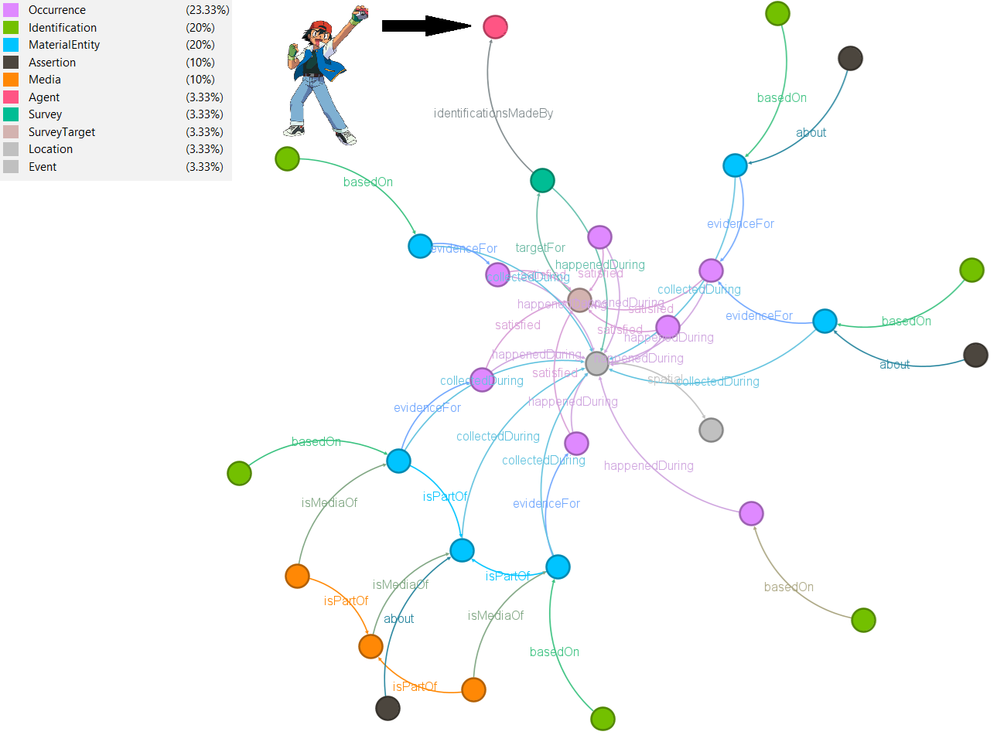

As can be seen, the graph reads like a book, and tells exactly the story researchers want it to say. This is crucial, as if biodiversity data is to be shared and reused among fellow researchers, first and foremost it needs to be fully understood. The set of terms in Darwin Core and the recently proposed Darwin Core DataPackage allow for the articulation of how the data are meant to be understood. To that end, the ontology in DWC-OWL allows for complex linking and eventually querying of these entities, maximizing reuse potential.

In the following section, each dataset is accompanied by a brief description of its structure, the modelling choices used to represent it in RDF, as well as a summary discussion of what worked well (and what did not). This work also serves as a series of real-world test cases against which the ontology can be evaluated and refined.

## Modelling process

Each dataset was obtained from a specific location on the web. In accordance with the FAIR principles, and to ensure proper attribution, the sources and creators of each dataset will be explicitly identified.

All datasets will be modelled using RDF and terms drawn from the DwC-OWL ontology. A Turtle serialization will be provided for each dataset, enabling loading and exploration in any RDF-compatible programming language. To the best of my knowledge, libraries for handling RDF data exist in all major programming languages (e.g., Python, JavaScript, Ruby).

Every resource will be assigned a unique Uniform Resource Identifier (URI). When possible, the URI supplied by the original dataset, preferably a Uniform Resource Name (URN), will be reused. If no stable identifier is available, a URI will be constructed using an example or placeholder namespace (e.g., http://example.org/). URIs built from this fictitious namespace will follow the convention http://bioboum.ca/{resource-class}/{resource-id}. When feasible, a persistent and resolvable Uniform Resource Locator (URL) from the web will be adopted.

Sometimes, in order to disentangle entities, URIs for resources will be built from each other. For example, an occurrence might have a URN-based URI like `<urn:catalog:{institution}:{project}:{occurrenceID}>` and a URN for its associated event would be built as `<urn:catalog:{institution}:{project}:{occurrenceID}-event>`.

The careful selection and construction of URIs is an important aspect of RDF modelling. A dedicated discussion of these considerations, particularly the distinctions and implications of URNs and URLs, and when both can be considered, will be provided separately.

Because datasets may be revisited and refined over time, the current modelling approaches should be considered provisional rather than definitive.

## Dataset outline

More than fifteen datasets have now been successfully represented in RDF following substantial modelling work. Rather than simply publishing the resulting RDF files and associated visualizations, each dataset will be accompanied by structured documentation to support interpretation by the research community. This approach also invites constructive critique regarding the modelling strategies employed.

Each dataset will therefore be described according to the following structure:

- **Dataset definition**: An overview of the dataset, including its geographic, temporal, and taxonomic scope. These set the ecological context of the dataset.

- **Dataset organization**: A description of the dataset’s structure and provenance, including where it was obtained. Direct links to where and how to obtain the dataset will be provided. The organization of the files will be presented here as well.

- **Modelling considerations**: An explanation of the modelling decisions applied to the dataset. This section will discuss how the data, usually in tabular form, was mapped onto the classes and object properties considered.

- **Ontology subset considered**: Although the DwC-OWL ontology contains a substantial number of classes and properties, only a subset is typically required. This section will outline the subset used for modelling the dataset. This will give a clearer idea of how the RDF data is structured.

- **Additions made**: Documentation of any supplemental data or interpretive additions introduced during the modelling process, clearly distinguished from the original dataset.

- **Difficulties encountered**: A discussion of challenges encountered during modelling, ranging from computational issues to conceptual questions about how best to represent certain entities.

- **Graph-based representation**: A visual representation of the dataset, in which nodes correspond to entities and edges correspond to the relations connecting them. A brief discussion will be provided to explain the resulting graph structure.

- **Lessons learned**: Reflections on insights gained through modelling the dataset and how these informed subsequent refinements to the DwC-OWL ontology. This section may also suggest directions for future modelling work.

## Real-world datasets

### Aulavik lemming nests

- **Dataset definition**: In order to monitor lemming populations in Arctic ecosystems, where they constitute a key food source for a wide range of predators, a long-term study of lemming abundance was conducted in Aulavik National Park, Canada. The study consists of annual counts of lemming nests at nine predetermined 1-hectare sampling plots within the park. Surveys were carried out each year in mid-July and span the period from 1999 through 2016.

- **Dataset organization**: The data, as a .csv file was downloaded from the [Government of Canada website](https://open.canada.ca/data/en/dataset/23694c59-ceec-4042-9e23-370b82e792a2). It consists of a single .csv file (though other formats can be requested) containing yearly counts of lemming nests for each sampling plot.

- **Modelling considerations**: For this dataset, explicit representation of `dcterms:Location` instances proved essential, as each location serves to tie together repeated yearly observations to the same sampling plot. Each yearly visit to a plot was modelled as a `dwc:Event`, while the nests observed during that visit were modelled as instances of `dwc:MaterialEntity`.

  For each event, a corresponding `dwc:MaterialEntity` instance was created whether nests was observed or not (this issue will be discussed later). This material entity then serves as evidence for a `dwc:Occurrence` which can represent the presence or absence of lemmings at the plot during that year. However, the Darwin Core vocabulary does currently support explicit enumeration of material entities, nor does it provide a direct mechanism for asserting that no instances of a material entity were observed.

  To address this limitation, this modelling approach makes use of two datatype properties provided by the DwC-DP model, which are `dwc:objectQuantity` and `dwc:objectQuantityType`. These properties were applied to material entities in order to represent the number of nests observed and allow explicitly state when zero nests were recorded at a given plot during a given year.

  This modelling choice also highlights a potential need for an additional object property to relate `dwc:MaterialEntity` instances to `dwc:Event` instances when material was observed but not physically collected. A candidate property such as `dwcdp:notedDuring` could serve this purpose, with `dwcdp:collectedDuring` defined as a subproperty indicating actual collection rather than observation alone.

- **Ontology subset considered**: The ontology subset used to model this dataset is relatively simple. Each yearly nest count is represented as a `dwc:Event`. Events occurring at the same sampling plot are linked to a shared `dcterms:Location` instance representing that plot. Each event is associated with a `dwc:MaterialEntity` corresponding to lemming nests, which in turn provides support for the presence or absence of a `dwc:Occurrence` of lemmings.

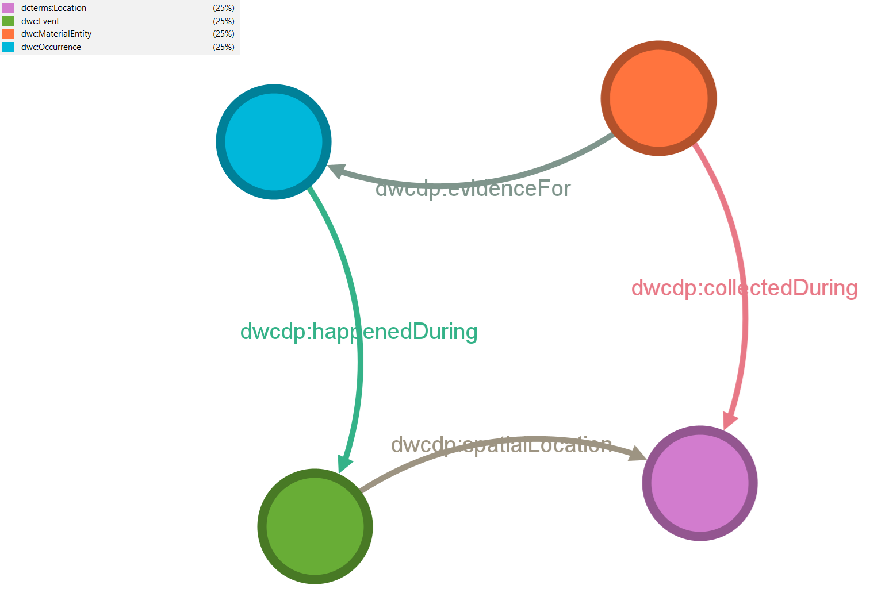

- **Additions made**: An instance of `dwc:Provenance` was created to describe the dataset as a whole. This provenance entity was linked to Parks Canada, modelled as a `dcterms:Agent`, acting as the publisher of the dataset.

  An online [document by Parks Canada mentioning the project](http://parkscanadahistory.com/publications/wafu/annual-report-e-2008.pdf) mentions that `all nests found were ripped apart to avoid recounting them the next year`. Nests are abandoned in spring and not reused, so they can be counted and handled without harming the animals. The entry was added as a `dwc:materialEntityRemarks` for all nests with a value of `dwc:objectQuantity` higher than `0` and related to a `dwc:Event` that had a `dwc:eventDate` of `2008` or earlier. As the document came out in 2008, no such statement can be ascertained for nests after this date.

  Finally, each sampling plot was modelled as an instance of `dcterms:Location` and populated with appropriate geographic context for Aulavik National Park. As no plot-specific coordinates were provided, plots were distinguished using a simple identifier scheme of the form `Plot {number}` as the value of `dwc:locationID`.

- **Difficulties encountered**: The principal modelling challenge for this dataset concerns how to represent the explicit absence of lemming nests during a yearly survey. When nests are observed, modelling is straightforward: a `dwc:MaterialEntity` instance is created, which supports a `dwc:Occurrence` of lemmings. However, confidently asserting that no nests were observed, and that this absence supports the absence of lemming occurrences, requires more careful treatment.

  This is essentially related to whether biodiversity data expressed as RDF would consider an Open World Assumption (OWA) or not. Under an OWA, absence of information does not indicate information of absence. Consequently, an event for which no nests are reported could, in principle, still have nests that were simply not recorded.

  To address this, the modelling explicitly includes a `dwc:MaterialEntity` with a value of `dwc:objectQuantity` equal to `0`. This asserts that the event took place and that no nest material was observed at the plot during that year. This assertion is further reinforced by creating a corresponding `dwc:Occurrence` instance with `dwc:occurrenceStatus` set to the controlled vocabulary value `absent`.

  A secondary issue concerns taxonomic resolution. Two species of lemmings occur in Aulavik National Park: the brown lemming (*Lemmus trimucronatus*) and the northern collared lemming (*Dicrostonyx groenlandicus*). Because these species belong to different genera, and because assigning the family Cricetidae would be overly broad, the occurrences were modelled using the `dwc:vernacularName` of `lemming`, rather than a more accurate scienitific designation.

- **Graph-based representation**: The graph structure for this dataset is relatively simple. At its center is the `dwc:Provenance` instance, which links to all yearly nest counts modelled as `dwc:Event` instances. Events corresponding to the same sampling plot are connected to the shared `dcterms:Location` representing that plot.

  Each event is associated with a `dwc:MaterialEntity`, which may have a `dwc:objectQuantity` value of `0`. This material entity supports a `dwc:Occurrence` of lemmings, which may in turn have a value of absent for `dwc:occurrenceStatus`.

  From a purely relational perspective in the graph, material entities with a quantity of `0` are not visually distinguishable from those with positive quantities, nor are `absent` occurrences visually distinct from `present` ones. Distinguishing these cases requires inspection of the datatype properties in the serialized data.

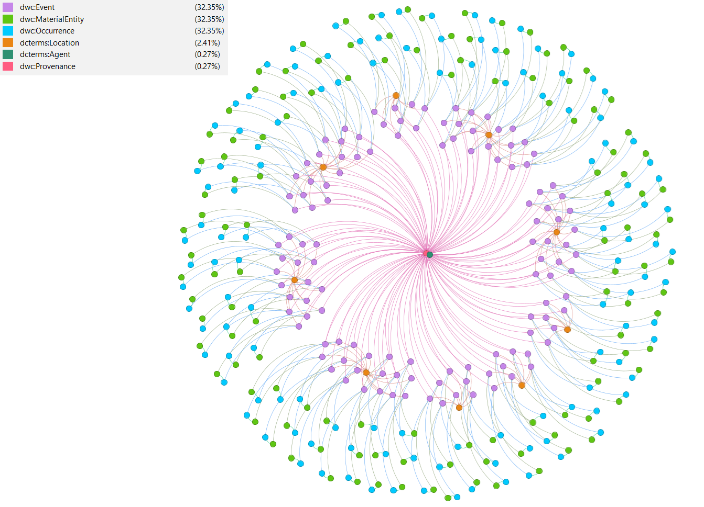

- **Lessons learned**: A lot of biodiversity data treats with direct observation of organisms as the basis for a `dwc:Occurrence`. However, this dataset illustrates cases where material traces, such as the example of lemming nests, form the primary evidence for inferring occurrence or absence. Being able to explicitly and confidently assert taxon absence on the basis of such material entities is a critical requirement for long-term monitoring studies.

  Although the taxon considered here is lemmings, similar sampling designs and inferential challenges arise in other contexts, such as bird nest surveys and other indirect observation programmes.

### BROKE-West fish

- **Dataset definition**: During the the BROKE-West cruise of RV Aurora Australis from January 2nd to March 17th, 2006, fish were sampled in the CCAMLR subarea of the Antarctic coastline. Sampling was conducted using Rectangular Midwater Trawl (RMT) nets to target midwater fish. Two trawling methods were employed: target trawls directed at acoustically detected aggregations, and routine double oblique hauls from the surface down to 200 m and back. The study considers a variety of material entities derived from the caught fish, as well as media images of these entities.

- **Dataset organization**: The dataset, as a Darwin Core DataPackage was obtained [from the GBIF test IPT](https://dwcdp-ipt.gbif-test.org/resource?r=broke-west-fish). The DataPackage contains 22 .csv files, corresponding to the different tables [based on the suggested DwC-DP SQL schema](https://raw.githubusercontent.com/gbif/dwc-dp-examples/refs/heads/master/gbif/dwc_dp_schema.sql).

- **Modelling considerations**: Although modelling this dataset requires a relatively high number of classes (fifteen), the overall approach is not particularly complex once the dataset structure is understood and have seen enough examples on this page. For instance, `dwc:Occurrences` take place within nested `dwc:Events`, which are conducted by `dcterms:Agents`. The relationships defined in the ontology closely mirror the structure of the dataset itself. This highlights evidenced by the thoughtful laying out of the tables and their relationships in the DwCDP model.

  One modelling aspect that deserves special attention, and which will be discussed further in a subsequent section, is the handling of entries in the `agent-agent-role.csv` table. This table relates individual `dcterms:Agent` instances to another `dcterms:Agent` representing a collective or group. These group agents are then related to scientific publications, modelled as `dcterms:BibliographicResource`, via authorship relationships. While this approach is conceptually straightforward, it introduces additional complexity that may not always be necessary.

  Because this table represents relationships between pairs of `rdfs:Resource` instances (or `owl:Thing`, depending on how you model it), `dwc:AgentAgentRole` class was treated here as a subclass of the more general `dwc:ResourceRelationship`. As such, it inherits properties from its parent class, while allowing additional properties to capture more specific information, such as author order within a publication.

  Another modelling challenge concerns the representation of protocols associated with event assertions, material entities, and surveys. This is addressed by defining the range of the object property `dwcdp:follows` as `dwc:Protocol`, while allowing for a broad domain that includes `dwc:Assertion`, `dwc:MaterialEntity`, and `eco:Survey`.

- **Ontology subset considered**: Compared to the other datasets examined, the Broke-West fish dataset requires a relatively large number of classes and a complex network of relationships. Nevertheless, the structure of these relationships remains conceptually straightforward.

  Without exhaustively describing the entire graph, several notable features deserve mention:

  - The instances of `dcterms:Agent` can play multiple roles, as reflected by the numerous relationships pointing toward them.
  - Instances from several classes can be related to `dwc:Protocol` through the `dwcdp:follows` object property.
  - Instances of `dwc:Event` can be nested within other `dwc:Event` instances via `dwcdp:happenedDuring`.
  - `dwc:MaterialEntity` instances can themselves be derived from other `dwc:MaterialEntity` instances using the `dwcdp:derivedFrom` object property.

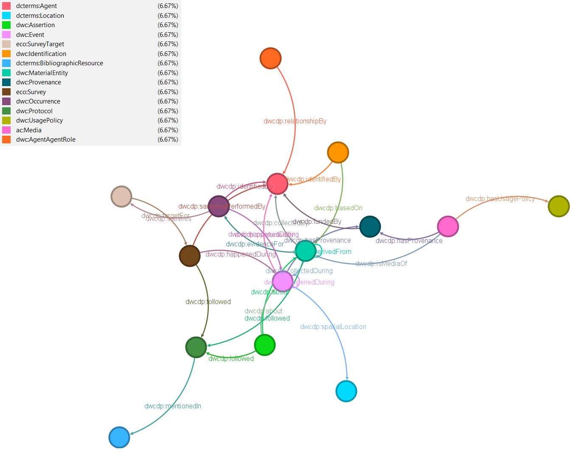

- **Additions made**: Given the level of documenting of the dataset, no considerable additions were made. The researcher Yi-Ming Gan, who provided metadata for the currently up to 18 versions of the dataset on the test IPT was modeled as a `dcterms:Agent` and added to the dataset as a metadata provider.

- **Difficulties encountered**: The dataset is exceptionally well annotated: IRIs are provided for nearly every measurement, and all fields are carefully documented. Nevertheless, four specific issues were identified during modelling:

  2. The `agent-agent-role.txt` table was also a bit of an issue to deal with. Indeed, there is already the object property `dwcdp:authoredBy`, which is a subproperty of `dcterms:creator` to link bibliographic resources to their authors. Consequently, consideration of such a concept seemed like a making the relationship between authors and bibliographic resource more complex. Likewise, no such approach can be taken if the bibliographic resource considers a single author. However, such an approach can have its merit if:

    - The contribution to the bibliographic resource might need to be more detailed. For example, the property `dwc:agentRoleOrder` allows the consideration of the author order in a group of authors. A similar approach can consider RDF lists, but would require consideration of all authors to preserve numerical order.
    - The relationship between two `dcterms:Agents` needs to be more defined. For example, one agent might be a researcher, and another might be an institution. The relationship might be more fleshed out through roles and periods, through which the role was active.

  If both possibilities are considered (i.e. allowing `dcterms:Agent` to represent both individual authors and groups of authors), users should be made aware of it so as to not hit a stumbling block during queries. Suppose that the triples were loaded into a triplestore and exposed through a SPARQL endpoint. The simple following SPARQL query which, for brevity's sake, considers property paths, can be used to make the matter clearer:

  ```sparql
  PREFIX dcterms: <http://purl.org/dc/terms/>
  PREFIX dwc: <http://rs.tdwg.org/dwc/terms/>
  PREFIX dwcdp: <http://rs.tdwg.org/dwcdp/terms/>
  
  SELECT ?occ
  
  WHERE {
    ?occ a dwc:Occurrence ;
         dwcdp:happenedDuring/^dwcdp:happenedDuring/dwcdp:followed/dwcdp:mentionedIn ?bib .
  
      ?bib a dcterms:BibliographicResource ;
           dwcdp:authoredBy <https://orcid.org/0000-0002-2042-5095> .
  }
  ```

  Where `<https://orcid.org/0000-0002-2042-5095>` is the ORCiD ID of Kawaguchi So, the principal author of the protocol used for the surveys in the study. This query should return all occurrences that followed a `dwc:Protocol` that was mentioned in a `dcterms:BibliographicResource` authored by So Kawaguchi. Surprisingly, this query will come up empty, because he is not the author of his own paper. To be technical, the group of authors, modeled as a `dcterms:Agent`, of which he is part of, is the actual author. This can be seen in the following query, which successfully retrieves the data:

  ```sparql
  PREFIX dcterms: <http://purl.org/dc/terms/>
  PREFIX dwc: <http://rs.tdwg.org/dwc/terms/>
  PREFIX dwcdp: <http://rs.tdwg.org/dwcdp/terms/>
  
  SELECT ?occ
  
  WHERE {
    ?occ a dwc:Occurrence ;
         dwcdp:happenedDuring/^dwcdp:happenedDuring/dwcdp:followed/dwcdp:mentionedIn ?bib .
  
    ?bib a dcterms:BibliographicResource ;
         dwcdp:authoredBy ?agentG .
      
    ?agentG a dcterms:Agent ;
            ^dwcdp:relationshipWith ?aARole .
            
    ?aARole a dwc:AgentAgentRole ;
            dwc:relationshipOfResource "isPartOf" ;
            dwcdp:relationshipBy <https://orcid.org/0000-0002-2042-5095> .
  }
  ```

  This query succeeds because it does not ask for a bibliographic resource where Kawaguchi So is the author, but rather for those where he is part of the agent that is the author. Note that, there is a quicker way to write the query, once again using property paths, which would link the bibliographic resource to Kawaguchi So as `dwcdp:authoredBy/^dwcdp:relationshipWith/dwcdp:relationshipBy <https://orcid.org/0000-0002-2042-5095> .`. However, the risk of proceeding in this manner is that it would return data irrespective of the relationship Kawaguchi So has with regards to the author group (e.g. he might be a role not directly involved with authorship).

  Finally, note that, if both paths are allowed for data entry, a safer way to query the triplestore would be:

  ```sparql
  PREFIX dcterms: <http://purl.org/dc/terms/>
  PREFIX dwc: <http://rs.tdwg.org/dwc/terms/>
  PREFIX dwcdp: <http://rs.tdwg.org/dwcdp/terms/>

  SELECT ?occ

  WHERE {
        ?occ a dwc:Occurrence ;
           dwcdp:happenedDuring/^dwcdp:happenedDuring/dwcdp:followed/dwcdp:mentionedIn ?bib .
 
    {
      ?bib a dcterms:BibliographicResource ;
           dwcdp:authoredBy <https://orcid.org/0000-0002-2042-5095> .
    }
    UNION
    {
      ?bib a dcterms:BibliographicResource ;
           dwcdp:authoredBy ?agentG .

      ?agentG a dcterms:Agent ;
              ^dwcdp:relationshipWith ?aARole .
  
      ?aARole a dwc:AgentAgentRole ;
               dwc:relationshipOfResource "isPartOf" ;
               dwcdp:relationshipBy <https://orcid.org/0000-0002-2042-5095> .
    }
  }
  ```

  This query requests the same data, but for either a bibliographic resource where Kawaguchi So is the author OR by a group of authors of which he is part of. The joy of SPARQL.

  2. The term of `eco:SurveyTarget` is very recent, having been proposed along with the DwCDP publishing model. It plays a role similar to the existing terms of `eco:targetDegreeOfEstablishmentScope`, `eco:targetGrowthFormScope`, `eco:targetHabitatScope`, `eco:targetLifeStageScope` and `eco:targetTaxonomicScope` in the Humboldt Extension Vocabulary. However, in this case, the use of the terms `eco:surveyTargetType`, `eco:surveyTargetValue` and possibly `eco:surveyTargetUnit` allow for a more detailed definition of the survey target of a study. For example, a survey target may be defined in terms of body size, which was not considered in the previous terms.

  This brings the issue of the following two nodes:

  ```turtle
  <https://bioboum.ca/survey-target/broke-west-rmt-003-rmt8-234582> a eco:SurveyTarget ;
      dwcdp:surveyID "BROKE_WEST_RMT_003_RMT8" ;
      dwcdp:surveyTargetID "BROKE_WEST_RMT_003_RMT8_234582" ;
      dwcdp:targetFor <https://www.bioboum.ca/survey/broke-west-rmt-003-rmt8> ;
      bb:hasDefinition [ dcterms:type dwc:taxon ;
              eco:includeOrExclude "include" ;
              eco:isSurveyTargetFullyReported true ;
              eco:surveyTargetType "taxon" ;
              eco:surveyTargetTypeIRI dwc:taxon ;
              eco:surveyTargetValue "Chionodraco" ;
             eco:surveyTargetValueIRI <urn:lsid:marinespecies.org:taxname:234582> ],
          [ dcterms:type dwc:taxonRank ;
              eco:includeOrExclude "include" ;
              eco:isSurveyTargetFullyReported true ;
              eco:surveyTargetType "taxonRank" ;
              eco:surveyTargetTypeIRI dwc:taxonRank ;
              eco:surveyTargetValue "Genus" ;
              eco:surveyTargetValueIRI dwc:genus ],
          [ dcterms:type <http://vocab.nerc.ac.uk/collection/P01/current/OBSMINLX/> ;
              eco:includeOrExclude "include" ;
              eco:isSurveyTargetFullyReported true ;
              eco:surveyTargetType "minimum body size" ;
              eco:surveyTargetTypeIRI <http://vocab.nerc.ac.uk/collection/P01/current/OBSMINLX/> ;
              eco:surveyTargetUnit "mm" ;
              eco:surveyTargetUnitIRI <http://vocab.nerc.ac.uk/collection/P06/current/UXMM/> ;
              eco:surveyTargetValue "0.85" ],
          [ dcterms:type <http://vocab.nerc.ac.uk/collection/P01/current/OBSMAXLX/> ;
              eco:includeOrExclude "include" ;
              eco:isSurveyTargetFullyReported true ;
              eco:surveyTargetType "maximum body size" ;
              eco:surveyTargetTypeIRI <http://vocab.nerc.ac.uk/collection/P01/current/OBSMAXLX/> ;
              eco:surveyTargetUnit "m" ;
              eco:surveyTargetUnitIRI <http://vocab.nerc.ac.uk/collection/P06/current/ULAA/> ;
              eco:surveyTargetValue "3" ] .

  <https://bioboum.ca/survey-target/broke-west-rmt-016-rmt8-234582> a eco:SurveyTarget ;
      dwcdp:surveyID "BROKE_WEST_RMT_016_RMT8" ;
      dwcdp:surveyTargetID "BROKE_WEST_RMT_016_RMT8_234582" ;
      dwcdp:targetFor <https://www.bioboum.ca/survey/broke-west-rmt-016-rmt8> ;
      bb:hasDefinition [ dcterms:type <http://vocab.nerc.ac.uk/collection/P01/current/OBSMINLX/> ;
              eco:includeOrExclude "include" ;
              eco:isSurveyTargetFullyReported true ;
              eco:surveyTargetType "minimum body size" ;
              eco:surveyTargetTypeIRI <http://vocab.nerc.ac.uk/collection/P01/current/OBSMINLX/> ;
              eco:surveyTargetUnit "mm" ;
              eco:surveyTargetUnitIRI <http://vocab.nerc.ac.uk/collection/P06/current/UXMM/> ;
              eco:surveyTargetValue "0.85" ],
          [ dcterms:type dwc:taxon ;
              eco:includeOrExclude "include" ;
              eco:isSurveyTargetFullyReported true ;
              eco:surveyTargetType "taxon" ;
              eco:surveyTargetTypeIRI dwc:taxon ;
              eco:surveyTargetValue "Chionodraco" ;
              eco:surveyTargetValueIRI <urn:lsid:marinespecies.org:taxname:234582> ],
          [ dcterms:type dwc:taxonRank ;
              eco:includeOrExclude "include" ;
              eco:isSurveyTargetFullyReported true ;
              eco:surveyTargetType "taxonRank" ;
              eco:surveyTargetTypeIRI dwc:taxonRank ;
              eco:surveyTargetValue "Genus" ;
              eco:surveyTargetValueIRI dwc:genus ],
          [ dcterms:type <http://vocab.nerc.ac.uk/collection/P01/current/OBSMAXLX/> ;
              eco:includeOrExclude "include" ;
              eco:isSurveyTargetFullyReported true ;
              eco:surveyTargetType "maximum body size" ;
              eco:surveyTargetTypeIRI <http://vocab.nerc.ac.uk/collection/P01/current/OBSMAXLX/> ;
              eco:surveyTargetUnit "m" ;
              eco:surveyTargetUnitIRI <http://vocab.nerc.ac.uk/collection/P06/current/ULAA/> ;
              eco:surveyTargetValue "3" ] .
  ```

  Taking into account the fact that the order of the blank nodes do not matter, both nodes are identical with regards to their definition of the survey target. Both of these survey targets correspond to `consider every organism that belongs to the genus Chionodraco and whose body size falls between 0.85 mm and 3 m`. The only noticeable differences are their URIs and the URI of the `eco:Survey` they are a target for. However, seeing as they are the same target, fusioning these two nodes might be considered, so as to reduce the number of repetitive `eco:SurveyTarget` nodes.

  3. A total of six protols are given in the `protocol.csv` table, `ctd`, `dry_mass_and_energy_content`, `light_conditions` `RMT_Routine`, `RMT_Target`, `stomach_content`. Accordingly, each was modeled as a `dwc:Protocol` with corresponding entries. However, only two, `ctd` and `light_conditions` are directly referenced by their protocolID in the tables.

  For `dry_mass_and_energy_content`, there should have been columns for `assertionProtocols` and `assertionProtocolID` to link it back to this protocol in the `material-assertion.csv` table. This approach was taken, by adding entries for these fields when the entry for `dwc:assertionType` was `Energy Content Dry Weight`.

  For `stomach_content`, the approach would have been different. In this case, [based on the suggested DwC-DP SQL schema](https://raw.githubusercontent.com/gbif/dwc-dp-examples/refs/heads/master/gbif/dwc_dp_schema.sql), a junction table of `material_protocol` would need to be created, joining entries from both tables. When converting this dataset to RDF, when the entry for `materialEntityType` contained the string `stomachContent`, a relationship to the corresponding protocol was established. Note that this will also consider all minor variations (which should be correct, to the best of my knowledge), such as `stomachContent - mucus`, `stomachContent - st wall` or `stomachContent - facet eye`.

  The same issue came up for `RMT_Target` and `RMT_Routine`, where a junction table of `survey_protocol` would need to be considered. In this case, `dwcdp:follows` was used to relate the `eco:Survey` to the `dwc:Protocol` of `RMT_Routine` whenever the value of `eco:protocolNames` corresponded to `Pre-planned routine hauls with standard double oblique tow` and to `RMT_Target` whenever the value corresponded to `target trawls on acoustically detected aggregations`.

  4. Though minor, it should be noted that one instance of `dwc:MaterialEntity`, whose corresponding `dwc:materialEntityID` value is `AAV3FF_00261` has the entry of `?` for `dwc:preparations`. It is a preserved whole organism of *Gymnodraco acuticeps*. The use of the question mark is not so much the issue, but does indicate that preservation methods are unknown. The actual issue is that this same material entity has a corresponding entry in the `material-assertion.txt` table with a blank cell. Blindly considering it in RDF would lead to the following node:

  ```turtle
  <https://bioboum.ca/assertion/aav3ff-00261-presrvation> a dwc:Assertion ;
      dwcdp:about <https://bioboum.ca/material-entity/aav3ff-00261> ;
      dwc:assertionID "AAV3FF_00261_presrvation" ;
      dwc:assertionType "Preservation Method" ;
      dwc:materialEntityID "AAV3FF_00261" .
  ```

  If we were to enforce a contraint that every value of `dwc:assertionType` must have an accompanying value of `dwc:assertionValue` (and vice-versa), then this node would not pass this constraint. If the preservation is unknown, it would be best to remove it. In the analysis, the entry in `material.txt` and corresponding the row in `material-assertion` have been removed.

- **Graph-based representation**: The graph seems to be separated between to sections, with clusters of nodes on the sides, giving it the appearance of a creature like a sea-angel, interesting considering the dataset.

  The "head" part consists essentially of `dwc:Assertions` about `dwc:Events`. More specifically, these are the assertions that followed two particular protocols, `ctd` and `light_conditions`. This has the effect of pulling the `dwc:Events` upwards, which is also shown by the fact that the node for the parent event of the entire cruise and of the `dcterms:Agent` responsible for conducting the eventh (the RV Aurora Australis) are in the "neck" region.

  The "torso" part is centered around a `dcterms:Agent` node, representing the researcher Anton Van de Putte. The reason behind this is that he is credited with carrying out the sampling in the surveys, carrying out recording and identifications of the occurrences, as well as the collections and identifications of the material entities.

  The "tail" part is made up of an `dwc:Occurrence` and a `dwc:Protocol` node. These correspond to an occurrence of *Pleurogramma antarcticum* with a `dwc:occurrenceID` of `BROKE_WEST_RMT_022_RMT8_234721`. The reason behind this is that this occurrence consists of 94 individuals, all of which were preserved through various methods, becoming `dwc:MaterialEntities`.

  Finally, the "arms" are `eco:Survey` instances, with their associated `eco:SurveyTargets`. These relate to the `dwc:Events` during which the surveys take place and the `dwc:Occurrences` that satisfy the survey targets.

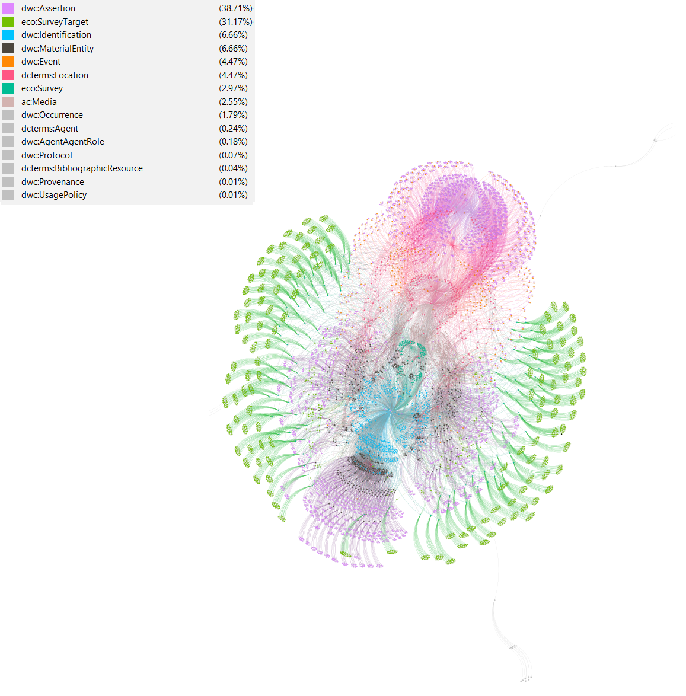

- **Lessons learned**: This dataset demonstrates how fully leveraging the DwC-DP model enables a rich, standardized, and explicit description of how data were generated. While the resulting model is complex, it is also complete, reducing reliance on external documentation such as README files and facilitating direct reuse through structured querying.

### Colombia bird ringing

- **Dataset definition**: As part of SELVA's Migration Ecology research program to study the ecology of migratory birds across ten departments in Colombia, a set of mist nets were set up across Colombia to study wild birds. This study would enable a better understanding of bird patterns, especially at stopover sites and for key conservation species such as the cerulean warbler (*Setophaga cerulea*) and the blackpoll warbler (*Setophaga striata*). Between 2018 and 2023, a total of 5 581 birds were recorded, banded and had measurements taken before being released into the wild.

- **Dataset organization**: The dataset can be downloaded [from GBIF](https://www.gbif.org/dataset/9407c83f-8690-4965-b4fb-48e8911d9430). The dataset contains the the standard `occurrence.txt` table that contains information about the bird occurrences and an `extendedmeasurementorfact.txt` table that contains information about the bird traits. In addition, it also includes a `permit.txt` file that contains information about a collecting permit that allowed for the project to take place.

- **Modelling considerations**: Each ringed bird was modelled as an individual `dwc:Organism`. The ring inscription was recorded as the organism’s identifier. Individual morphological and biometrical measurements (mass, wing length, etc.) were modelled as `dwc:Assertion` instances associated with the `dwc:Organism`. Taxonomic identifications were modelled using `dwc:Identification` which also targeted the individual.

  The permit metadata are represented as a `dwc:Permit` class, which links to the sampling events that it authorises. Permit properties from the GGBN Permit Extension, `ggbn:permitStatus` and `ggbn:permitType`, were used to record controlled-vocabulary values, as these should be represented as URIs drawn from the GGBN vocabularies.

- **Ontology subset considered**: The core classes of `dwc:Organism`, `dwc:Occurrence`, `dwc:Event`, `dcterms:Location` and `dwc:Assertion` were used to model the bird captures and their measured traits. In this case the permit issuing authority is modeled as a `dcterms:Agent`.

  Permit-related modelling introduces `dwc:Permit` class, together with additional classes of `dwc:PermitStatus` and `dwc:PermitType` that aggregate the GGBN permit vocabulary terms, represented as SKOS concepts.

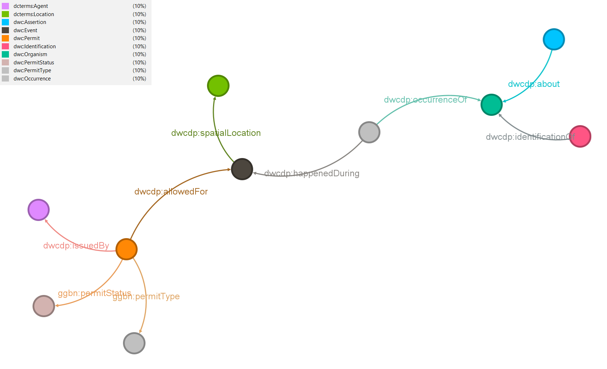

- **Additions made**: In the `permit.txt` file, the entry for `ggbn:permitText` is `ANLA:01102:2022:SELVA`. This identifier seems to be referring to the permit that is considered in the study. It would be valid to assume that `ANLA` would stand for [Autoridad Nacional de Licencias Ambientales](https://www.anla.gov.co/), being the body that issued the permit. Consequently, the ANLA was modeled as a `dcterms:Agent` that issued the permit.

  The permit extension allows the addition of legal status of material (specimen, tissue, DNA, etc.). However, the vocabulary is made up mainly of `skos:Concepts`, which even though they have their applications, are difficult to frame within an ontology. This is partly due to the fact that `skos:Concepts` have no inherent hierarchy, as they are all instances of the class `skos:Concept` and are linked together through `skos:broader` and `skos:narrower` relationships and are grouped into `skos:ConceptSchemes`. Nonetheless, they are useful ways to organise sets of terms that do not require strong hierarchical structure.

  Semantically, it requires the creation of a new class, `dwc:Permit`, which can be linked to these these properties. Accordingly, two new object properties are created `dwcdp:allowsFor` and `dwcdp:issuedBy`. The first, `dwcdp:allowsFor`, links the `dwc:Permit` instance to the `dwc:Events` it allows for. This relationship is one-to-many, as one permit is valid for carrying out several sampling events. The second, `dwcdp:issuedBy`, relates the `dwc:Permit` to the `dcterms:Agent` that issued it. This `dcterms:Agent` is usually a governmental organization, responsible for evaluating, granting, and monitoring environmental licenses and permits, such as ANLA in Colombia.

- **Difficulties encountered**: The main issue encountered with the modeling of this dataset was with regards to the `permit.txt` extension, most notably, how the enties are handled. Each row in this table is identified by the occurrence identifier, and therefore relates each occurrence to the permit. Consider the following line:

| id                         | permitType                                                   | permitStatus    | permitText            |
|----------------------------|--------------------------------------------------------------|-----------------|-----------------------|
| SELVA:anillamiento:BB05234 | Permiso de recolección de especímenes de especies silvestres | Permiso vigente | ANLA:01102:2022:SELVA |

  This entry presents several difficulties which make its translation into RDF difficult. Therefore, the following modifications were considered:
  
  1. The value of `ANLA:01102:2022:SELVA` was not considered as a valid entry for `ggbn:permitText`, it was used instead as the URI for the `dwc:Permit`.
  2. The free-form text of `"Permiso de recolección de especímenes de especies silvestres"@es` was used as the value of `ggbn:permitText`.
  3. The value of `ggbn:permitType` needs to be a URI, and one from a controlled vocabulary, the one established by the GGBN Permit Type Vocabulary. Given the Spanish description of the permit, the URI for Collecting Permit, `<http://data.ggbn.org/schemas/GGBN/terms/vocabulary/permit_type/Collection_Permit>`, was chosen.
  4. The value of `ggbn:permitStatus` needs to be a URI, and one from a controlled vocabulary, the one established by the GGBN Permit Status Vocabulary. Given the Spanish description of the permit, the URI for Collecting Permit, there seems to be no exact match. The closest that could be found is the URI for Permit Available `<http://data.ggbn.org/schemas/ggbn/terms/Permit_available>`, which was chosen.
  5. In the `id` column is the value of a `dwc:Occurrence`. However, from a semantic point of view it does not make sense for a permit to allow for an occurrence to take place. A `dwc:Permit` would be best described as a document allowing for the conduction of an activity. In this case.
  Note that the range of the object 
  
  Note that these terms are instances of `skos:Concepts` so though they represent valid URIs, they do not fit directly within an ontology. To accomodate their usage in DwC-OWL, OWL classes, which are subclasses of `skos:Concept` were created. Doing so allows all the terms in the vocabulary to be collected and enumerated under one class, something that cannot be done with a `skos:ConceptScheme`. Furthermore, by proceeding in this manner, all instances of this subclass remain valid `skos:Concepts`, which does not change their semantic interpretation.

  Note also, that row 11078 in the `extendedmeasurementorfact.txt` will cause a breakage in the parser, as the weight of the bird is given as `12,7` g, which is not a valid number.

- **Graph-based representation**: At the center of the graph are two entities, the single `dwc:Permit` and the set of `dcterms:Locations`. The single permit is related to all `dwc:Events` as it allowed for them. The fact that there are so few `dcterms:Locations` is due to the fixed nature of the mist nets. Several bird captures, modeled as `dwc:Events` can happen, but they will be at the same geographic spot, which is where the mist nets are positioned. The `dwc:Events`, representing the capture of each bird cluster around these points.

  These events are linked to information about each individual `dwc:Organism`, representing each individual bird. Each bird has a `dwc:Occurrence`, which represents its capture; a `dwc:Identification`, which represents its taxonomic assignment; and a set of `dwc:Assertions` which provide information about each measurement taken on it.

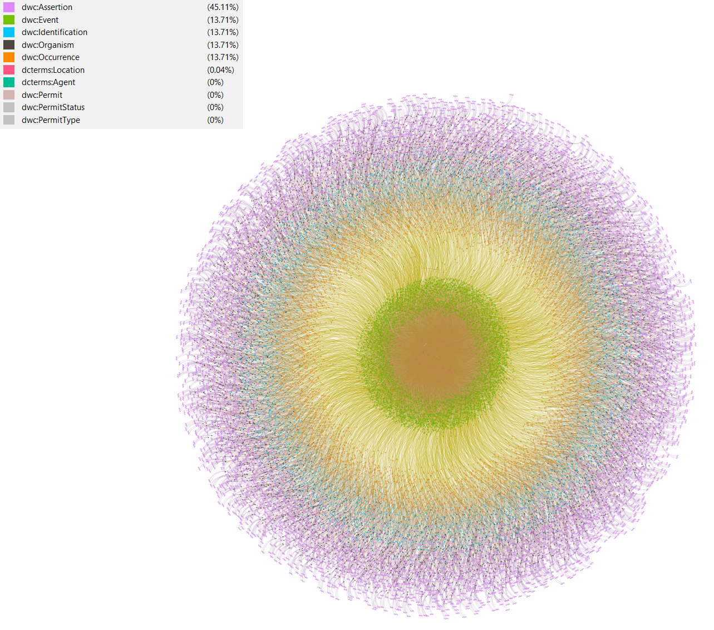

- **Lessons learned**: The original consideration in this dataset is the consideration of a novel `dwc:Permit` class and its associated classes for the controlled. This class has not been proposed in the DwC-DP model, so it should not be considered authoritative. However, its consideration might prove necessary in cases like this, where permit information is available and can be added. Nonetheless, it will offer an example of how permit information can be supplied in biodiversity datasets. This can be especially important when dealing with sensitive species, or species for which handling requires particular governmental accreditation.

  One main point of contention would be whether or not the permit vocabulary is applicable to events and occurrences. The permit vocabulary is mentionned as having `a 1:many relation for 1 specimen, tissue, or DNA record` and that it `has to be used with the new defined Material Sample Core (not the Occurrence Core)`. However, there is evidently interest, as there is a published occurrence dataset that makes use of the extension (albeit without respecting the controlled vocabulary aspect).

  Though the terms seem independent, they are semantically linked. For example, a preserved specimen in a collection or in a herbarium may represent a material sample, but has an associated occurrence when it was taken. Likewise, a soil or water sample may be a material entity, but from it several occurrences can be derived through either taxonomic analysis or genomic sequencing.

### Crop pollinisator visits

- **Dataset definition**: Between 2017 and 2021, the National Agriculture and Food Research Organization (NARO) of Japan conducted a series of monitoring activities focusing on insects visiting crop flowers across the country. At multiple farms, wild insects visiting crop production trees were captured and preserved in plastic vials. These preserved organisms were later identified to assess the abundance and diversity of pollinators contributing to crop production.

- **Dataset organization**: The dataset, published as a Sampling event Darwin Core Archive, was downloaded [from GBIF](https://www.gbif.org/dataset/bbaca86c-f703-41fc-800a-fa301c0661fd). It includes two tab-delimited text files: `occurrence.txt`, which contains records of individual insect occurrences; and `event.txt`, which provides information about each sampling event—typically a single day, or occasionally a series of days, during which crop trees were monitored for flower-visiting insects.

- **Modelling considerations**: In `occurrence.txt`, each row corresponds to an insect that visited a flower, was captured, and later identified. This single row therefore conflates several distinct entities that must be separated in RDF. Specifically:
  
  1. The `dwc:Occurrence` describing the insect's presence
  2. The `dwc:MaterialEntity` representing the preserved specimen
  3. The `dwc:Identification` assigned to that specimen

  In the same way, the `event.txt` file also conflates two conceptual entities: the `dwc:Event` itself and the `eco:Survey` conducted within that event. This has proven to be a recurring pattern when converting Darwin Core Archives to RDF: multiple conceptual layers are often represented within the same row and must be disentangled.

- **Ontology subset considered**: Six classes were required to model this dataset: `dwc:Occurrence`, `dwc:MaterialEntity`, `dwc:Identification`, `dwc:Event`, `dcterms:Location`, and `eco:Survey`. Their relationships are tightly interwoven: the material entity, the occurrence, and the event form a closed loop. This is because both the occurrence and the material entity connect to the event, but the material entity also connects to the occurrence as well, as it is the evidence for this occurrence. Note that the object property `dwcdp:happenedDuring` is used twice, once to relate each `dwc:Occurrence` to its `dwc:Event`, and again to relate the `eco:Survey` to the same `dwc:Event`. Altogether, the graph faithfully represents both the data-collection process and the intended interpretation of the dataset.

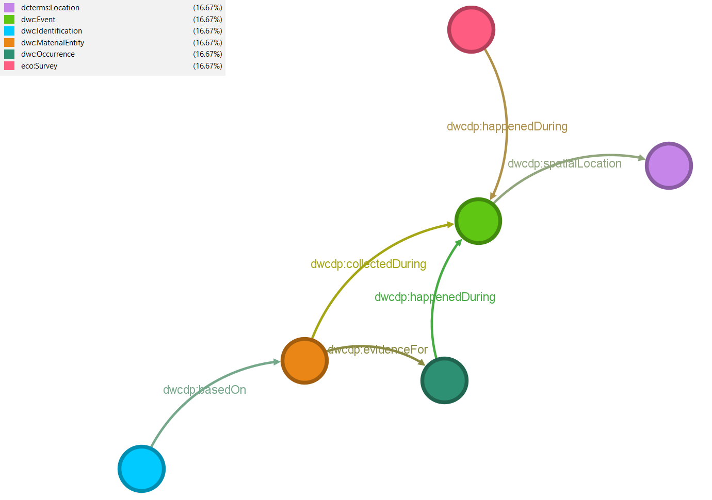

- **Additions made**: The survey followed a documented scientific protocol referenced in a published article. This was modelled using instances of `dwc:Protocol` and `dcterms:BibliographicResource`. The authors of the publication were modeled as `dcterms:Agents` and linked accordingly.

- **Difficulties encountered**: As noted earlier, one of the principal challenges when modelling Darwin Core Archives in RDF is separating the distinct entities implied by each table row. Although the DwC-OWL ontology provides domains and ranges for each property, difficulties may also arise from the identifiers used in the dataset.

  In this case, each `dwc:occurrenceID` is a URN, such as `urn:catalog:NIAES:Pollinators:AK17-16`. While such URNs can be treated as URIs, they almost certainly represent the identifier of the preserved specimen rather than of the occurrence itself. For this reason, the URN was assigned to the `dwc:MaterialEntity` rather than to the occurrence.

  Since the dataset is already published on GBIF, both events and occurrences have stable URLs. Events follow the pattern https://www.gbif.org/dataset/{dataset-key}/event/{eventID}, which for this dataset will be https://www.gbif.org/dataset/bbaca86c-f703-41fc-800a-fa301c0661fd/event/{eventID}. Occurrence URLs are a different matter, but can be retrieved via the GBIF API. A small Python script will be used to demonstrate how to incorporate both URLs and URNs in RDF serialization.

- **Graph-based representation**: The `dwc:Protocol` instance functions as a central hub within the graph. All `eco:Survey` instances radiate outward, representing surveys conducted under the same protocol. Each survey is linked to its corresponding `dwc:Event`. The multiple `dwc:Occurrences` associated with each event create the characteristic "flower-like" appearance of the directed graph.

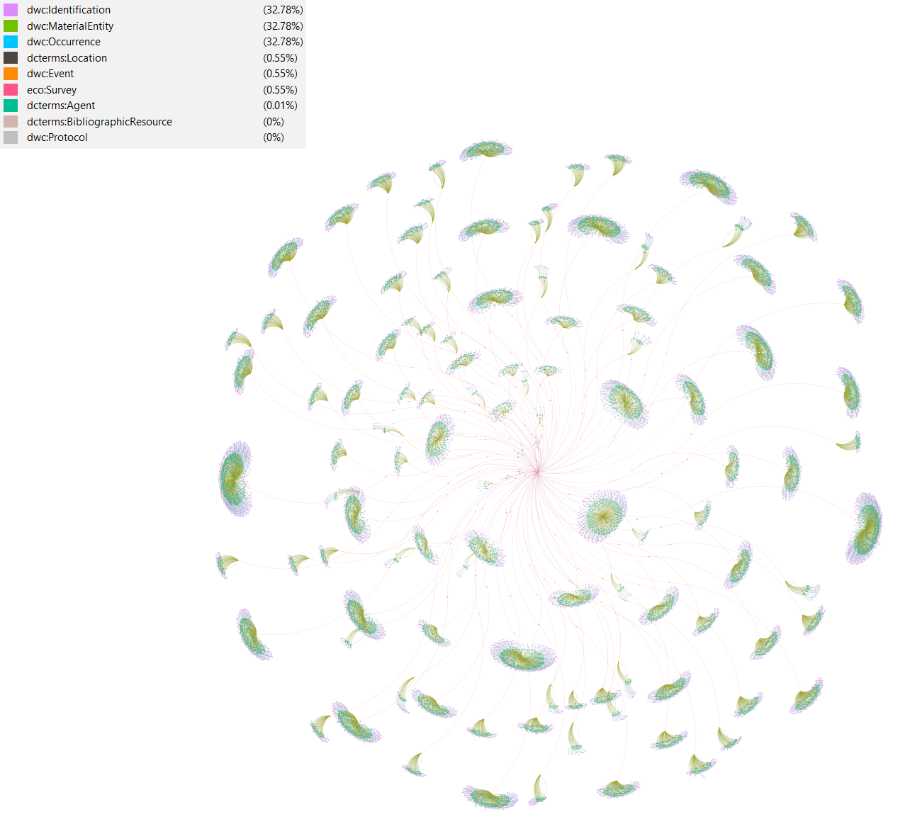

- **Lessons learned**: The fact that the dataset was published as a sampling event dataset greatly facilitated modelling. However, a recurring ambiguity remains: determining the appropriate number of `dwc:Event` levels to model. In this dataset, each `dwc:Event` corresponds to a day (or series of days) during which observations took place. One could argue that each individual insect visit could itself be modeled as a `dwc:Event`, with the day acting as a parent event. This would allow finer annotation—such as time of visit, behavioural notes, or observer remarks.

  This approach can be easily done, but was not for two reasons:

  1. No information exists about individual visit events. Indeed, the entry for `dwc:eventID` in `occurrence.txt` refers only to the day event.
  2. In DwC-OWL, the object property `dwcdp:happenedDuring` is a transitive property. Therefore, even if visit-level events were modelled, a reasoner would automatically infer the occurrence's relationship to the parent event, meaning the coarser model remains semantically valid.

  These questions illustrate ongoing challenges in event granularity and highlight the need for careful consideration when modelling hierarchical sampling structures in RDF.

### Insektmobilen

- **Dataset definition**: As part of the Insektmobilen project, through the Natural History Museum of Denmark, citizen scientists were recruited to collect insects using car nets near their homes (in Denmark) in June and July 2018. Their cars were equipped with funnel-shaped nets, which had a detachable sampling bag in which flying insects were collected and preserved in 96% ethanol. Each route was sampled once during two daily time intervals, midday (12–15 h) and evening (17–20 h), while driving at a maximum speed of 50 km/h. Samples were sent back to the research institution for analysis, allowing assessment of insect diversity. Taxonomic identifications were carried out using both morphological examination and metabarcoding based on genetic sequencing. The dataset considers over 350 drivers, of which an interactive map of the routes can be viewed [here](https://aminem0.github.io/dwc-owl-rdf/maps/insektmobilen_routes.html).

- **Dataset organization**: The dataset, as an occurrence dataset with various extensions can be downloaded [from GBIF](https://www.gbif.org/dataset/cb8a261a-66cb-4068-809e-9e773359bb30). The conversion considered here is based on the files available from the Darwin Core DataPackage examples [GitHub repository](https://github.com/gbif/dwc-dp-examples/tree/master/survey/insektmobilen/output_data).

- **Modelling considerations**: This dataset requires a relatively large number of classes to model its structure, but their use is largely straightforward. This is facilitated by the fact that the source files already adhere to the DwC-DP model.

  The fact that each route was driven twice by the same drivers required special attention. This was addressed in two complementary ways. First, a parent `dwc:Event` was introduced, with the two drives represented as child events. Second, both child events were linked to the same `dcterms:Location` instance, reflecting the fact that they followed the same geographic path.

  Although drivers were anonymized, information about them remains encoded in the data. Each event has a `dwc:eventID` following the pattern `P{integer}.{integer}{A|B}`, which makes it possible to determine which driver conducted a given survey. The same identifiers appear in the `dwc:samplingPerformedByID` column of the `survey.csv` file. Drivers were therefore modelled as instances of `dcterms:Agent`.

- **Ontology subset considered**: Together with the BROKE-West dataset, Insektmobilen is one of the most complex datasets examined, requiring fifteen classes to adequately represent its structure. Despite this complexity, the resulting graph accurately captures the relationships present in the data.

  Several features of the ontology subset deserve particular attention:

  - Identifications can be based on morphological material or nucleotide sequences. As a result, the object property `dwcdp:evidenceFor` may link either a `dwc:MaterialEntity` or a `dwc:NucleotideSequence` to a `dwc:Occurrence`.
  - Material entities can be derived from other material entities using the `dwcdp:derivedFrom` object property. These derivation chains may span several levels, for example, a purified DNA extract derived from a raw DNA extract, itself derived from a size-sorted bulk insect sample.

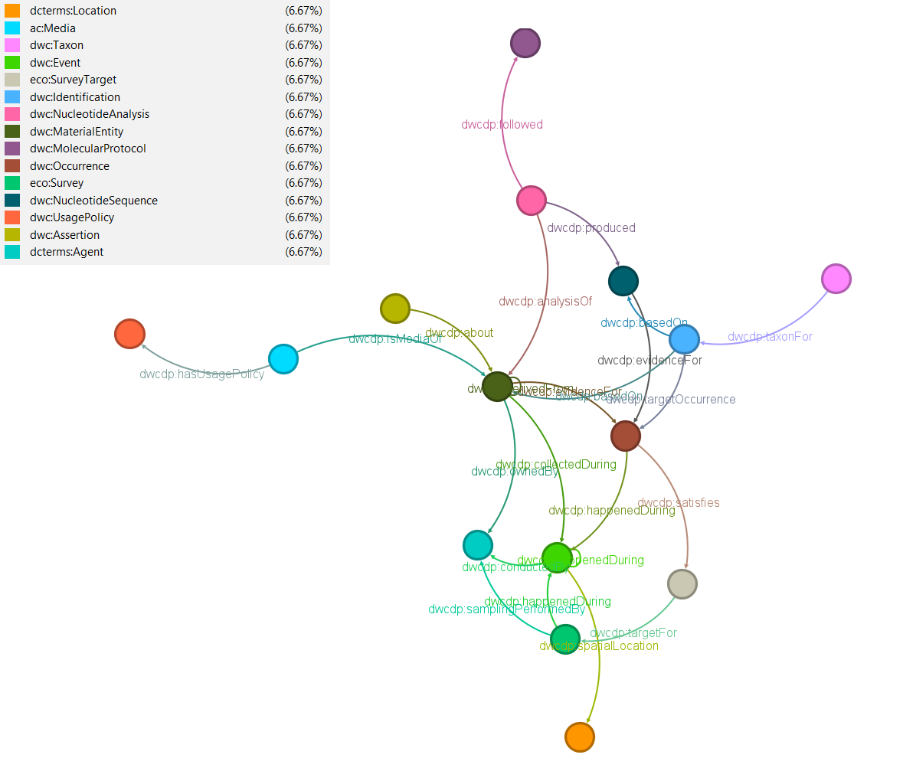

- **Additions made**: Although the dataset was already well structured according to the DwC-DP schema and included a wide range of tables, a small number of additions were introduced.

  First, instances of `dwc:Agent` were explicitly modelled to represent each anonymized citizen scientist. Second, a `dwc:UsagePolicy` was added to capture the fact that all images associated with the dataset are released under a CC-BY-NC 4.0 license.

  Finally, because the majority of taxa were identified using BLASTN, reference taxa were modelled as instances of `dwc:Taxon`. As can be seen in the dataset, these taxa were based on Barcode of Life Data System Barcode Index Numbers (BOLD BINs), which were used to generate resolvable URLs pointing to the corresponding resources.

- **Difficulties encountered**: The `identification.csv` file contains information about all identifications performed during the project. However, identifications are made on bulk material entities rather than on individual organisms. This means that multiple identifications can be associated with the same material entity while referring to different organisms. This situation differs substantially from datasets such as Moth AMI, where multiple identifications refer to the same organism.

  In the Insektmobilen dataset, identifications often target distinct organisms within the same material entity. While this is unproblematic for sequence-based identifications, it poses challenges for morphological identifications. For example, the material entity `P6.1AS` has six morphological identifications. Without additional linking information, it is impossible to determine which occurrence corresponds to which taxonomic identification (e.g. which occurrence was identified as Coleoptera versus Diptera). One could look at the occurrence nodes for a matching taxon assignment, but this requires that it receives the identification as is and this procedure can get tedious for a large number of nodes.

  This highlights the need for an object property that explicitly links identifications based on entities such as `dwc:MaterialEntity` or `dwc:NucleotideSequence` to their corresponding `dwc:Occurrence`. The issue can be illustrated by the following SPARQL query:

  ```sparql
    PREFIX dwc: <http://rs.tdwg.org/dwc/terms/>
    PREFIX dwcdp: <http://rs.tdwg.org/dwcdp/terms/>

    SELECT ?occ ?sciName

    WHERE {
        ?occ a dwc:Occurrence ;
             ^dwcdp:evidenceFor <https://www.bioboum.ca/material-entity/p6-1as> .

        ?ident a dwc:Identification ;
               dwc:scientificName ?sciName ;
               dwcdp:basedOn <https://www.bioboum.ca/material-entity/p6-1as> .
    }
  ```

  This query will give a cartesian product, where every combination of occurrence and identification will be made, returning 36 values. Note that some of these values will be wrong, such as the row `<https://www.bioboum.ca/occurrence/2830-morph> Diptera`, which is wrong because <https://www.bioboum.ca/occurrence/2830-morph> is identified as Coleoptera. Instead, the following query, which adds only a single line, will work:

```sparql
    PREFIX dwc: <http://rs.tdwg.org/dwc/terms/>
    PREFIX dwcdp: <http://rs.tdwg.org/dwcdp/terms/>

    SELECT ?occ ?sciName

    WHERE {
        ?occ a dwc:Occurrence ;
             ^dwcdp:evidenceFor <https://www.bioboum.ca/material-entity/p6-1as> .

        ?ident a dwc:Identification ;
               dwc:scientificName ?sciName ;
               dwcdp:basedOn <https://www.bioboum.ca/material-entity/p6-1as> ;
               dwcdp:targetOccurrence ?occ .
    }
  ```

  The query will successfully retrieve all pairs of occurrence IRIs and their associated scientific names based on the identified material entity, as:

| occ                                            | sciName       |
|------------------------------------------------|---------------|
| <https://www.bioboum.ca/occurrence/2829-morph> | Staphylinidae |
| <https://www.bioboum.ca/occurrence/2827-morph> | Heteroptera   |
| <https://www.bioboum.ca/occurrence/2830-morph> | Coleoptera    |
| <https://www.bioboum.ca/occurrence/2832-morph> | Diptera       |
| <https://www.bioboum.ca/occurrence/2831-morph> | Apocrita      |
| <https://www.bioboum.ca/occurrence/2828-morph> | Aphidoidea    |

  To support this modelling, an explicit occurrence reference was required in the identification table. For nucleotide-based identifications, `dwc:occurrenceID` values were generated through string manipulation, as they follow the pattern `{nucleotideSequenceID}_{materialEntityID}`. For morphological identifications, occurrence identifiers were retrieved by matching entries in the `occurrence.csv` table.

  Additional minor issues were also encountered. Some material entities appear in certain tables but not in others. For example, the identification with `dwc:identificationID` value of `seq_145781` refers to a material entity `P6.2AS_pure`, which is not declared in the `material.csv` table. Such entities were therefore recreated (as well as their associated links) during processing to ensure internal consistency.

  Furthermore, while most tables were encoded in UTF-8, the `event.csv` file was encoded in Latin-1 and required re-encoding. 
  
  Finally, all media links in the archive were broken, even though the images themselves remain accessible via the GBIF dataset page and cache.

- **Graph-based representation**: Due to the sheer number of interconnected nodes, the complete graph is difficult to visualize. Instead, a partial graph representing all surveys conducted by the anonymized driver `P200` is shown first. This driver completed four surveys (two pairs), one in Langvad and one in Vesløs.

  Each fan-like structure originates from a driving event node, from which all associated occurrences radiate outward. Nucleotide sequences associated with each occurrence remain close to the occurrence node via the `dwcdp:evidenceFor` property. These are followed by identification nodes and, finally, the taxa used for those identifications.

  Nucleotide sequences are not duplicated in the dataset. Consequently, a single `dwc:NucleotideSequence` may be produced by multiple `dwc:NucleotideAnalysis` instances. As a result, some sequence nodes appear centrally in the graph rather than within individual fan structures, forming dense clusters. A similar pattern is observed for `dwc:Taxon` nodes, which may be reused across multiple of identifications targeting distinct occurrences.

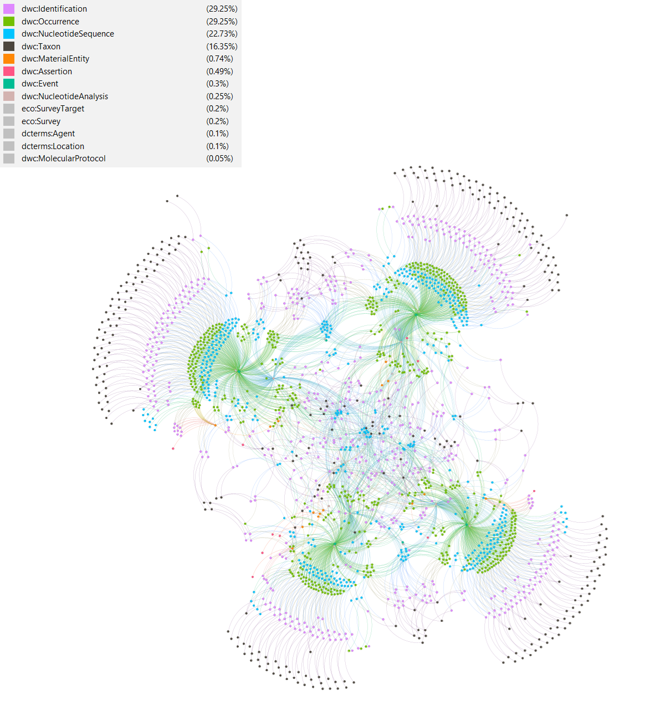

  Expanding the graph to include all drivers from `P200` to `P2015` results in an even denser central structure. As additional surveys are incorporated, new occurrences are added, but many of them reference nucleotide sequences or taxa already present in the dataset. Consequently, these shared nodes are drawn toward the center of the graph.

  For example, the taxon identified by the URI https://portal.boldsystems.org/bin/BOLD:AEF2817, corresponding to the fungus gnat *Scatopsciara atomaria*, is referenced by 2 635 distinct identifications.

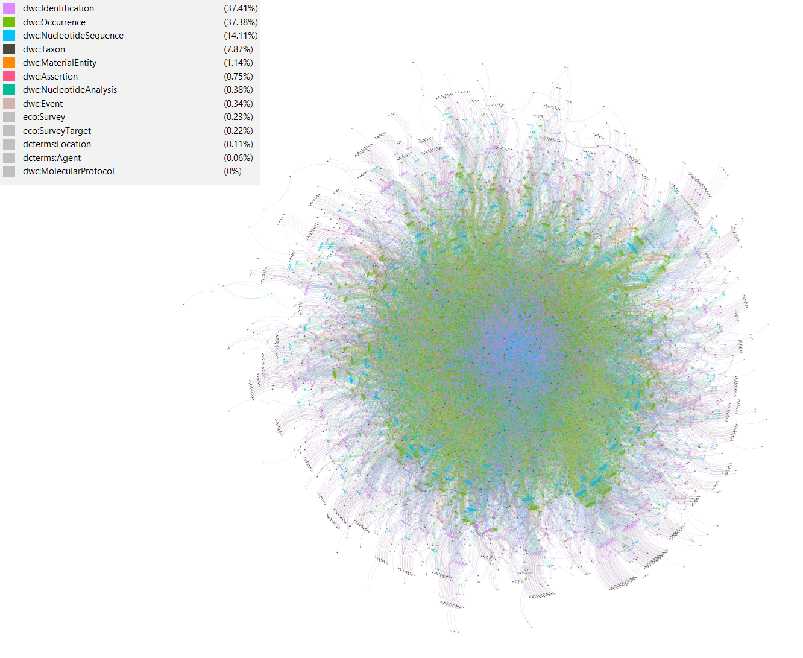

- **Lessons learned**: Although such graphs are challenging to visualize in two dimensions, they remain fully queryable. This underscores the importance of a well-designed ontology. As citizen science initiatives and metabarcoding projects continue to expand in scale and complexity, projects as complex as Insektmobilen will appear more frequently. Ontological models must be expressive enough to capture their structure while remaining flexible enough to support meaningful querying and reuse.

### Jiulongfeng Nature Reserve camtrap

- **Dataset definition**: Within the Jiulongfeng Nature Reserve (九龙峰自然保护区) in Huangshan, eastern China, a set of 32 camera traps was deployed to document the diversity and distribution of mammals. Cameras were installed at different locations and operated for periods ranging from 43 to 252 days (typically around 100 days). Every mammal detection was identified, and an occurrence dataset was produced.

- **Dataset organization**: The dataset, published as a sampling event dataset, can be downloaded [from GBIF](https://www.gbif.org/dataset/d5fc33c5-e514-45ea-8655-d1c6dc934d35). Although it originates from camera trap data, no multimedia extension is included. The dataset comprises of two files: `occurrence.txt`, which contains information about each occurrence, such as the date and identification details; as well as `event.txt`, which describes each camera deployment event, including geographic coordinates and deployment duration for each camera.

- **Modelling considerations**: As with other biodiversity datasets, the primary classes used were `dwc:Occurrence`, `dwc:Event`, and `dwc:Identification`. Even though no explicit media references are provided in the download, media evidence was inferred and modeled as `ac:Media` instances. The exact modeling details are discussed later.

  Two types of agents were considered. These are a a human agent, responsible for reviewing the media and performing the identification; and a set of camera agents (one for each camera), responsible for recording the occurrences and recording the media.

- **Ontology subset considered**: The ontology subset used here parallels the structure of the Ryukyu Islands media dataset. The following classes were used: `ac:Media`, `dwc:Occurrence`, `dwc:Identification`, `dwc:Event`, `dcterms:Location`, and `dcterms:Agent`.

  A key difference lies in the separation of agent roles. In the graph below, the same agent node may appear at the end of three object properties: `dwcdp:conductedBy`, `dwcdp:recordedBy`, and `dwcdp:identifiedBy`. However, these roles need not refer to the same entity. In this case they do not, as the human agent is responsible for the identifications and the cameras are responsible for taking the media and recording the occurrences.

  The self-relationship of `dwc:Event` via `dwcdp:happenedDuring` enables nested event structures, which are required for camera-trap data where each detection event occurs within a parent deployment event.

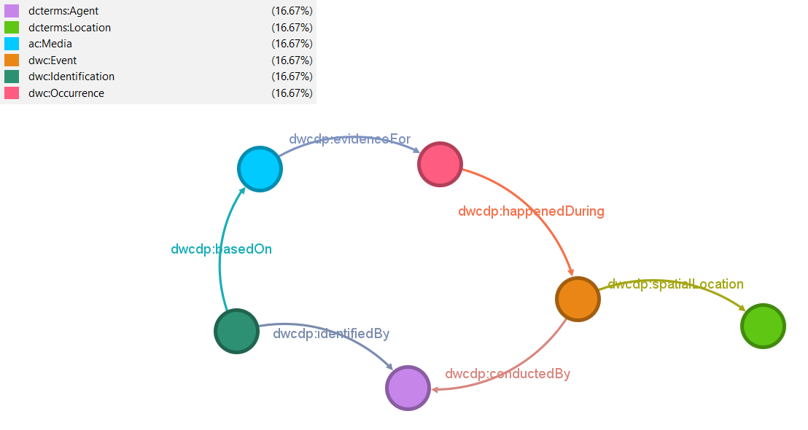

- **Additions made**: Each camera was modeled as a separate `dcterms:Agent`. Since the cameras were all deployed at different sites in early 2022, assigning each location its own camera agent is reasonable.

  Although Wei Zhao (the human agent) is listed as the value for all `dwc:recordedBy` entries in the published dataset, this is misleading. The camera is the entity that records occurrences, whereas the human identifies the organism. The model was therefore corrected to reflect this protocol.

- **Difficulties encountered**: A recurring issue is that the identifiers for `dwc:Occurrence` instances are actually filenames of the images they are based on. For example, an occurrence of Reeves's muntjac (*Muntiacus reevesi*) uses the identifier `HNK-C0CZQ-JLF06-IMAG1391.JPG` which is evidently the image file the occurrence was based on and not the occurrence itself.

  Additionally, every `dwc:eventID` entry for occurrences corresponds to the name of the deployment event, not the individual detection. In camera-trap workflows, every time the sensor triggers, a new `dwc:Event` occurs, nested within the parent deployment event. Because timestamps exist for each trigger event, this hierarchy should be modeled explicitly.

- **Graph-based representation**: To visualize the data, only the first 25 000 occurrences (of about 51 000) were included in the graph for visual representation.

  At the center is the human agent, Wei Zhao, who is credited with all `dwc:Identifications`. Each identification is based on a `ac:Media` instance that provides evidence for a `dwc:Occurrence`.

  Convergence was noted at multiple levels do to the fact that several entities connected to particular nodes. Indeed, all occurrences were recorded by the same type of agent, the deployed camera. Likewise, all events occur at fixed physical locations, the cameras being fixed. These explain why the number of distinct `dcterms:Agent` and `dcterms:Location` nodes is small.

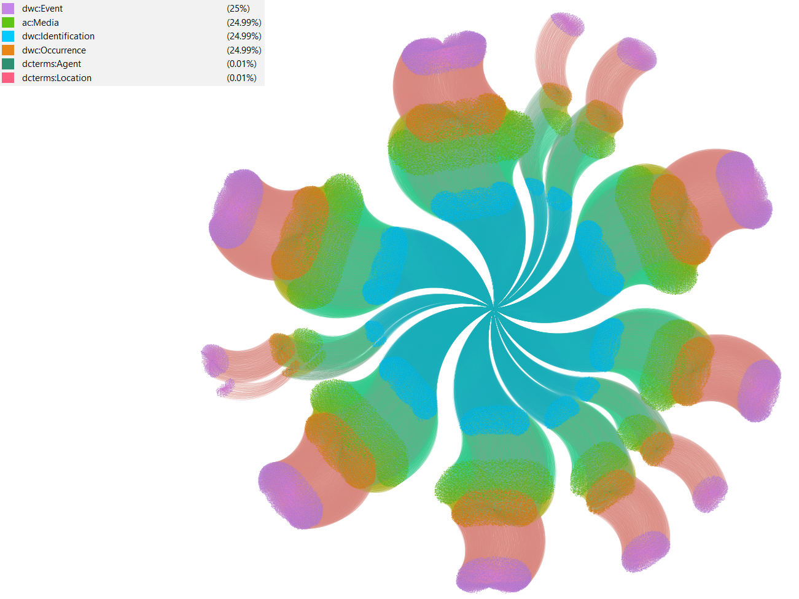

- **Lessons learned**: This dataset was chosen specifically because it should contain media information but does not.
One could create a dummy URL such as http://bioboum.ca/media/hnk-c0czq-jlf06-imag0004-avi, but doing so falsely implies the existence of a persistent, resolvable link. Instead, this modeling exercise explored the use of blank nodes for representing media entities that are known to exist but have no retrievable identifier.

  While one could theoretically avoid modeling media altogether, placing the filename and its existence in `dwc:occurrenceRemarks` or `dwc:identificationRemarks`, this would be semantically incorrect. The existence of media evidence is a real fact about the observation and should be represented explicitly in RDF.

  Blank nodes are common in ontology design (e.g., for OWL restrictions), where they allow the representation of entities that are logically important but not metaphysically important. However, they can also serve as proxies for real-world entities without stable identifiers, as in this dataset. They represent something known to exist, necessary to the logic of the graph, but not externally referenceable.

  For example, the following SPARQL DESCRIBE output illustrates how a media object might be modeled using a blank node:

  ```turtle
  @prefix ac: <http://rs.tdwg.org/ac/terms/> .
  @prefix dc: <http://purl.org/dc/elements/1.1/> .
  @prefix dcterms: <http://purl.org/dc/terms/> .
  @prefix dwc: <http://rs.tdwg.org/dwc/terms/> .
  @prefix dwcdp: <http://rs.tdwg.org/dwcdp/terms/> .

  <https://www.gbif.org/occurrence/5893170344-ident> a dwc:Identification ;
      dwc:class "Mammalia" ;
      dwc:family "Mustelidae" ;
      dwc:kingdom "Animalia" ;
      dwc:order "Carnivora" ;
      dwc:phylum "Chordata" ;
      dwc:scientificName "Arctonyx collaris" ;
      dwcdp:basedOn [ a ac:Media ;
              dc:format "image/jpeg" ;
              dcterms:title "HNK-C0CZQ-JLF06-IMAG0444.JPG" ;
              dwcdp:evidenceFor <https://www.gbif.org/occurrence/5893170344> ] ;
      dwcdp:identifiedBy <https://scholar.google.com/citations?user=JPHTcaIAAAAJ> .
  ```

  This correctly states that the identification is based on a `ac:Media` instance called `"HNK-C0CZQ-JLF06-IMAG0444.JPG"`, even though no external identifier exists for the image.

  This contrasts sharply with datasets like the Ryukyu reef images, where media files have actionable URLs. In the Jiulongfeng dataset, the media is only meaningful within the graph itself.

  The same logic applies to modeling cameras, where the snippet:

  ```turtle
  @prefix ac: <http://rs.tdwg.org/ac/terms/> .
  @prefix dcterms: <http://purl.org/dc/terms/> .
  @prefix dwc: <http://rs.tdwg.org/dwc/terms/> .
  @prefix dwcdp: <http://rs.tdwg.org/dwcdp/terms/> .

  <https://www.gbif.org/occurrence/5893170486> a dwc:Occurrence ;
      dwc:class "Mammalia" ;
      dwc:family "Mustelidae" ;
      dwc:kingdom "Animalia" ;
      dwc:order "Carnivora" ;
      dwc:phylum "Chordata" ;
      dwc:scientificName "Martes flavigula" ;
      dwcdp:happenedDuring <https://www.gbif.org/occurrence/5893170486-event> ;
      dwcdp:recordedBy [ a dcterms:Agent,
              dwc:agentType "camera trap" ;
              dwc:preferredAgentName "camera trap JLF06" ] .
  ```

  This states that the occurrence was recorded by a specific camera agent, but the agent is a blank node without a global identifier.

  Blank nodes should be used sparingly because they limit interoperability, as they cannot be referred to outside of the considered graph. However, in cases like this, where the existence of an entity without a persistent ID is necessary to the correct interpretation of the data, they are appropriate and semantically meaningful.

### Joseph Rock herbarium

- **Dataset definition**: Founded in 1908, the Joseph F. Rock Herbarium (HAW) is the University of Hawai‘i’s official repository for botanical specimens, including the Lyon Arboretum collection. It holds around 50 000 dried plant specimens, representing Hawaiian and Pacific Island flora, with a focus on vascular plants. The collection reflects over a century of plant exploration across the Pacific basin and continues to grow through ongoing research. Its digitization efforts make the collection increasingly accessible to researchers and the public worldwide.

- **Dataset organization**: The dataset, as a Darwin Core Archive, can be downloaded [from GBIF](https://www.gbif.org/dataset/96beb7d8-f762-11e1-a439-00145eb45e9a). The dataset contains various files, including an `occurrences.csv` file that records information about both the material entities and the occurrences, as well as a `multimedia.csv` file, containing information about the digitized specimen images. There is also a `measurementOrFact.csv` file with a single statement about a specimen.

- **Modeling considerations**: The occurrence of the organism and the associated specimen in the herbarium were modelled separately. The occurrence was modeled as an instance of a `dwc:Occurrence` and the associated specimen in the herbarium was modelled as an instance of a `dwc:MaterialEntity`. The URI for the specimen was its URL in the Consortium of Pacific Herbaria (CPH) data portal. However, the URI for the occurrence was the URI identifying the GBIF occurrence record.

  All specimen images were modelled as instances of `ac:Media`. The relationship between the image variants (good quality and thumbnail) and the original image was modelled using the `dwcdp:derivedFrom` object property. In this case, the good quality and thumbnail are derived from the original image. It would make sense to use a different object property than in cases such as the Moth AMI dataset, where cropped images are literaly part of the original image. In this case, variants are obtained through image compression, resolution reduction and possibly dimension reduction, which makes the object property `dwcdp:partOf` inappropriate.

- **Ontology subset considered**: The ontology subset considered is centered around material entities and media instances. There are several differences regarding the considered object properties that distinguish it from other datasets that considered media (such as Jiulongfeng, Moth AMI, or Ryukyu):

  - The media instance is media of the material entity, but only the material entity is the evidence for the occurrence. This is because the media is not a media of the occurrence itself, but rather of the material entity collected during its associated event.
  - The identification is based on the material entity instead of the media instances.
  - The media can have variants, such as the web variant or thumbnail variant. When present, these were considered to be `dwcdp:derivedFrom` the original image and assumed to have the same usage policy.

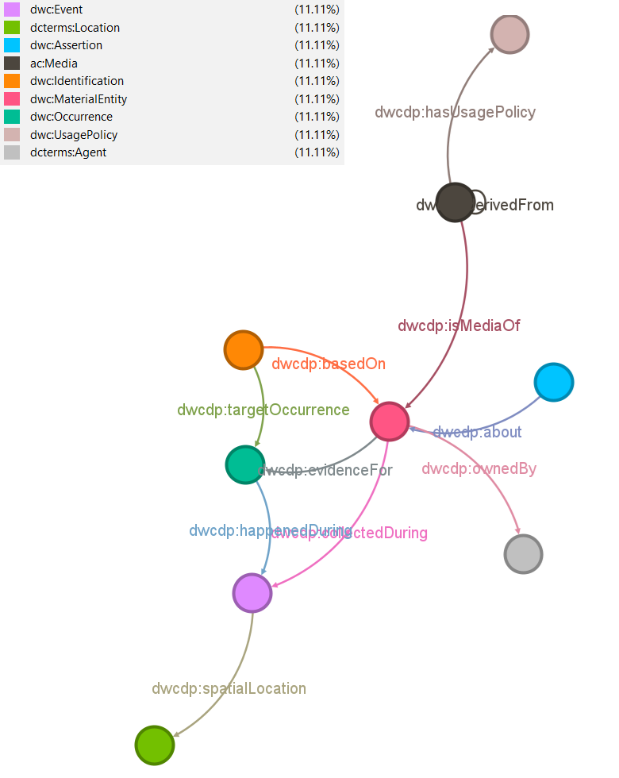

- **Additions made**: The University of Hawaiʻi at Mānoa was modelled as a `dcterms:Agent` and was considered the owner of all material entities considered in this dataset. Its entry in the Global Registry of Scientific Collections (GRSciColl) was used as an identifier.

  There appear to be two usage terms considered for the images used in this dataset. The quasi-totality of images (99.91%) consider a Creative Commons Non-Commercial Share-Alike (CC-NC-SA), whereas only a small fraction consider a Creative Commons Non-Commercial (CC-NC) license. Both usage terms were added as instances of `dwc:UsagePolicy` and related to the associated media.

- **Difficulties encountered**: Some entries in the `occurrences.csv` have datatype properties that would be applicable to the associated `dcterms:Location`, but none for the associated `dwc:Event`. There may be different reasons for this:
   
  - For some specimens, such as [this (upside-down) specimen of *Vigina marina*](https://pacific.symbiota.org/media/HAW_/HAW18/HAW18129_1764482501_web.jpg), event information is entirely available and its absence is due to the time needed to digitize herbarium specimens. These are somewhat easy to spot, as the entirety of the information is absent. In due time, this information will be made available in machine-readable format.
  
  - However, other cases are more complicated. For example, [for this specimen of *Myoporum sandwicense*](https://pacific.symbiota.org/media/HAW_/HAW45/HAW45309_1764577336_web.jpg), there really are no event-related properties available. Unless this information is saved somewhere else, the event node will remain an empty link between both the material entity and the occurrence node and the location node.

  Therefore, empty nodes of type `dcterms:Location` that had no datatype properties were pruned and removed from the graph. Note that the triple relating its associated event to through the object property `dwcdp:spatialLocation` was also removed. This was done as, even though any `dwc:Event` should theoretically has an associated `dcterms:Location`, a location without properties is semantically useless.

  The URLs of the multimedia are unusual and somewhat scattered, possibly owing to the orphaned nature of the dataset. The distribution of media instances is as follows:

  - The majority (75.86%) of the images are on a Google Cloud Storage.
  
  - A fair amount (15.61%) is hosted on a bare Apache server. A lookup of this IP address showed that it is hosted on the University of Hawaiʻi campus.
  
  - Likewise, another amount (8.10%) is hosted on the iDigBio API.
  
  - A small amount (0.4%) are hosted on what appears to be the CPH server.
  
  - Finally, a small amount of only 8 images (0.01%) are hosted on a now dead Google Drive. Unless these images were backed up somewhere, they might be lost. However, it should be noted that on the specimen page, these images appear to be identical to other images. Therefore, these images could be duplicates and might be removed in the near future.

  For media being served by iDigBio, the URL is usually not a direct link to the media itself, but rather a parametrized API endpoint. The URLs follows the pattern https://api.idigbio.org/v2/media/{uuid}?size={media-quality}. Responses are usually 302 redirects to the desired resources. Most requests are capable of reaching the resource, as they follow 302 status codes, but some might not, unless being specifically told to follow the `Location` response header.

  Also, according to [RFC 3986](https://datatracker.ietf.org/doc/html/rfc3986), spaces must be percent-encoded in URIs. However, some of the provided URIs in the `multimedia.csv` file have spaces in them. For example, the URL of an image of *Adhatoda cydoniifolia* is given as https://storage.googleapis.com/d58fa815-ad25-4249-ac6b-569baf4cbdc1/photos/HAW_Vascular/HAW04829 (2).jpg has a space. Browsers would be able to fill in this blank, but using the value directly in an RDF serializer would break it, because it took the value literally. Slugifying all media URLs was not a viable option, as it would destroy the parameter section of the URL when it was a parametrized API call (e.g. https://api.idigbio.org/v2/media/1f52de42462b6441b349677e55c8ddaf?size=fullsize would become a non-functional https://api.idigbio.org/v2/media/1f52de42462b6441b349677e55c8ddaf-size-fullsize). This meant having to carefully programmatically percent encode spaces in every file URL that showed them.

  Finally, in some cases, the original image is apparently the only variant, but is the value entered for both the `accessURI` and `goodQualityAccessURI` entries. This would cause issues for the object property `dwcdp:derivedFrom`, which would end up stating that a media instance was derived from itself. This required verification not only that entries were present for the variants, but also that they were different from the original image.

- **Graph-based representation**: To visualize the data, a random subset of 5 000 occurrences. This was done so as to capture visually the variety of the dataset, as it seems to be structured into sections, either by section of the herbarium or by dataset completedness.

  The center of the graph is dominated by two nodes, namely the node representing the herbarium and the node representing the CC-BY-NC-SA usage policy, which is by far the most considered usage policy in the dataset. The `ac:Media` and `dwc:MaterialEntity` instances surround it, as the herbarium is the owner of all specimens and images are media of the material entities.

  Media instances derived from material entities stick together into small clusters for two reasons. The first is because they are all media of this same specimen. The second is due to the derivation relationships of the web variant and thumbnail variant from the original image.

  Identifications, occurrences and events form a layer around this dense mass, as they relate to the specimen through various object properties. These nodes also stick together as they are interrelated, since identifications target occurrences that happen in events. The `dcterms:Location` nodes form an outer layer since they only relate to the events.

  The other usage policy, CC-BY-NC, is considered for only a small fraction of the dataset. It is responsible for the slight overflow from the compact cluster seen on the lower-right.

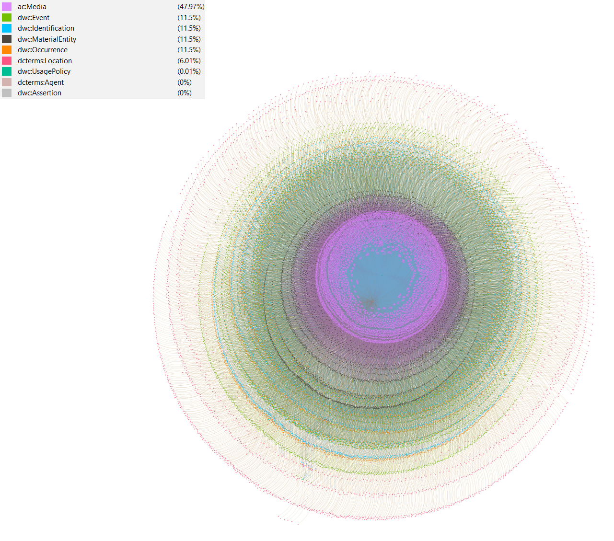

- **Lessons learned**: Beyond technical considerations, this dataset illustrates the long-term challenges of integrating legacy collections into the semantic web. Herbarium data often reflect decades, or centuries (the oldest specimen in the dataset is a), of evolving curation practices, digitization priorities, and infrastructure changes. The vast amount of information they possess makes them prime candidates for integration into RDF and linking within the semantic web.

  From a modelling perspective, this reinforces the importance of explicitly distinguishing between what is known, what is unknown, and what is temporarily unavailable. RDF and DwC-DP provide sufficient expressive power to represent this uncertainty without forcing artificial completeness. In this sense, the Joseph Rock Herbarium dataset highlights both the strengths of semantic modelling for natural history collections and the need for careful, conservative interpretation when transforming digitized legacy data into interoperable graphs.

### Kalimantan odonata survey

- **Dataset definition**: To characterize Odonata communities across mixed-mosaic heath (kerangas) forests, a survey was conducted in the habitats of the Mungku Baru Education Forest in Central Kalimantan, Indonesia. Fieldwork occurred between November 2019 and February 2020 as part of a broader biodiversity conservation program. The sampling design consisted of 250-m line transects surveyed across three habitat types: kerangas, low pole peat swamp, and mixed swamp forest. Each habitat contained two transects, and each transect was assessed eight times.

- **Dataset organization**: The dataset, published as a Darwin Core Archive, can be downloaded [from GBIF](https://www.gbif.org/dataset/861c1ecb-764b-4d89-864b-b913a58fae0a).

  The archive contains a single file, `occurrence.txt`, which amalgamates all information relating to the project. No extensions are provided. As discussed below, this has consequences for data modelling, as multiple types of entities are embedded within the same table and sometimes condensed into JSON strings.

- **Modelling considerations**: Because all content is folded into a single table, including several JSON-encoded fields, individual instances of the relevant classes had to be explicitly created to distinguish the different types of information.

  The hierarchical structure of the sampling design was preserved using three levels of `dwc:Event`. The topmost level is the habitat, within which the transect level assessments happen. The second level is that of the assessments of the line-transects. This is what is explicitely stated in the documentation.

  However, it is implied that each Odonata sighting represents an event as well, with its own associated assertions. Consequently, a third level of `dwc:Event` was modelled to take into account this hierarchy.

- **Ontology subset considered**: The standard classes and their relationships relationships between `dwc:Occurrence`, `dwc:Identification`, `dwc:Event` and `dcterms:Location` were considered. Note that, in this case, the three levels of `dwc:Events` are considered by the self-referencing arrow of the object property `dwcdp:happenedDuring`.

  The two different types of `dwc:Assertions`, those that target `dwc:Occurrences` and those that target `dwc:Events` use the same object property `dwcdp:about` and are distinguished only by their range. This is shown by the two different arrows stemming from `dwc:Assertions`.

  The sampling survey brings terms from the `eco:` namespace, so as to detail how the survey was carried out and what were its targets. The `eco:Survey` and `eco:SurveyTarget` allow for a detailed definition of the events and the survey that was carried out, and separates the considered entities.

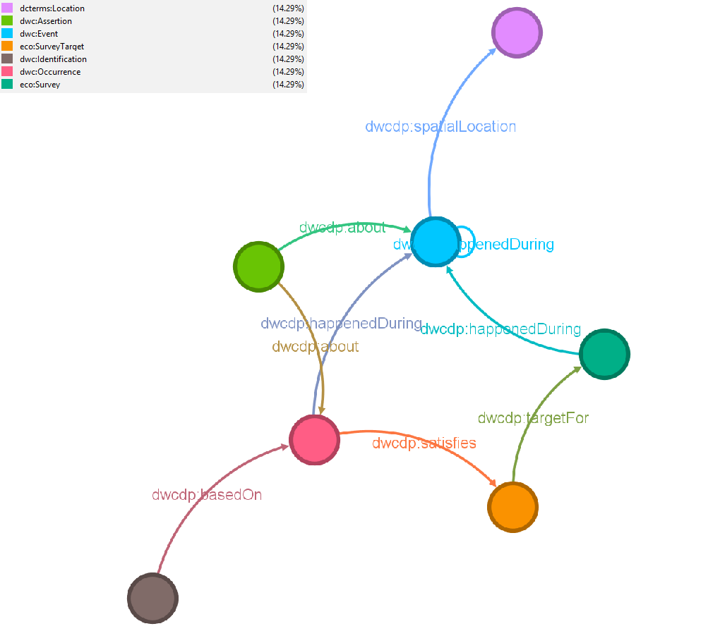

- **Additions made**: To detail how the sampling was carried out and the target taxonomic scope considered, instances of `eco:Survey` and `eco:SurveyTarget` were created to represent the sampling methodology. In this case, the survey target is quite simple, as it is a definition of `all adult Odonata`.

- **Difficulties encountered**: Though the data were well detailed and provided in a machine-readable JSON format, there were a few points that proved to be challenges

  1. Theoretically, it provided a challenge regarding how to model `dwc:Events`. The main reason is that a value of `dwc:eventID` is provided, following the pattern `<bnf:odo:khdtk:transect:{parent-event}:event:{event-number}>` and defines a survey along a transect line. Also provided is a value for `dwc:parentEventID`, which is of the pattern `<bnf:odo:khdtk:parvent:{habitat-code}{number}>`, where the habitat code is `K` for kerangas, `LP` for low pole peat swamps and `R` for riverine mixed peat swamp. This value is essentially information about the habitat and transect number.

  The issue is that, in the methodology, it is stated that `[e]nvironmental data [...] were recorded at each capture location within a 5 m diameter of the sight of capture`. These environmental data are what make up the `dwc:dynamicProperties` values. However, this means that there should be another layer that should be considered, as every Odonata that entered the line of sight of the researcher should represent a `dwc:Event`, which has `dwc:Assertions` about it, being the `dwc:dynamicProperties`. Therefore, there should be three levels of event: Odonata visual sighting - survey - habitat.

  2. Everything is mixed in one file conflation. The dataset is published using the occurrence core. However, there are no extensions and everything is contained in the `occurrence.txt` file. Thankfully, the information is in a machine-readable JSON format, which facilitates the creation of `dwc:Assertions`. However, both the environmental data and the organism measurements would have been better provided as an `extendedmeasurementorfact.txt` file.
  
  3. As a consequence of the last point, the information is sometimes supplied in different entries than would be expected. For example, environmental variables measured at each sighting of an Odonata are provided in `dwc:dynamicProperties`, whereas `dwc:eventRemarks` also contains free-form text reporting the weather at each event. Likewise, measurements about each occurrence are provided in the `dwc:taxonRemarks` instead of `dwc:occurrenceRemarks`, which is where they should be. Instead `dwc:occurrenceRemarks` contains free-form text about the behavior of the organism at the time of sighting and `dwc:OrganismRemarks` contains morphological, rather than morphometric, information about the occurrence. From the latter, possibly more `dwc:Assertions` could be extracted.

  4. Given the fact that only an `occurrence.txt` file was used, only information about occurrences can be entered. However, looking at the `dwc:eventID` values, one finds 43 individual values, whereas 48 are to be expected (3 habitats, 2 line transects, 8 assessments). There is the possibility that the events could not take place due to weather events, as there is an entry of `As a result of heavy rains transect could not be continued`. However, it is also quite likely that these events actually did take place, but that no Odonata were recorded. This information could have been conveyed by using an `event.txt` extension.

- **Graph-based representation**: The center of the graph is made up of the only `eco:SurveyTarget`, which defines the adult Odonata that were targeted by the study. As it is the target for all `eco:Surveys` conducted and that all `dwc:Occurrences` satisfy this target, these are drawn to it and close to the center. As all occurrences are around the center, the first ring of `dwc:Assertions` are occurrence assertions about these occurrences, and are the measurements of each Odonata.

  The `dwc:Events` are connected to the occurrences and the surveys, placing them further from the center. This is also why the assertions that make up the outer ring of `dwc:Assetions` are event assertions about these events, and are the environmental variables measured after making visual contact with each Odonata.

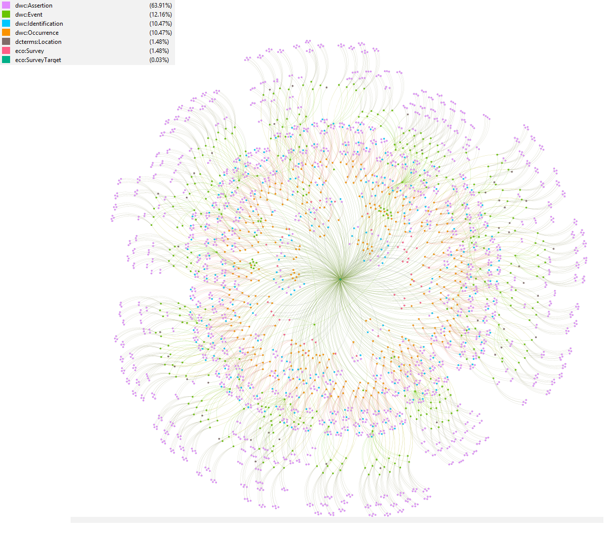

- **Lessons learned**: This dataset illustrates the challenges of representing complex hierarchical sampling designs in a flat tabular format. Although the use of parseable JSON is commendable, RDF provides a much clearer and more explicit representation, separating entities cleanly and enabling correct nesting of events.

  The study also highlights the practical difficulties of encoding rich methodological detail within the constraints of a single file. In contrast, graph-based modelling naturally separates entities and accommodates more complex sampling considerations, such as multi-level event hierarchies.

### Lake Mburo Park rodents

- **Dataset definition**: In 2005, an experimental setup was conducted to assess the factors affecting small mammal communities in African savannahs in Lake Mburo National Park, Uganda. Four treatments were considered based on two factors. The first factor is whether the plot showed large vegetated *Macrotermes* termite mounds or was in adjacent savannah areas. The second factor is the presence or absence of large-herbivore grazing. Large grazing mammals were excluded by erecting a 2-m high fence to prevent their entry and grazing. Each combination was replicated three times. Rodents were trapped using live traps placed in the plots, captured individuals were identified, sexed, and measured.

- **Dataset organization**: The dataset, as a Darwin Core Archive can be downloaded [from GBIF](https://www.gbif.org/dataset/9e54a9c3-98cf-438d-bdf2-89358b647ffa). The archive contains an `occurrence.txt` table that records each rodent capture and an `extendedmeasurementorfact.txt` table that records each measurement taken on the individual rodents.

- **Ontology subset considered**: The relationships between classes in this dataset are relatively straightforward. Every captured rodent is modelled as a dwc:Occurrence of a `dwc:Organism`. Every measurement was modelled as a `dwc:Assertion` targeting the individual rodent.

  Each rodent capture represents a separate `dwc:Event`. However, as traps were left at the same spot, all captures in that trap share the same `dcterms:Location`.

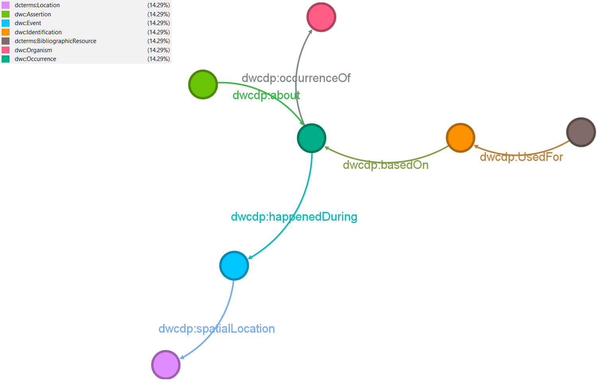

- **Additions made**: Each measurement was described more thoroughly by providing IRIs for the type of measurement, the value (if non-numeric), and the units considered. This approach enables entirely machine-readable data. For these cases, the Ontology of Biological Attributes (OBA), the Phenotype And Trait Ontology (PATO), and the Unit Ontology (UO) were used.

  According to the research paper, identifications were based on the book `The Rodents of Uganda`. Consequently, as for the Ryukyu media dataset, the book was modelled as a `dcterms:BibliographicResource` using its ISBN-13 number as an identifier.

- **Difficulties encountered**: The paper mentions that recaptures occurred and that individuals were marked with paint upon capture to allow identification of recaptures. Table 1 in the paper also shows that some individuals were indeed recaptured. However, the UUIDs in the Darwin Core Archive are provided per `dwc:Occurrence` only, and there is no organism-level identifier in either table. Consequently, unless recapture information was preserved in another file, it is lost.

  Six records of the woodland dormouse (*Graphiurus murinus*) have their `dwc:scientificName` incorrectly entered as *Graohiurus murinus*. This leads to incorrect total counts for this species.

  It should be noted that, even after these corrections, there are slight discrepancies between the values reported in the paper and those in the Darwin Core Archive. For a few rarer species, counts do not match perfectly. Additional reidentifications might have been carried out after the publication of the research paper.

  String casing proved to be an issue for several of the entries. Some nodes received multiple entries for a term simply because it was written with different casings. This is especially important, as the replicate and treatement factor are used for the `dwc:localID` in the pattern `{replicate}-{vegetation level} {grazing level}`. Consequently, values of `dwc:localID` were lowercased and values of `dwc:locality` were title-cased to avoid considering `Mound fenced` and `Mound Fenced` as different levels or `Sanga Gate` and `Sanga gate` as separate localities.

- **Graph-based representation**: At the center of the graph are two entities: the `dcterms:Location` nodes representing trap locations and the `dcterms:BibliographicResource` representing the identification reference. The identification reference aggregates all `dwc:Identification` nodes and the set of locations aggregates the `dwc:Event` nodes, creating the compact core.

  Surrounding the core is an outer ring of `dwc:Occurrence` nodes, which are related to events via `dwcdp:happenedDuring` and to identifications via `dwcdp:basedOn`. This forms the first outer ring.

  Finally, every occurrence is an occurrence of an individual `dwc:Organism` that has a set of `dwc:Assertion` instances about it. This produces the more diffuse outer ring, since each individual has multiple assertions.

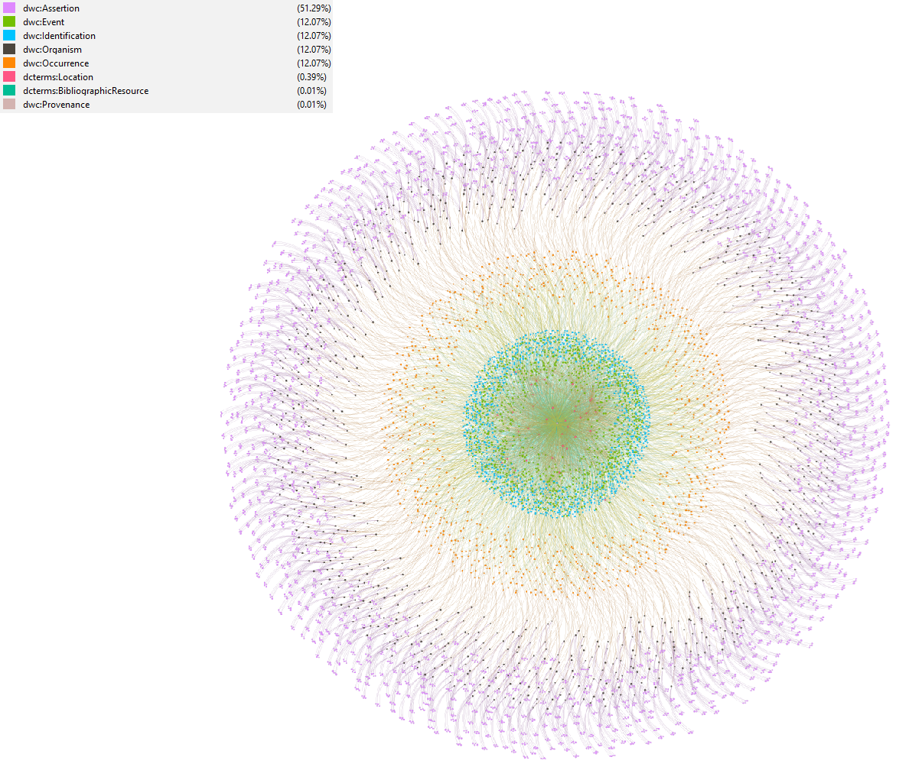

- **Lessons learned**: The end goal of data annotation is not only archival but also reuse. This dataset was used to evaluate how easily information can be extracted once the data are loaded into a triplestore.

As a starting point, the following SPARQL query returns all body masses in the dataset that are expressed in grams:

  ```sparql
  PREFIX dwc: <http://rs.tdwg.org/dwc/terms/>

  SELECT ?bodyMass

  WHERE {
    ?trait a dwc:Assertion ;
           dwc:assertionTypeIRI <http://purl.obolibrary.org/obo/OBA_VT0001259> ;
           dwc:assertionUnitIRI <http://purl.obolibrary.org/obo/UO_0000021> ;
           dwc:assertionValueNumeric ?bodyMass .
  }
  ```

  The query is deliberately simple, as it uses a single namespace and a single entity. The use of IRIs for assertion types and units prevents textual variation issues due to how the term is expressed (e.g., `body mass`, `bmass`, `b. mass`, `bodyMass`).

  The SPARQL query may be refined to include the species of the organism on which the measurement was made. This requires the use of object properties and introduces ontological considerations. To obtain body mass values in grams together with the scientific name of the organism on which it was measured, the following query can be executed:
  
  ```sparql
  PREFIX dwc: <http://rs.tdwg.org/dwc/terms/>
  PREFIX dwcdp: <http://rs.tdwg.org/dwcdp/terms/>

  SELECT ?species ?bodyMass

  WHERE {
    ?trait a dwc:Assertion ;
           dwc:assertionTypeIRI <http://purl.obolibrary.org/obo/OBA_VT0001259> ;
           dwc:assertionUnitIRI <http://purl.obolibrary.org/obo/UO_0000021> ;
           dwc:assertionValueNumeric ?bodyMass ;
           dwcdp:about ?org .

    ?org a dwc:Organism ;
         ^dwcdp:occurrenceOf ?occ .

    ?occ a dwc:Occurrence ;
         dwcdp:happenedDuring ?event .

    ?ident a dwc:Identification ;
           dwcdp:basedOn ?occ ;
           dwc:scientificName ?species .
  }
```

  Note the addition of the `dwcdp:` prefix to reference object properties and the use of the inverse property `^dwcdp:occurrenceOf` to navigate from a `dwc:Organism` to its `dwc:Occurrence`. Equivalent formulations include moving the `dwcdp:occurrenceOf` triple into the occurrence block (and keeping the original directionality as `?occ dwcdp:occurrenceOf ?org`) or defining explicit inverse properties (as in Darwin-SW, which uses the pair `dsw:occurrenceOf` and `dsw:hasOccurrence`). Each option has merits and requires further discussion.

  Finally, the SPARQL query can be expanded to compute the average body mass and the number of observations within each treatment group. This requires aggregate functions `AVG()` and `COUNT()` to get the values, as well `GROUP BY` and `ORDER BY` to arrange results. The following query computes these values for the two most frequent species, Kaiser's rock rat (*Aethomys kaiseri*) and the African pygmy mouse (*Mus minutoides*):

  ```sparql
  PREFIX dcterms: <http://purl.org/dc/terms/>
  PREFIX dwc: <http://rs.tdwg.org/dwc/terms/>
  PREFIX dwcdp: <http://rs.tdwg.org/dwcdp/terms/>

  SELECT ?species ?treatmentType (AVG(?bodyMass) AS ?meanBodyMass) (COUNT(?bodyMass) AS ?nObs)

  WHERE {
    ?trait a dwc:Assertion ;
           dwc:assertionTypeIRI <http://purl.obolibrary.org/obo/OBA_VT0001259> ;
           dwc:assertionUnitIRI <http://purl.obolibrary.org/obo/UO_0000021> ;
           dwc:assertionValueNumeric ?bodyMass ;
           dwcdp:about ?org .

    ?org a dwc:Organism ;
         ^dwcdp:occurrenceOf ?occ .

    VALUES ?species { "Aethomys kaiseri" "Mus minutoides" }

    ?ident a dwc:Identification ;
           dwcdp:basedOn ?occ ;
           dwc:scientificName ?species .

    ?occ a dwc:Occurrence ;
         dwcdp:happenedDuring ?event .

    ?event a dwc:Event ;
           dwcdp:spatialLocation ?location .

    ?location a dcterms:Location ;
              dwc:locationID ?locationID .

    BIND(STRAFTER(?locationID, "-") AS ?treatmentType)
  }

  GROUP BY ?species ?treatmentType
  ORDER BY ?species DESC(?meanBodyMass)
```

  The `VALUES ?species { "Aethomys kaiseri" "Mus minutoides" }` block restricts the query to those two species. Omitting it would compute aggregates for all species. The `STRAFTER()` function extracts the treatment type from the location identifier (e.g., yielding `mound unfenced` from `2-mound unfenced`).

  The query produces the following table:

| species            | treatementType    | meanBodyMass         | nObs |
|--------------------|-------------------|----------------------|------|
| *Aethomys kaiseri* | savannah fenced   | "90.31"^^xsd:decimal | 29   |
| *Aethomys kaiseri* | mound unfenced    | "85.38"^^xsd:decimal | 106  |
| *Aethomys kaiseri* | mound fenced      | "84.46"^^xsd:decimal | 197  |
| *Aethomys kaiseri* | savannah unfenced | "65.50"^^xsd:decimal | 6    |
| *Mus minutoides*   | mound unfenced    | "7.62"^^xsd:decimal  | 107  |
| *Mus minutoides*   | savannah fenced   | "7.31"^^xsd:decimal  | 132  |
| *Mus minutoides*   | savannah unfenced | "7.12"^^xsd:decimal  | 71   |
| *Mus minutoides*   | mound fenced      | "7.03"^^xsd:decimal  | 170  |

  Several results can be derived from this output:

  1. Kaiser's rock rat exhibits a substantially higher body mass than the African pygmy mouse, being approximately an order of magnitude heavier.
  2. The effect of treatment differs by species. For Kaiser's rock rat there are notable differences in body mass among treatments, whereas for the African pygmy mouse differences are minor.
  3. Treatment effects are not uniform. For example, in savannah environments the exclusion of large herbivores is associated with a substantial increase in body mass for Kaiser's rock rat. However, no noticeable difference can be seen in the mound environments.

  In conclusion, ontological construction is a challenging process. It requires consideration of how best to express entities and their relationships while facilitating querying and reuse.

### Lanternfish gut metabarcoding

- **Dataset definition**: During the 2nd International Indian Ocean Expedition (May–June 2019), aboard the RV Investigator, juvenile lanternfish (*Hygophum*) were sampled in the Indian Ocean. Their gut contents and gut lining were analyzed using DNA metabarcoding following several protocols. The protocols compared included the Nanopore MinION and Illumina MiSeq sequencing platforms, as well as three primer sets: COI "Leray", 18S rRNA V4 "Zhan", and COI "Lobo". The resulting nucleotide sequences were submitted to BLASTN (blastn 2.12.0, e-value cutoff = 0.001, percent identity ≥ 80%) to evaluate the diet of these fishes.

- **Dataset organization**: The dataset, published as a Darwin Core Archive, was downloaded [from OBIS](https://obis.org/dataset/5d206e57-370c-453f-a882-b54d517294e7). It contains the standard `occurrence.txt` table, as well as a `dnaderiveddata.txt` table describing molecular analyses and their resulting sequences, and a `resourcerelationship.txt` table describing relationships between each fish and its gut content.

- **Modelling considerations**: The content of the `resourcerelationship.txt` table is relatively straightforward: each fish occurrence is related to gut-content occurrences using a predator–prey relationship, expressed as `hasEaten`. This can be modelled as an instance of `dwc:OrganismRelationship` (a subclass of `dwc:ResourceRelationship`) connecting the fish occurrence and the prey occurrence. The specific nature of the relationship is described using an instance of `dwc:OrganismRelationshipAssertion`.

  The `dnaderiveddata.txt` table requires more substantial modelling effort, because its rows combine information about:

  1. The molecular protocol followed, modelled as an instance of `dwc:MolecularProtocol`, with datatype properties in the `mixs:` and `gbif:` namespaces.
  2. The sequencing analysis performed, modelled as an instance of `dwc:NucleotideAnalysis`, which links the protocol followed, the material being sequenced, and the sequences produced.
  3. The nucleotide sequences generated, modelled as instances of `dwc:NucleotideSequence`, which serve as evidence for the prey occurrences inferred from BLAST results.

  The occurrences of fish themselves represent actual organisms collected during the cruise. In contrast, the occurrences of prey items represent taxa inferred from nucleotide sequences, and therefore use the `dwc:NucleotideSequence` as their evidence.

- **Ontology subset considered**: The relationships between classes in this dataset are relatively complex. To distinguish between the fish occurrences and the prey occurrences, separate nodes were created even though both are instances of `dwc:Occurrence`.

  Each fish occurrence was associated with the `dwc:Event` representing the cruise, which is when the captures took place, conducted by a `dcterms:Agent`. Two `dwc:MaterialEntity` instances, gut content and gut lining, were derived from each fish. Because all fish were captured during the cruise (i.e. the same `dwc:Event`), an additional property `dwcdp:derivedFrom` was required to relate each material entity to the corresponding fish occurrence.

  The metabarcoding workflow produced instances of `dwc:NucleotideSequence` via instances of `dwc:NucleotideAnalysis`, each linked to a `dwc:MolecularProtocol`. Given the nature of the process, each analyses produced a large number of sequences. Because prey occurrences are inferred from these sequences, they are not observed occurrences but evidence-based, inferred on the basis of the nucleotide sequences.

  Finally, each prey occurrence participates in a predator–prey interaction with the corresponding fish occurrence. This relationship is modelled using `dwc:OrganismInteraction` that links the two occurrences.

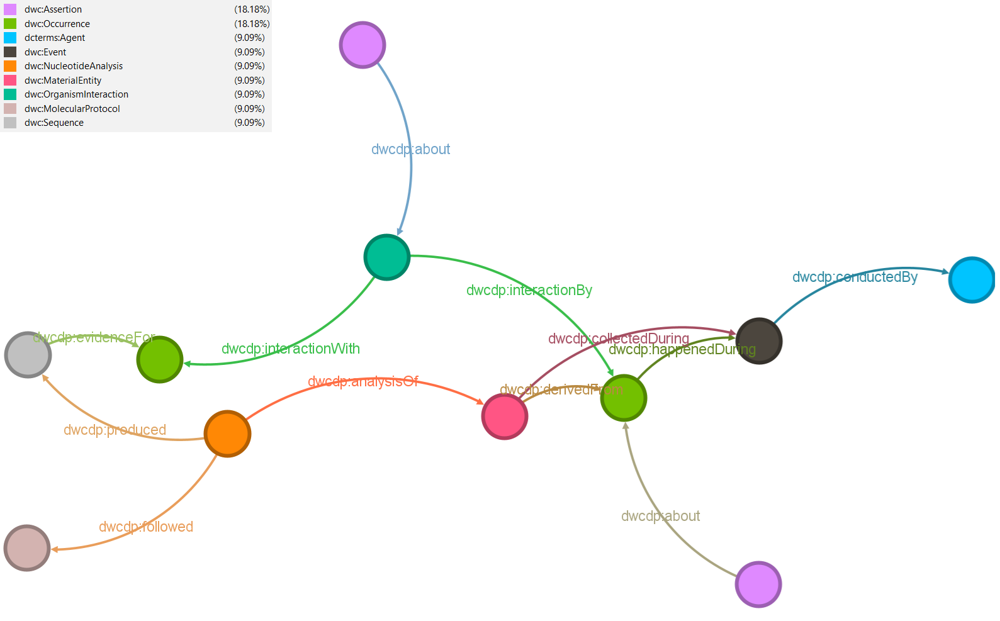

- **Additions made**: The fish occurrences themselves are present in the Darwin Core Archive. However, the detail that the sampling took place aboard the RV Investigator during the 2nd International Indian Ocean Expedition is provided only in the accompanying documentation and publication. To represent this, the vessel was modelled as a `dcterms:Agent` that conducted the sampling, using a web page describing the vessel as its identifier. Similarly, a web page describing the cruise was used as the identified of the `dwc:Event`.

- **Difficulties encountered**: The DNA-Derived Data extension for Darwin Core is very helpful for describing genetic and molecular information. However, because each row is represented with a single identifier, separating different conceptual entities requires careful parsing. In the lanternfish dataset, identifiers in the `dnaderiveddata.txt` file follow patterns such as `<urn:edna:in2019_v03_edna_nanopore_{fish-id}_{platform}_{primers}_{material}-{uuid}>`. Note that the `dwc:occurrenceID` of each fish in `occurrence.txt` is of the form `<urn:edna:in2019_v03_edna_nanopore_{fish-id}-1>`. I have not yet uncovered the meaning of this `1`.

  Additionally, it should be noted that the `dnaderiveddata.txt` file contains human-reable entry names, which requires an additional conversion step. Indeed, human-readable terms like `target_gene` or `otu_db` allow quick lookup, but require an additional step to convert to but the MIxS property URIs, which are identified using numbers like `0000044` and `0000087`. Though the matter can be easily resolved by building a Python dictionary and using it as a lookup table.

- **Graph-based representation**: At the center of the graph is the `dwc:Event` corresponding to the 2nd International Indian Ocean Expedition. The fish occurrences connect directly to this event. Each fish serves as the origin point for a branching structure resembling a butterfly (or a starfish or a jellyfish): its predator-prey relationship, as `dwc:OrganismInteraction` entities connect them to the clusters of prey occurrences. This connection thickens the "arms", as each fish consumed a fair amount of prey.

  All prey occurrences connect to `dwc:NucleotideSequence` instances, which converge at the `dwc:NucleotideAnalysis` node that produced them. As groups, nucleotide sequences are produced by the same nucleotide analysis, this causes a tightening at the extremities. Though it is difficult to see, the `dwc:MolecularProtocol` instances act as thin threads linking analyses that used the same protocol, producing cross-connections within and across fish.

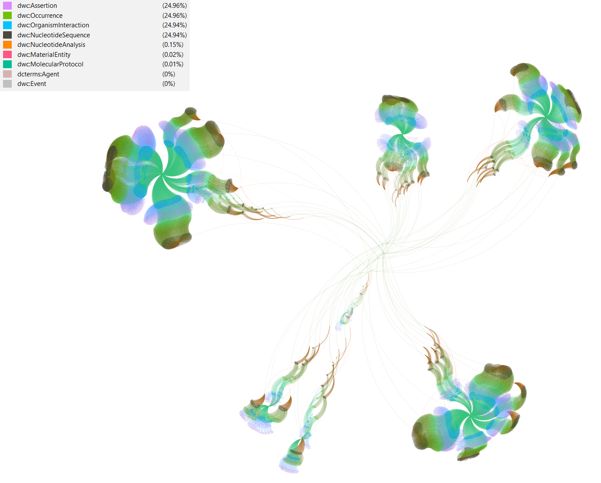

- **Lessons learned**: Although the DNA-Derived Data extension mixes multiple types of information in a single row, its overall structure is extremely helpful when representing genetic workflows. The newer classes (`dwc:NucleotideAnalysis`, `dwc:NucleotideSequence`, and `dwc:MolecularProtocol`) enable clear distinctions between different components of the sequencing workflow.

  This modelling approach supports richer biodiversity knowledge graphs: occurrences can be queried based on the material they were derived from, the molecular protocol used, or the sequencing results themselves. As a result, metabarcoding datasets become more reusable, interoperable, and semantically expressive.

### Lianas of Suriname

- **Dataset definition**: Lianas are ecologically important woody climbers in tropical forests, contributing substantially to biodiversity, forest structure, carbon dynamics, and providing resources for wildlife and people. A research project initiated by an NGO, – The Amazon Conservation Team – Suriname, sought to document and advance understanding of liana and climbing plant diversity in the forests of the Guiana Shield region. As part of this effort, plant specimens were systematically collected to support taxonomic research and biodiversity documentation of woody climbers. The dataset also contains vernacular names of the plants in various languages, including Trió (an indigenous language) and Samaraccan (a creole language). The project culminated in the publication of `The Lianas of the Guianas: A guide to woody climbers in the tropical forests of Guyana, French Guiana, and Suriname`, an illustrated field guide describing hundreds of species and designed for both specialists and non-specialists.

- **Dataset organization**: The dataset, as an occurrence core Darwin Core Archive can be downloaded [from GBIF](https://www.gbif.org/dataset/db81038b-c938-4b9a-8b30-4242ece71aad). The archive consists primarily of an occurrence.txt file, which contains information on specimen-based occurrences, including identifications and spatial data.

- **Modelling considerations**: The dataset maps quite directly to the basic Darwin Core classes. For example, each specimen is a `dwc:MaterialEntity` that was collected during a `dwc:Event` and is evidence for a `dwc:Occurrence` of a taxa. the overall modelling approach is comparatively straightforward when contrasted with datasets involving multiple sampling protocols or environmental measurements.

- **Ontology subset considered**: The essential Darwin Core classes required to represent specimen-based biodiversity data, `dwc:Occurrence`, `dwc:MaterialEntity`, `dwc:Identification`, `dwc:Event`, and `dcterms:Location`, were used and related using their conventional object properties.

  The project itself was modelled as an instance of `dwc:Provenance`, while the published field guide was modelled as a `dcterms:BibliographicResource`. These two entities were related using the object property `dcterms:source`. The directionality of this relationship is notable and is discussed further below.

  Both `dwc:Event` and `dwc:MaterialEntity` instances are linked to the same provenance using the object property `dwcdp:hasProvenance`. This implies that `dwcdp:hasProvenance` must have a single range of `dwc:Provenance`, while allowing for a sufficiently broad domain to accommodate both events and material entities.

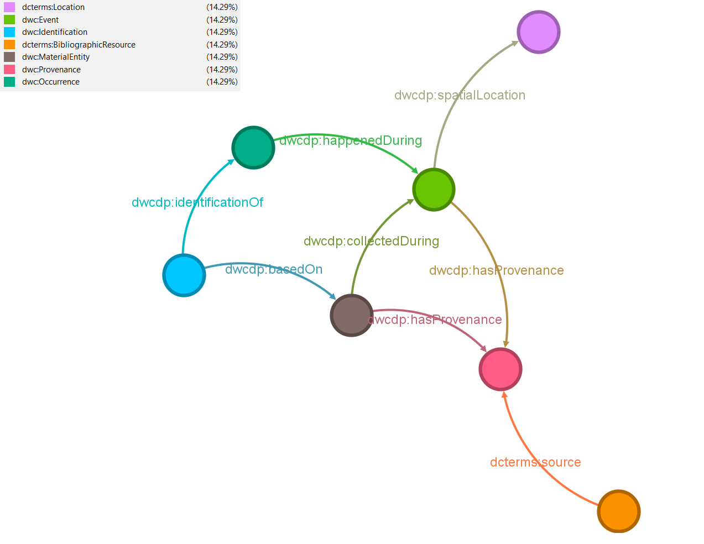

- **Additions made**: The dataset itself contains only the occurrence data. The information to fill in the `dwc:Provenance` instance was obtained from the description of the dataset.

  The book is also mentionned, but not explicitely considered. The book was modeled as a `dcterms:BibliographicResource` and identified using its ISBN-13 number.

  The vernacular names for each plant were parsed from the entry in the `dwc:vernacularName` field. These were used as seperate and repeated entries with appropriate language tags. As indigenous and creole languages are not widely used, ISO639-3 codes were used, being obtained [from the ISO 639-3 website](https://iso639-3.sil.org/).

- **Difficulties encountered**: As mentionned previously, the information contains only information about the occurrences. To be more precise, it does contains more information about the material entities derived from these occurrences than about the occurrences themselves.

  For example, though it may be tempting to let each `dwc:Occurrence` have its own associated `dwc:Event`, this might be dangerous. Indeed, it does not takes into account the possibility that multiple occurrences were noted and mulitple material entities collected in a single event. To a certain extent, this can be hypothesized, as some entries have identical event dates, geographic coordinates and verbatim localities. However, these assumptions can be dangerous without consulting the agents who collected the data.

  Consequently, with the exception of the `dwc:MaterialEntity`, that used the identifier supplied in the dataset, almost all other entities (`dwc:Occurrence`, `dwc:Event`, `dwc:Identification` and `dwc:Location`) were modelled as blank nodes. This maintains semantic relationships between the entities, but leaves enough vagueness that they do not commit errors. Indeed, as blank nodes do not have identifiers, using them in this manner does not leave out the possibility that these blank nodes are the same.

  As an example, a `dwc:Identification` node would have this appearance:

  ```turtle
  [] a dwc:Identification ;
      dwc:dateIdentified "2008"^^xsd:gYear ;
      dwc:family "Annonaceae" ;
      dwc:identifiedBy "P. Maas" ;
      dwc:genus "Bocageops" ;
      dwc:scientificName "Bocageops multiflora" ;
      dwc:scientificNameAuthorship "(Mart.) R.E.Fr." ;
      dwc:specificEpithet "multiflora" ;
      dwc:vernacularName "finu uwii"@srm,
          "rasai"@tri ;
      dwcdp:basedOn <ACT-S:Liana:BHoffman6698> ;
      dwcdp:identificationOf _:N421cb1582d864165b818846164497a1c .
  ```

  The data can still be queries in the usual manner with SPARQL. For example the following query will request all vernacular names of any individual identified as *Bocageopsis multiflora*:

  ```sparql
  PREFIX dwc: <http://rs.tdwg.org/dwc/terms/>

  SELECT DISTINCT ?name

  WHERE {
        ?ident a dwc:Identification ;
               dwc:scientificName "Bocageopsis multiflora" ;
               dwc:vernacularName ?name .
  }
  ```

  The `DISTINCT` keyword is required to avoid duplicated names for different individuals that received the same identification. 

  Another point is the extraction of vernacular names. There was a semi-fixed pattern in the names of the plants, which usually was `{name} ({language}), {name} ({language})`. The extraction was done using a regular expression that split on commas, found the languages in parentheses and obtained the language tag from a Python dictionary. However, the possibility that several vernacular names would need to be taken into account. Likewise, the insertion of comments, and the possibility of using various splits such as a colon or the word `or`, complicates extraction.

- **Graph-based representation**: The graph shows an aggregation of both `dwc:Event` and `dwc:MaterialEntity` instances around the `dwc:Provenance`. This was expected, as they both directly connect to it through the `dwcdp:hasProvenance` object property. Also at the center is the book, which has the provenance as its source.

  Other entities, such as `dwc:Occurrence`, `dwc:Identification` and `dcterms:Location` instances form the outer layer, as they only connect to events and material entities.

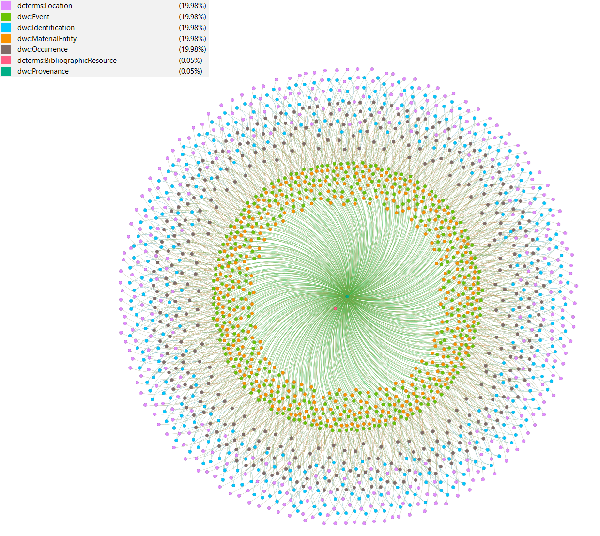

- **Lessons learned**: The consideration not only scientific information, but also vernacular names can be an important aspect of biodiversity datasets. The ability to add language tags in RDF means that datasets can not only for scientific information, but also cultural information.

  This aspect can be seen for the species *Duguetia eximia* where one individual has the `dwc:vernacularName` entry in Trió of `"kapai jamïimë"@tri`, whereas the other has both `"kapai jamï"@tri` and `"sikiman"@tri`. The former had the additional comment of `(short variety)`, which might highlight distinctions made on other bases than species, and adds to the cultural value of the dataset.

  Finally, it should be noted that the triple relating the book to the provenance is `<urn:isbn:9789460222245> dcterms:source <https://doi.org/10.15468/dokmsc> .`. Though the object property of `dcterms:source` is the same as the one considered [in the suggested DwC-DP SQL schema](https://raw.githubusercontent.com/gbif/dwc-dp-examples/refs/heads/master/gbif/dwc_dp_schema.sql), the directionality is different. Entries in the SQL schema relate the provenance to an external source from which it is derived, whereas here the book is derived from the provenance.
  
  This underscores the fact that biodiversity datasets are not only scientific artefacts but also cultural ones, capable of influencing and contributing to other knowledge products.

### Liloan reef monitoring

- **Dataset definition**: To provide a baseline for the evaluation and implementation of reef conservation and management, a sampling campaign was conducted between 2015 and 2016 on Poblacion and Kadurong Reefs (Liloan, Philippines). The survey recorded multiple types of measurements, including physico-chemical variables (e.g., water quality), percent cover of benthic reef components, and occurrences of several biological communities. Sampled communities comprised phytoplankton, zooplankton, and fish.

- **Dataset organization**: The dataset is available both [from GBIF](https://www.gbif.org/dataset/788eaed9-c607-4510-bd28-5db2ea598dc4) and [from OBIS](https://obis.org/dataset/16cbef75-11a1-47c7-84a8-172470203a68). Both endpoints deliver the same content.

  The archive contains two tables: `occurrence.txt`, which documents species occurrences across all sampled communities, and `extendedmeasurementorfact.txt`, which records environmental variables measured at each site.

- **Modelling considerations**: At first glance the modelling appears straightforward: site visits can be modelled as `dwc:Event` instances, species detections as `dwc:Occurrence` instances, and environmental variables as `dwc:Assertion` instances targeting events.

  However, some practical questions arise due to how the sampling design is laid out:

  - First, sampling sites differ by campaign. Phytoplankton and zooplankton were sampled with different net sizes but at the same points (S01–S20 for phytoplankton; and S01–S03 and S07–S09 for zooplankton), which correspond to the physico-chemical measurement points. Fish communities, however, were assessed at eight different transect points (T01–T08), which are a subset of transects used for benthic variables (T01–T10). Thus, planktonic and fish campaigns are distinct in sampling design and locations.

  -  Second, the relationship between campaigns and events requires careful modelling. Although phytoplankton and zooplankton sampling overlapped at six sites, these campaigns are methodologically different and should not be naïvely modelled as simple sub-events of a single event. It would be preferable to represent each campaign as an `eco:Survey` that happened during the parent `dwc:Event`. This preserves conceptual coherence and avoids conflating sampling methods.

  Modelling campaigns as `eco:Survey` instances also enables the use of `eco:SurveyTarget`, which provides a more detailed description of the campaign's scope and targets.

- **Ontology subset considered**: The standard relationships among `dwc:Occurrence`, `dwc:Identification`, `dwc:Event`, and `dcterms:Location` are used. All environmental measurements are represented as `dwc:Assertion` instances targeting the relevant `dwc:Event`.

  The main addition in this dataset is `eco:Survey`, which occurs within a `dwc:Event`. Each survey has an associated procedure and target definitions, modelled via `eco:SurveyTarget`. Every occurrence recorded in a survey can, usually, be interpreted as satisfying the survey's targets.

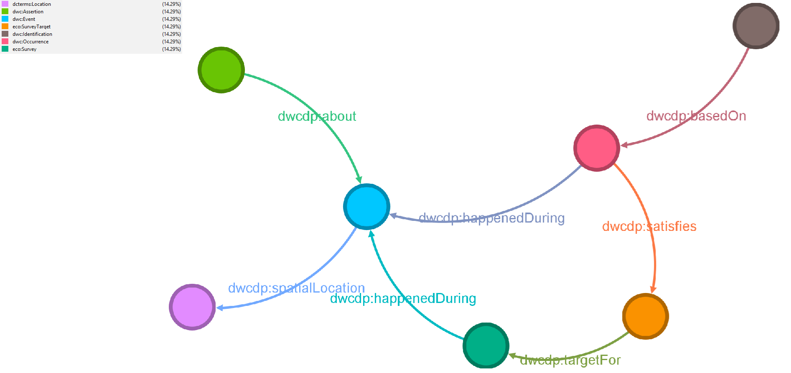

- **Additions made**: The `eco:Survey` and `eco:SurveyTarget` classes were introduced to represent the distinct sampling campaigns for each community. These were populated using methodological details from the dataset description and methodology.

  A `dwc:Provenance` instance was created to capture data provenance and project metadata. The ASEAN Centre for Biodiversity, which published the dataset, was modelled as a `dcterms:Agent`.

- **Difficulties encountered**: Despite the title `Sampling-event dataset of short-term monitoring of Poblacion and Kadurong Reefs in Liloan, Cebu, Philippines`, the archive functions as an occurrence dataset rather than an explicit sampling-event dataset. Events therefore had to be reconstructed from the informations in `occurrence.txt` and `extendedmeasurementorfact.txt`.

  This reconstruction was facilitated by consistent occurrence identifiers of the form `{project}:{site}:{date}:{community}`, which can be parsed to recover events and targeted communities.

  Another difficulty was present in `extendedmeasurementorfact.txt`. In this file, `dwc:measurementID` column does not provide unique identifiers for individual measurements but instead classifies measurements into the categories of `benthic` or `physicochemical`. The actual measurement identifiers were placed in `dwc:occurrenceID`, which in should link to `occurrence.txt` but in this case does not.

- **Graph-based representation**: As expected from the modelling choices and the sampling outline, fish and plankton campaigns form distinct clusters. Fish assemblages and their transects are shown on the right side of the graph, whereas plankton assemblages and their sites appear on the left side of the graph. The two isolated clusters of `dwc:Assertion` nodes in the middle correspond to the two transect points where benthic variables were measured but no underwater visual census for fish was conducted (T09-T10).

  Within each community cluster, `eco:SurveyTarget` nodes form the core, as all observed `dwc:Occurrence` instances satisfy these targets. The `eco:Survey` instances surround the targets because they are targets of said survey targets. The `dwc:Identification` nodes lie on the periphery, as they attach to specific occurrences.

  The six `dwc:Event` instances where both phytoplankton and zooplankton were sampled create a bridge connecting the respective phytoplankton and zooplankton clusters.

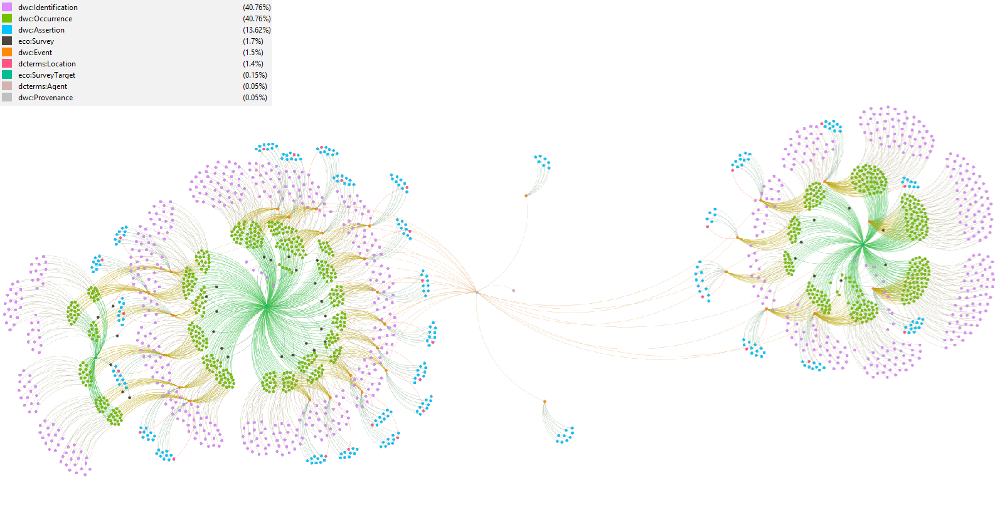

- **Lessons learned**: For well-designed field programs that deliberately include or exclude particular taxa or methods, `eco:Survey` and `eco:SurveyTarget` are valuable modelling primitives. They enable precise expression of the sampling plan and support interpretation of absences. That is to say whether a taxon was absent because it was truly absent or simply because it was outside of the considered scope.

  When comparing campaigns across communities, these classes provide a clean mechanism to relate each campaign to its sampled sites and to document methodological differences.

### Moth AMI captures

- **Dataset definition**: Antenna is an online platform that leverages machine learning to scale insect biodiversity monitoring. One such project, carried out as part of The Vermont Atlas of Life, involves the deployment of two Automated Monitoring Insect (AMI) traps to study patterns in moth diversity. The instruments operated during fixed monitoring periods (sessions), typically lasting one night, and collectively produced over one million image captures. All images are stored in a shared Amazon S3 repository provided by Compute Alliance Canada. Each detected insect capture received two automated identifications generated by pre-trained image recognition models: a *Moth / Non-Moth classifier*, which determines whether the organism is a moth, and a more detailed *Quebec & Vermont species classifier*, capable of producing species-level identifications.

- **Dataset organization**: The dataset does not exist as a static archive or packaged file. Instead, the data is exposed through a [Django REST API](https://demo.antenna.insectai.org/api/v2/) against which requests can be made. The API provides several endpoints, including those for events and occurrences.

- **Modelling considerations**: The dataset is fundamentally centred around image captures. Consequently, each image was modelled as an `ac:Media` instance. However, it was necessary to distinguish between the capture as an image and the capture as an event. The latter was therefore modelled as a `dwc:Event`.

  Capture events occur within a broader event representing the period during which the instrument is active (i.e. a monitoring session). To reflect this structure, a hierarchical event model was adopted, in which individual capture events occur within a session-level event.

  Every media instance possesses several additional media instances that are a part of it. These cropped images, on which the identifications are carried out, were also modelled as `ac:Media` instances and linked back to the original image through the object property `dwcdp:isPartOf`.

  Each of the machine-learning model was modelled as a `dcterms:Agent` that carried out separate identifications. Each image of an organism received two identifications, one for each model.

  Reference taxa, which allow linking identifications to stable identifiers, were modelled using `dwc:Taxon` instances. These instances used GBIF taxon identifiers.

- **Ontology subset considered**: Five classes form the core of the ontology subset considered: `ac:Media`, `dcterms:Agent`, `dwc:Event`, `dwc:Identification`, and `dwc:Occurrence`. Together, these classes capture the main semantic relationships between images, sampling events, identifications, and inferred occurrences.

  The media instances correspond to image captures of organisms and form the base for identifications, and also serve as evidence for occurrences. Although both the object properties `dwcdp:conductedBy` and `dwcdp:identifiedBy` point to `dcterms:Agent`, these roles are fulfilled by different agents. Sampling events are conducted by the AMI instruments themselves, whereas identifications are performed by image recognition software.

  The use of the `dwc:Taxon` class allows identifications to refer directly to taxonomic concepts rather than relying solely on string-based names. This also enables reference to stable taxon identifiers and, potentially, to different taxon concepts, rather than to a single asserted classification.

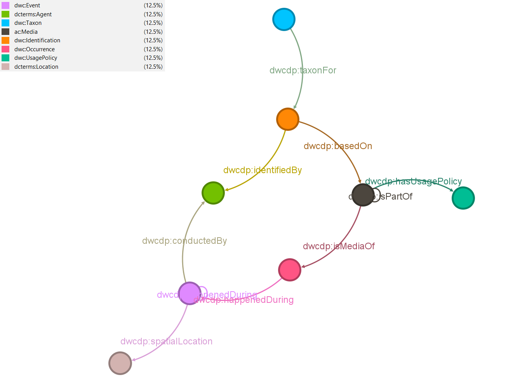

- **Additions made**: An instance of `dwc:UsagePolicy` was created to relate all media instances to their usage terms. All media instances in the demo are licensed under a Creative Commons Attribution – NonCommercial license (CC BY-NC 4.0), and this policy instance explicitly captures that fact.

- **Difficulties encountered**: The demo API has a straightforward structure and is relatively easy to query. The fact that the dataset is exposed through an API makes it easily processable and well suited to programmatic access.

  However, one difficulty encountered was the actual URL of the API. The documentation lists and shows the API base URL as https://api.demo.insectai.org/api/v2/. This endpoint is not functional and returns a 404 error. Inspection of the network fetch requests revealed that the correct base URL is instead https://demo.antenna.insectai.org/api/v2/.

  This issue propagates throughout the API, meaning that cross-queries cannot be performed by directly following nested URLs returned in responses. To make chained requests, URLs must therefore be reconstructed using string manipulation to extract relevant identifiers and reinsert them into the correct base URL.

- **Graph-based representation**: The centre of the graph is dominated by two `dcterms:Agent` nodes representing the two classifier models. These nodes attract the majority of `dwc:Identification` instances, reflecting the fact that all identifications are produced by automated classifiers.

  One particularly noticeable taxon node is identified by the URL https://www.gbif.org/species/797, which corresponds to the taxon Lepidoptera. As defined by the protocol, the *Moth / Non-Moth classifier* can only assign occurrences to this taxon. As a result, the node representing Lepidoptera is effectively superposed with the node representing this classifier. Identifications carried out by this algorithm make up centermost cluster of identification nodes.

  The second classifier produces a more diverse set of identifications, forming a secondary and more external layer of identification nodes. These identifications are linked to a broader range of `dwc:Taxon instances`. Rare taxa appear at the periphery of the graph and connect to only a few identifications, while more common taxa appear closer to the centre and connect to many.

  Between the layers of identifications lies a layer of `ac:Media` instances, which relate to both the identification and the occurrences. Media nodes are also drawn toward the centre due to their shared connection to the `dwc:UsagePolicy` instance governing all images.

  Finally, the two agent nodes representing the instruments, Luna and Mothra, appear at the extremities of the graph. These nodes pull the event instances around them. Luna is associated with fewer events and occurrences, whereas Mothra is associated with a larger number of capture events and occurrences.

  For graphical purposes, a subset of 3 000 occurrences is considered.
 
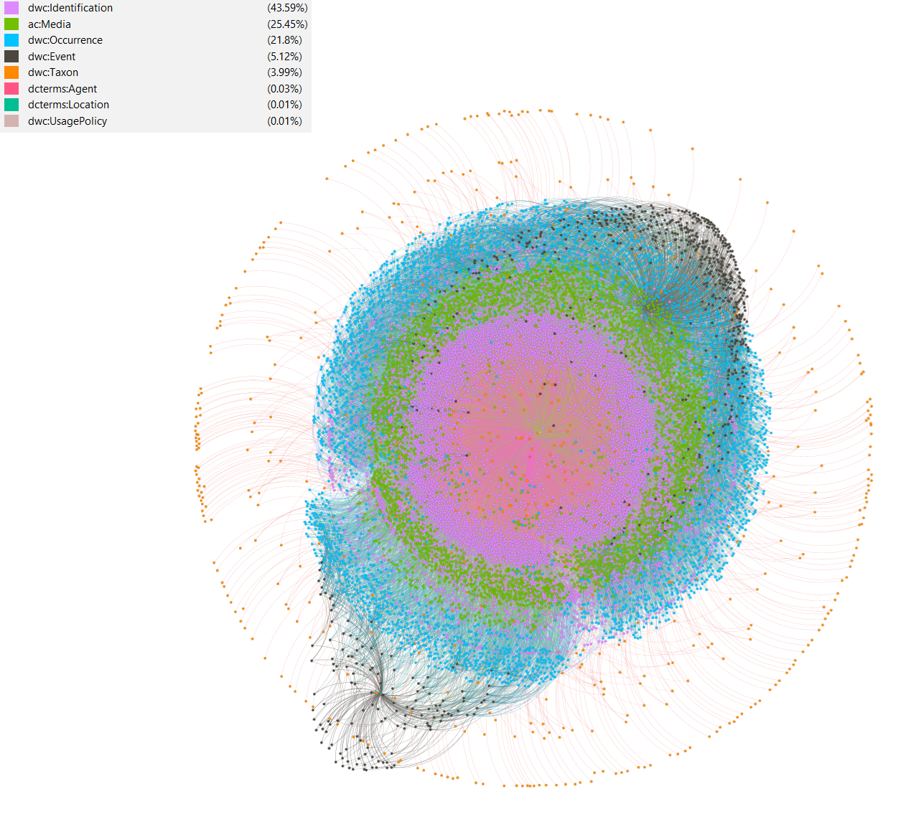

- **Lessons learned**: The dataset shares many similarities with other image-based biodiversity datasets, such as the Ryukyu image dataset and the Jiulongfeng reserve examples. RDF provides a clean and natural framework for representing sampling projects, media instances, and biodiversity occurrences. However, this dataset also highlights several important distinctions.

  First, no human agents are directly involved in either sampling or identification. Events are conducted by autonomous instruments, and identifications are produced by pre-trained artificial intelligence models. This underscores that the `dcterms:Agent` class should not be restricted to human actors when modelling biodiversity data.

  Second, the use of stable URLs to refer to taxa allows identifications to be linked directly to taxonomic concepts rather than to ambiguous textual labels. This improves semantic precision and machine readability, particularly in automated identification workflows where reproducibility and interpretability are critical.

### NMNH paleobiology specimen

- **Dataset definition**: The Smithsonian National Museum of Natural History houses more than 139 000 specimens spanning a wide range of taxa, including animals, plants, and protists. Although the largest proportion of observations originate from the United States, the geographic scope of the collection is global. The collection includes information about fossil collection campaigns as well as media documenting the collected fossil material. The dataset used here is a subset specifically designed to highlight the distinctive modelling challenges associated with fossil specimens.

- **Dataset organization**: The entire dataset can be downloaded [from GBIF](https://www.gbif.org/dataset/c8681cc2-9d0a-4c5f-b620-5c753abfe2bc). However, the current analysis is based on a smaller subset that was published on the test IPT. There are two versions of the subset, [Test A](https://dwcdp-ipt.gbif-test.org/resource?r=paleo-test-a) and [Test B](https://dwcdp-ipt.gbif-test.org/resource?r=paleo-test-a).

  Both versions contain a varying amount of .csv files, based on the tables in the suggested DwC-DP SQL schema, 11 for Test A 14 for Test B. The RDF conversion considered here is mostly based on the Test A version, but has made various modifications.

- **Modelling considerations**: Each fossil collection event was modelled as a `dwc:Event`, with the collected fossil material being collected as a `dwc:MaterialEntity`. Instances of `dcterms:Agent` were created to represent the people and organizations carrying out the various activities surrounding studies, including but not limited to collection, identification and digitization.

  Identification of the fossil material, which is modeled as a `dwc:Identification` instance, allows the inference of an occurrence of the taxon. As for the other datasets, the material entity is evidence for the occurrence. However, contrary to other datasets, the occurrence cannot be linked back to the event through the usual `dwcdp:happenedDuring` object property because the nature of the event. Doing so would bring back the occurrence into present time and location, which is not the case.

  Instead, both the material entity and the inferred occurrence are framed within the same geological context using `dwcdp:happenedWithin`. In other words, the occurrence and the material are within the same geological context, while only the material entity is associated with the collection event.

- **Ontology subset considered**: As it is a fossil dataset, the considered ontology is centered around the `dwc:MaterialEntity` class. Indeed, it is what is collected during events, on which indentifications are based off of and the basis of evidence for an occurrence.

  The dataset also requires the consideration of the `dwc:GeologicalContext` class, which provides geological information about the collected material and eventually an occurrence, if the material is identified. Therefore, the material entity and its possibly inferred occurrence can be framed within a geological context instance through the object property `dwcdp:happenedWithin`.

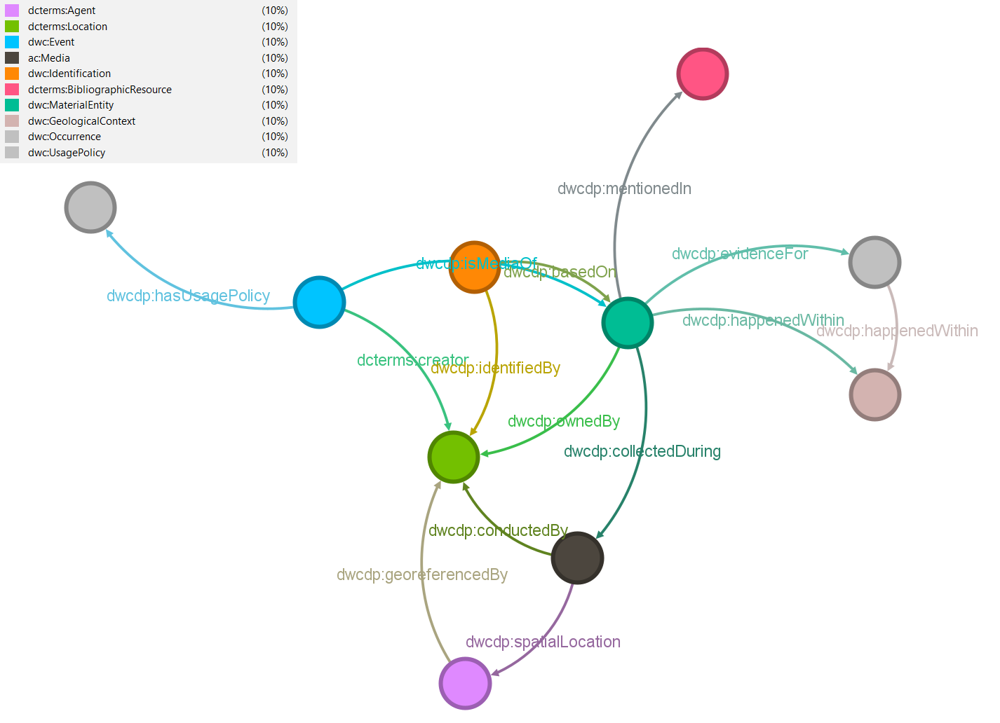

- **Additions made**: Most media associated with the specimens were released under public-domain terms (i.e. CC0). To represent this explicitly, a `dwc:UsagePolicy` instance was created and populated with the appropriate licensing information.

- **Difficulties encountered**: The principal theoretical difficulty arises from the fact that inferred occurrences cannot be linked to events, as is usually done in other examples. Linking occurrences to events would imply that the organisms existed at the time and place of collection, which is not the case for fossil material.

  The single entry in the `agent-agent-role.csv` table documents the employment period of the American geologist Ellen James Moore at the United States Geological Survey. This was modelled as an instance of `dwc:AgentAgentRole`, considered a subclass of `dwc:ResourceRelationship`. As discussed previously for the BROKE-West fish dataset, this represents an example of second type of application of this pattern, where it is used to state the nature and duration of a relationship between two `dcterms:Agent` instances.

  Most identifiers in the `agents.csv` file are local identifiers provided without contextual resolution. Values such as `9EA07EEC` or `2E0FD7ED` cannot be interpreted as URIs. Similarly, identifiers like `USNM:PAR:10122764` appear to be internal museum identifiers rather than globally resolvable identifiers. Consequently, unless an identifier was explicitly provided as a URI, in this case a URL, agent resources were minted within a local dummy namespace.

  Several additional issues were encountered at a more technical level:

  1. The identification table lacks foreign keys. In a fossil dataset, a `dwc:materialEntityID` field linking identifications to the material on which they are based. No such field is present, requiring manual lookup of material records and their identifications via the Paleobiology website.

  2. In four entries of the `material-media.csv` table and one entry of the `media.csv` table, the Name-to-Thing resolver is incorrectly written as http://n2t/net, preventing proper resolution and media download. In addition, one media entry appears twice in the `material-media.csv` table.

  3. Three images are listed in the `media.csv` table but have no corresponding entries in the `material-media.csv` junction table. These were added back into the dataset.

  4. The media format in the `media.csv` is listed as `tiff`, which is not a valid MIME type. Although the Paleobiology Collections website indicates also `image/tiff` for all image resources, all attempts to retrieve TIFF files resulted only in JPEG images. Accordingly, these entries were changed to `image/jpeg` in the conversion.

  5. Three media items lack any usage statement. While this may reflect an omission, it is notable that all three correspond to specimen label images. During modelling, the `ac:Media` instances of these resources were not related to the `dwc:UsagePolicy` instance.

  6. Some agents listed in the `agents.csv` table do not appear in any other table. Examination of the Paleobiology website showed that, for many of these, they were individuals that were credited with the creation of the images. Therefore, they were related to the corresponding image through the `dcterms:creator` object property.

- **Graph-based representation**: At the center of the graph is the `dcterms:Agent` instance representing the National Museum of Natural History. All fossil specimens, modelled as `dwc:MaterialEntity` instances, are connected to it as it is the institution that owns them. Three additional agent-centric clusters are particularly notable:

  - An agent node around which many `dcterms:Location` instances are connected. This node represents Curt Breckenridge, credited with performing most of the georeferencing.

  - An agent node around which most `ac:Media` instances are connected. This node represents Pixel Acuity, credited as the creator of the majority of specimen images.

  - An agent node around which many `dwc:Identification` instances are connected. This node again represents Ellen James Moore, who carried out several identifications in this dataset.

  Material entities typically cluster around both a collection event and a geological context, reflecting the fact that material is extracted during a specific event from a particular geological stratum. As defined in the modelling section, both material entities and inferred occurrences are linked to geological contexts, while only material entities are linked to collection events.

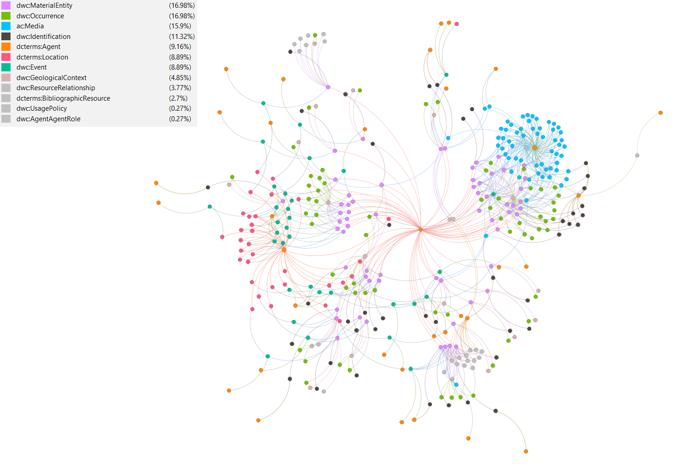

- **Lessons learned**: While most biodiversity datasets follow the convention that an occurrence happens during an event, fossil datasets represent a fundamental exception. In fossil studies, material entities and inferred occurrences are framed within geological timescales that are distinct from the modern collection events through which the material was obtained.

  This distinction highlights the importance of clearly separating collection, evidence and inference activities in biodiversity data models. However, when correctly done, the data can be clearly interpreted with the intended meaning.

### Ryukyu Islands reef media

- **Dataset definition**: Along the coral reefs of the Ryukyu Islands (Japan), the Global Oceanographic Data Center (GODAC) collected images and videos of marine organisms using a remotely operated underwater vehicle. Organisms visible in these media were later identified, and biological occurrence records were generated based on the geographic location at which each photograph or video was captured. Identifications were based on Japanese vernacular names and, when identifications required additional clarification, relevant taxonomic literature was consulted.

- **Dataset organization**: This dataset has an unusual characteristic: it has two independent download endpoints with partially mismatched content. It can be downloaded either [from GBIF](https://www.gbif.org/dataset/ffd03c32-a7ca-4fae-adc8-6f81cddbe43b) or [from OBIS](https://obis.org/dataset/61a0fac8-6bba-4c30-986b-248bc12da62c). Despite the GBIF version being labelled 1.2 and the OBIS version 1.1, the OBIS archive is more recent, containing a few additional fields that are not present in the GBIF version.

  Crucially, the OBIS archive contains valid media URLs that resolve to the actual media files, whereas all media links in the GBIF archive are dead. Anyone relying on the GBIF version alone would be unable to resolve or download the associated media objects.

- **Modelling considerations**: The modelling process relies primarily on the core biodiversity classes, which are `dwc:Occurrence`, `dwc:Identification` and `dwc:Event`. Several records also include biological statements about an organism (e.g., sex or life stage), which required the use of the `dwc:Assertion` class.

  Because this dataset consists of image and video files, the class `ac:Media` was also considered. Each media file was modelled as an instance of `ac:Media` and identified using the working (non-404) URLs obtained from OBIS. The `dwc:Identifications` were related to the media object, not to the organism directly, because the identification is based on inspecting the media.

  The object properties `dwcdp:evidenceFor` and `dwcdp:isMediaOf` naturally form many-to-many relationships. A single organism may be represented in several media items, and a single media item may depict multiple organisms. In the Darwin Core Archive, this is done by using the `dwc:associatedMedia` field with values separated by the pipe character (` | `). The RDF conversion therefore had to support repeated values and generate multiple triples for the cell entry.

  Because vernacular names and almost all identification references are provided in Japanese, this dataset also offered a good opportunity to use language-tagged literals, such as `"ハナビラクマノミ"@ja` or `"オオアカホシサンゴガニ"@ja`, to indicate that the literal value is in Japanese.

- **Ontology subset considered**: It can be seen that part of the entities center around the `dwc:Occurrence` and describe the context around it such as the event and the agent that recorded it; whereas another part considers the `ac:Media` and describe to the identification and rights around it. The object property `dwcdp:evidenceFor` acts as a bridge between the two, linking the fact that the occurrence report is based on the media depicting the organism.

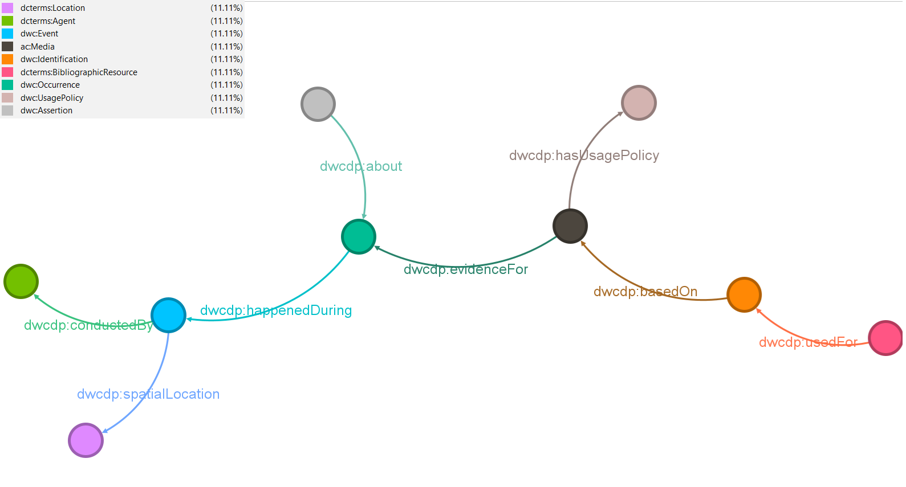

- **Additions made**: A dataset-level rights object was created as an instance of `dwc:UsagePolicy`, populated with information about the usage terms for the media. The original literal value `"ccbync"` in `dcterms:license` is not appropriate for a `dcterms:` property, which expects an IRI. The correct form should be something like `<https://creativecommons.org/licenses/by-nc/4.0/>`. Also, the remotely operated vehicle was also modelled as a `dcterms:Agent`, representing the agent responsible for conducting all events.

- **Difficulties encountered**: A recurring difficulty, also present in other datasets, was the ambiguity of identifiers.
Values in the `dwc:occurrenceID` column follow the form `urn:catalog:JAMSTEC:godac_coralreef_web:1011`. However, these URNs appear to refer to the media items, not to occurrences themselves. Assigning them directly to `dwc:Occurrence` would therefore be misleading, and they were instead used for the corresponding `ac:Media`.

  Because identification references are provided as Japanese book titles, they cannot be reliably turned into URIs without facing some difficulties. To resolve this, ISBN-13 identifiers were used as URNs after confirming the bibliographic information from Japanese online bookstores. For example, the book `日本産魚類検索全種の同定第三版` was instead identified as `urn:isbn:9780306406157`. This provides a globally stable, unambiguous identifier, unlike a literal string title.

  Some occurrences in the dataset include organism-level assertions directly as datatype properties. For example, four occurrences contain values for `dwc:sex` and thirteen contain values for `dwc:lifeStage`. While this approach is permissible, it raises an important modeling question given the existence of the `dwc:Assertion` class. Specifically: should these values be captured directly as datatype properties of `dwc:Occurrence`, or should they instead be represented as full `dwc:Assertion` records linked to the occurrence?

  A number of Darwin Core terms fall into this ambiguous category, properties that can be interpreted either as simple annotations or as observational assertions. These include: `dwc:behavior`, `dwc:caste`, `dwc:lifeStage`, `dwc:reproductiveCondition`, `dwc:sex`, and `dwc:vitality`.

  My current view is that these would be better modeled as instances of `dwc:Assertion`, each providing a structured description of the observed property. The datatype properties, if kepts, would be more appropriately used as datatype properties of specific subclasses of `dwc:Assertion`, as is done in DwC-OWL, where the domain of terms like `dwc:sex` and `dwc:lifeStage` is defined as the union of `dwc:OccurrenceAssertion` and `dwc:OrganismAssertion`. In description logic, this would use the existential restriction as `dwc:OccurrenceAssertion` ⊑ `dwc:Assertion` ⊓ ∃`dwcdp:about`.`dwc:Occurrence`.

  A comparable design decision appears in the mineralogy extension, where mineral-related descriptive terms (e.g., `minext:cleavage`, `minext:luster`, `minext:crystalForm`, etc.) are declared as datatype properties to be used with the class `dwc:MaterialEntityAssertion`. This ensures that domain semantics are respected while still allowing fine-grained descriptive assertions.

  Some additional information could be modelled, but only with manual interpretation. For several entries, `dwc:occurrenceRemarks` indicate that some measurements were taken, remarks such as `"Body length: ca. 10 cm"` or `"ca. 7 cm"`. However, , without explicit information stating what was measured, it is difficult to assess what the value of `"ca. 7 cm"` relates to.

- **Graph-based representation**: The submersible vehicle, modelled as a `dcterms:Agent` pulls all `dwc:Event` around it, they all link to this agent. Likewise, the `dwc:UsagePolicy` instance pulls all `ac:Media` media instances around it, as it is the rights under which they are distributed. Together, these two nodes produce the double-ring structure visible in the graph. The outer rings consist of the `dwc:Identification` instances associated with each media file, as well as the `dwc:Occurrences` and `dcterms:Locations` associated with each event.

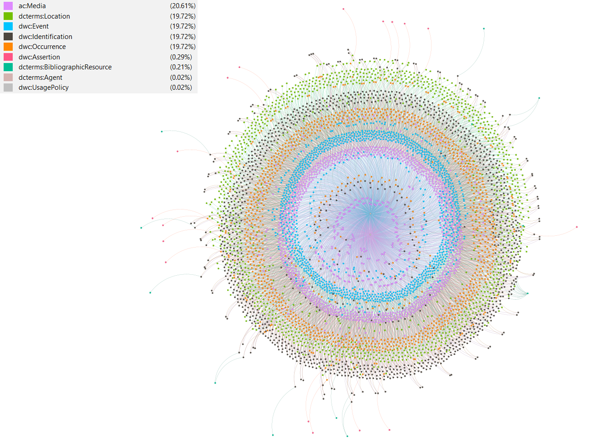

- **Lessons learned**: Media resources are an increasingly important component of biodiversity datasets. Because images and videos can be shared online, the annotation of media, including rights metadata, controlled vocabulary values, and links between organisms, identifications, and media objects—should be treated as a crucial element of dataset modelling.

  Controlled vocabularies such as the TDWG subject orientation and subject part vocabularies can enrich media annotations. For example, the following SPARQL DESCRIBE output illustrates how a media object might be annotated:

```turtle
@prefix ac: <http://rs.tdwg.org/ac/terms/> .
@prefix dc: <http://purl.org/dc/elements/1.1/> .
@prefix dwc: <http://rs.tdwg.org/dwc/terms/> .
@prefix dwcdp: <http://rs.tdwg.org/dwcdp/terms/> .

<https://dbarchive.biosciencedbc.jp/data/jam-coral-img/LATEST/img/1011/20110714_4.jpg> a ac:Media ;
    dc:format "image/jpeg" ;
    dwcdp:evidenceFor <https://www.gbif.org/occurrence/5105831354> ;
    dwcdp:hasUsagePolicy <http://bioboum.ca/usage_policy/ryukyu_islands_usage_policy> ;
    ac:subjectOrientationLiteral "left" ;
    ac:subjectPartLiteral "entireOrganism" ;
    dwcdp:hasSubjectOrientation <http://rs.tdwg.org/acorient/values/r0005> ;
    dwcdp:hasSubjectPart <http://rs.tdwg.org/acpart/values/p0001> .
```

  In this case, the object properties `dwcdp:hasSubjectOrientation` and `dwcdp:hasSubjectPart` play a role similar to `ac:subjectOrientationIRI` and `ac:subjectPartIRI`. However, the difference is that the `dwcdp:` bridges the gap between the OWL ontology and the SKOS vocabulary, by creating a subclass of `skos:Concept`. This allows for the creation an enumerated range for the object property and the consideration of various vocabularies.

### *Solidobalanus fallax* records publication

- **Dataset definition**: In 2004, the `Journal of the Marine Biological Association of the United Kingdom` (volume 84) published a paper titled `Habitat and distribution of the warm-water barnacle Solidobalanus fallax (Crustacea: Cirripedia) records`. The paper compiles occurrence records for the barnacle *Solidobalanus fallax* in the Plymouth area (south-west England). Records derive from a variety of sources, including trawl surveys on the Plymouth inshore grounds (since 1994), SCUBA observations (since 2000), and personal communications. The species is noted as having the potential to become a pest of aquaculture infrastructure south of Britain.

- **Dataset organization**: The dataset can be downloaded either [from GBIF](https://www.gbif.org/dataset/29e95cd7-4759-4aa7-bde0-8463118c873a) or [from OBIS](https://obis.org/dataset/2218a192-6760-4718-bb1f-0f9d827fa291). Both endpoints give the same dataset. Within the Darwin Core Archive are three files, `occurrence.txt` which provides information the occurrences and one absence of the barnacle, `events.txt` which provides information about every record and finally `extendedmeasurementorfact.txt` which provides information about the abundance of each occurrence.

- **Modelling considerations**: Because the dataset documents occurrences of a single species, a compact modelling approach is enough to capture the information. The classes used are `dwc:Occurrence`, `dwc:Event`, and `dcterms:Location`. These classes capture the spatial, temporal, and taxonomic aspects of the records without introducing unnecessary complexity.

- **Ontology subset considered**: The ontology subset used to model this dataset comprised of `dwc:Occurrence`, `dwc:Event`, and `dcterms:Location`. The publication that collated the records was modelled as a `dcterms:BibliographicResource` and linked to occurrences and events using the object property `dwcdp:mentionedIn`.

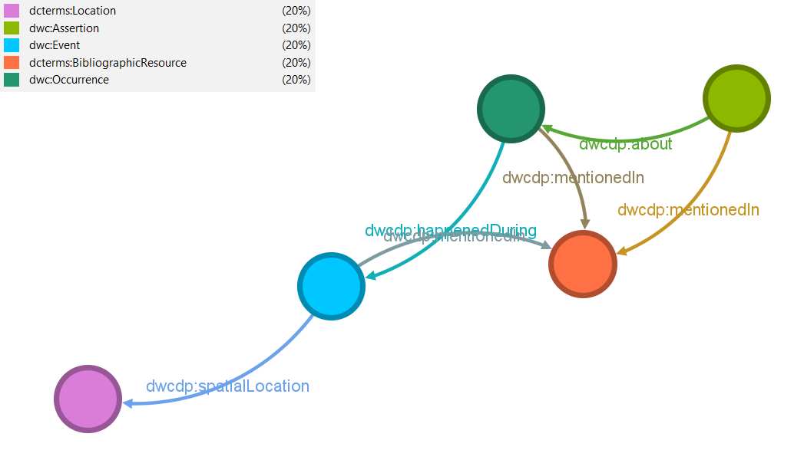

- **Additions made**: The dataset, despite having three files, has less content than the original paper. The original paper provides textual descriptions of the locations, sometimes providing the event type. These were added back as `dwc:locationRemarks` values.

  Likewise, the paper also provided information about the substrate or the animals on which the barnacles were recorded. This information can be important to inform possible vectors of this barnacle, and were added back as `dwc:occurrenceRemarks`.

- **Difficulties encountered**: As mentionned, the information contained in the `extendedmeasurementorfact.txt` table is simply the numeric values of the count of the barnacles at each event, when the values are not semiquantitative. Note that subevents are pooled to produce the final count value. The only thing added is the IRI from the NERC vocabulary for the concept of `count of individuals`, which is `<http://vocab.nerc.ac.uk/collection/P01/current/OCOUNT01>`.

  I hesitated between whether to model this count value as a `dwc:Assertion` or not. The hesitancy was in large part to the fact that datatype properties, `dwc:organismQuantity` and `dwc:organismQuantityType`, to do this already exist. This means that providing the values `5` for `dwc:organismQuantity` and `individuals` for `dwc:organismQuantityType` would fill the same role as creating an instance of a `dwc:Assertion` for that same purpose.

  However, I point out that there might be a valid reason to use this term, by pointing to the Broke-West fish dataset. Looking through the turtle file reveals this snippet:

  ```turtle
  <https://www.bioboum.ca/assertion/aav3ff-00248-stomach-136-rhincalanus-gigas-count> a dwc:Assertion ;
    dwc:assertionType "individual count" ;
    dwc:assertionValueNumeric 1.0 ;
    dwcdp:about <https://www.bioboum.ca/material/aav3ff-00248-stomach-136-rhincalanus-gigas> .
  ```

  Which is a `dwc:Assertion` used to define the number of individuals of the copepod *Rhincalanus gigas*. However, in this case, it is allowed and necessary. The reason being that this `dwc:Assertion` is used here to describe the individual counts of organisms in a `dwc:MaterialEntity`, in this case the stomach content of an Antactic fish *Electrona antarctica*, and not a `dwc:Occurrence` as in the *Solidobalanus* dataset.

- **Graph-based representation**: Given the small number of classes considered and their simple organization, the interpretation of the graph is straightforward. At the center of the graph is the scientific paper. The first ring around it are the `dwc:Occurrences` which are drawn to it because they are mentionned in the paper. The second ring consists of the `dwc:Events`, which despite being mentioned in the paper and drawn to it, are slightly more distant due to the fact that each event is connected to a `dcterms:Location`.

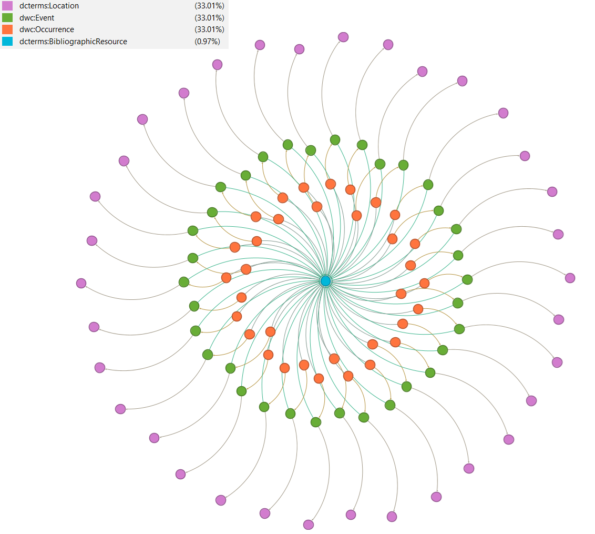

- **Lessons learned**: When the barnacle was noted as being present on another organism and not on a substrate, an occurrence could have been created and linked to the barnacle occurrence through a `dwc:OrganismInteraction` instance. For example, consider the following line:

| Date       | Location                | Number of *Solidobalanus* | Notes                         |
|------------|-------------------------|---------------------------|-------------------------------|
| 26-Jul-95  | trawl Bigbury Bay, 33 m | 4                         | 2 each on two *Maia squinado* |

  This row could have converted into 2 separate instances of *Solidobalanus fallax*, each with `2` for `dwc:organismQuantity` and `individuals` for `dwc:organismQuantityType`, and two separate instances of spider crabs (*Maia squinado*), each with `1` for `dwc:organismQuantity` and `individuals` for `dwc:organismQuantityType`. The pairs of occurrences would be related through a `dwc:OrganismInteraction`, relating the fact that the barnacle was an epibiont on the spider crab.
  
  Though enticing, this becomes impossible for some rows such as:

| Date       | Location             | Number of *Solidobalanus*  | Notes                                         |
|------------|----------------------|----------------------------|-----------------------------------------------|
| 29-Jun-95  | trawl off West Rutts | 14                         | on *Buccinum* shells inhabited by *Eupagurus* |
  
  In this case, we are incapable of doing the same exercise, as we do not know neither how many hermit crabs there are nor how the barnacles are spread.

  However, the actual interest in this dataset was the following entry in table 1 of the paper that is quite original:

| Date       | Location                           | Number of *Solidobalanus* | Notes                                  |
|------------|------------------------------------|---------------------------|----------------------------------------|
| 08-Nov-95  | dredge off Hillsea ('Stoke') Point | 1                         | on *Scalpellum* growing on *Eunicella* |

  Based on this entry, a single individual of *Solidobalanus* was observed on a goose barnacle (*Scalpellum*). However, this goose barnacle is itself noted as growing on a sea-fan (*Eunicella*). This means that there were two interactions between these three individuals. These types of interactions can represent an interesting modelling excercise.

  As suggested in the Darwin Core DataPackage explanations, `pairwise interactions must be used to represent multi-organism interactions`. As an exercise, this approach was taken, leading to the graph below:

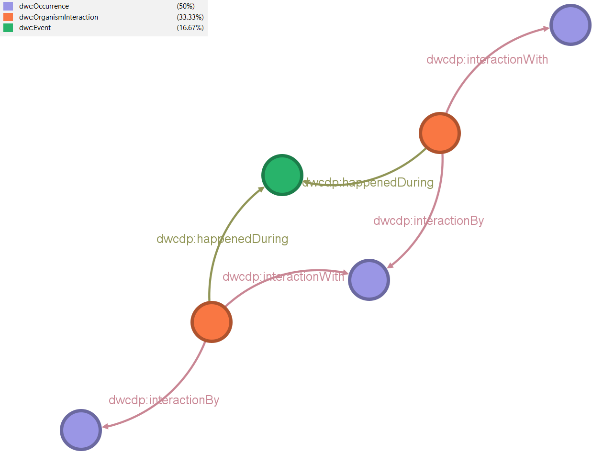

  In this case, the barnacle is on the bottom-left, the goose barnacle in the middle and the sea-fan on the top left. The pairs of `dwc:OrganismInteractions` describe successively the relationship between the three individuals.

  This exercise can be extended to consider a graph-based representation of the statement `In the scientific paper, it was mentionned that, during a dredge off Hillsea Point on the 8th of November 1995, 1 individual of Solidobalanus fallax was on Scalpellum growing on Eunicella`. This produced the graph below:

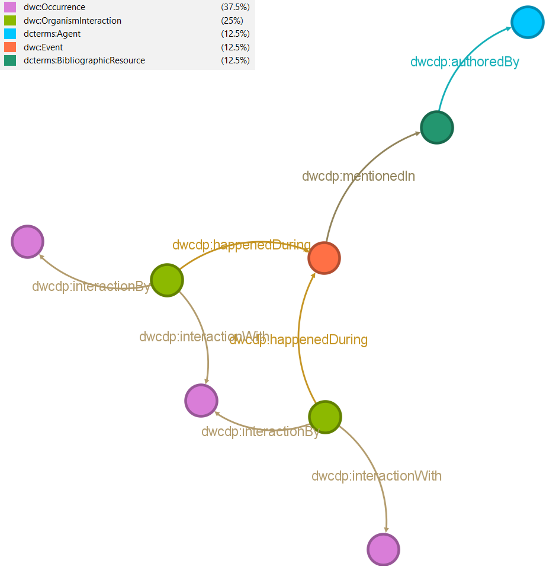

  Using, whenever possible real URLs, the statement can be encoded and shared as the following turtle file:

```turtle
@prefix bibo: <http://purl.org/ontology/bibo/> .
@prefix dc: <http://purl.org/dc/elements/1.1/> .
@prefix dcterms: <http://purl.org/dc/terms/> .
@prefix dwc: <http://rs.tdwg.org/dwc/terms/> .
@prefix dwcdp: <http://rs.tdwg.org/dwcdp/terms/> .
@prefix xsd: <http://www.w3.org/2001/XMLSchema#> .

<https://www.gbif.org/occurrence/4153002329> a dwc:Occurrence ;
    dwc:occurrenceRemarks "on Scalpellum growing on Eunicella" ;
    dwc:scientificName "Solidobalanus fallax" ;
    dwcdp:mentionedIn <https://doi.org/10.1017/S0025315404010616h> ;
    dwcdp:organismQuantity 1 ;
    dwcdp:organismQuantityType "individuals" .

<https://www.gbif.org/occurrence/4153002329-host1> a dwc:Occurrence ;
    dwc:genus "Scalpellum" ;
    dwcdp:mentionedIn <https://doi.org/10.1017/S0025315404010616h> .

<https://www.gbif.org/occurrence/4153002329-host2> a dwc:Occurrence ;
    dwc:genus "Eunicella" ;
    dwcdp:mentionedIn <https://doi.org/10.1017/S0025315404010616h> .

<http://bioboum.ca/organism-interaction/solidobalanus-on-scalpellum> a dwc:OrganismInteraction ;
    dwc:organismInteractionType "was attached to" ;
    dwcdp:happenedDuring <https://www.gbif.org/dataset/29e95cd7-4759-4aa7-bde0-8463118c873a/event/dasshdt00000144_013> ;
    dwcdp:interactionBy <https://www.gbif.org/occurrence/4153002329> ;
    dwcdp:interactionWith <https://www.gbif.org/occurrence/4153002329-host1> ;
    dwcdp:mentionedIn <https://doi.org/10.1017/S0025315404010616h> .

<http://bioboum.ca/organism-interaction/scalpellum-on-eunicella> a dwc:OrganismInteraction ;
    dwc:organismInteractionType "was growing on" ;
    dwcdp:happenedDuring <https://www.gbif.org/dataset/29e95cd7-4759-4aa7-bde0-8463118c873a/event/dasshdt00000144_013> ;
    dwcdp:interactionBy <https://www.gbif.org/occurrence/4153002329-host1> ;
    dwcdp:interactionWith <https://www.gbif.org/occurrence/4153002329-host2> ;
    dwcdp:mentionedIn <https://doi.org/10.1017/S0025315404010616h> .

<https://www.gbif.org/dataset/29e95cd7-4759-4aa7-bde0-8463118c873a/event/dasshdt00000144_013> a dwc:Event ;
    dwc:eventDate "1995-11-08"^^xsd:date ;
    dwc:eventType "dredge" ;
    dwcdp:mentionedIn <https://doi.org/10.1017/S0025315404010616h> ;
    dwcdp:spatialLocation <https://www.gbif.org/dataset/29e95cd7-4759-4aa7-bde0-8463118c873a/event/dasshdt00000144_013-loc> .

<https://www.gbif.org/dataset/29e95cd7-4759-4aa7-bde0-8463118c873a/event/dasshdt00000144_013-loc> a dcterms:Location ;
    dwc:coordinateUncertaintyInMeters 500.0 ;
    dwc:decimalLatitude 50.288617 ;
    dwc:decimalLongitude -4.045 ;
    dwc:geodeticDatum "EPSG:4326" ;
    dwc:locationRemarks "dredge off Hillsea ('Stoke') Point" .

<https://doi.org/10.1017/S0025315404010616h> a dcterms:BibliographicResource ;
    dc:title "Habitat and distribution of the warm-water barnacle Solidobalanus fallax (Crustacea: Cirripedia) records" ;
    dcterms:issued "2004"^^xsd:gYear ;
    bibo:pages "1169-1177" ;
    bibo:volume "84" .
```

### Turtle remote sensing dataset

- **Dataset definition**: As part of the Marine Bioresource Conservation and Restoration Research project, a marine conservation initiative aimed at restoring ecosystem health through the protection and recovery of marine species, fifteen sea turtles were equipped with radio-transmitters. Their movements throughout the Western Pacific Ocean were monitored to inform species protection and habitat management strategies. The dataset spans October 2015 to October 2022. Although most tracks fall within the waters of South Korea and Japan, some individuals traveled as far as China and Vietnam.

- **Dataset organization**: The dataset was obtained from Movebank [through the Tracking Data Map](https://www.movebank.org/cms/webapp/map). Each tracked sea turtle had an individual .csv file associated to it. Each .csv file contains georeferenced records from the radio-transmitter, including timestamps and coordinates. Additional metadata include the scientific name and a local identifier associated with each individual.

- **Modelling considerations**: In each .csv file, every row represents a `dwc:Event` corresponding to a recorded radio-transmitter signal. Each signal implicitly indicates a `dwc:Occurrence` of the animal at a given time and place. To ensure that all occurrences from a given file are correctly associated with the same tracked individual, a corresponding instance of `dwc:Organism` was created. All occurrence records were linked to this organism using the property `dwcdp:occurrenceOf`.

- **Ontology subset considered**: Only four classes were required to model this dataset: `dwc:Organism`, `dwc:Occurrence`, `dwc:Event`, and `dcterms:Location`. Their relationships are conceptually straightforward: occurrences are occurrences of an individual organism, which happen during an event, and each event is associated with a specific location.

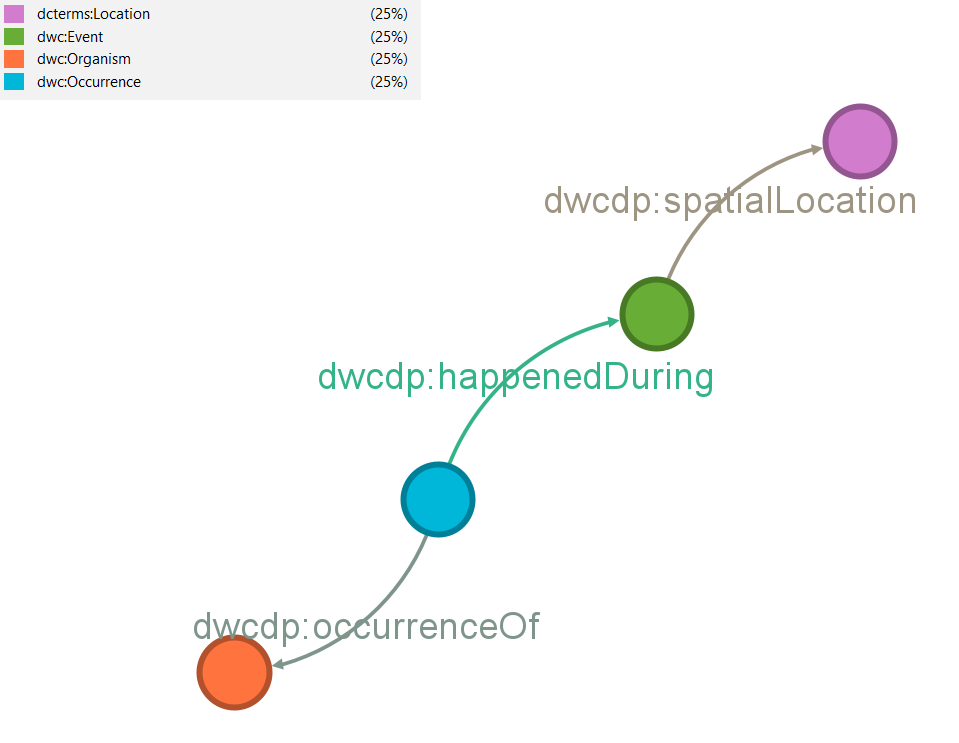

- **Additions made**: Although not strictly necessary, all `dwc:Event` instances were linked to a shared instance of `dwc:Provenance`, representing the project. This instance was enriched with metadata such as the project name, the funding agencies (the Marine Biodiversity Institute of Korea, MABIK, and the Ministry of Oceans and Fisheries of Korea, MOF), as well as the project’s principal investigator, Prof. Yong-Rock An. The latter three were modelled as `dcterms:Agents`.

- **Difficulties encountered**: Processing data exported from Movebank was generally straightforward due to the clear correspondence between their column structure and Darwin Core terms. The distribution of data across individual .csv files also posed no difficulty, as the same parsing function could be applied iteratively.

  One oddity was the .csv file for individual `KOR-001`. The transmitter appeared to place the turtle in the Arctic Ocean for 21 consecutive points. Closer inspection revealed that the latitude and longitude columns were reversed. Correcting this inversion showed that the turtle had in fact remained around Dolsan Island (돌산도) for approximately one month. The RDF serializations correct this fact, but the data is left as is.

  A more conceptual challenge involved determining how to model the role of the principal investigator, Prof. Yong-Rock An. Although his exact involvement in data collection is not specified, he is the principal investigator of the project and therefore has a clear link. However, most object properties considered relate directly to biodiversity data acquisition and treatment. For now, he is represented as a creator and linked to the `dwc:Provenance` instance using `dcterms:creator`, consistent with the practice in Darwin Core Archives where dataset contributors are treated as creators in the EML metadata.

- **Graph-based representation**: The `dwc:Provenance` instance forms the central node of the graph. All `dwc:Event` instances connect outward from it. Each event is linked to its corresponding `dcterms:Location`, which captures its geospatial coordinates, and to the `dwc:Occurrence` of the sea turtle. All occurrences, in turn, converge on the single `dwc:Organism` instance representing the tracked individual.

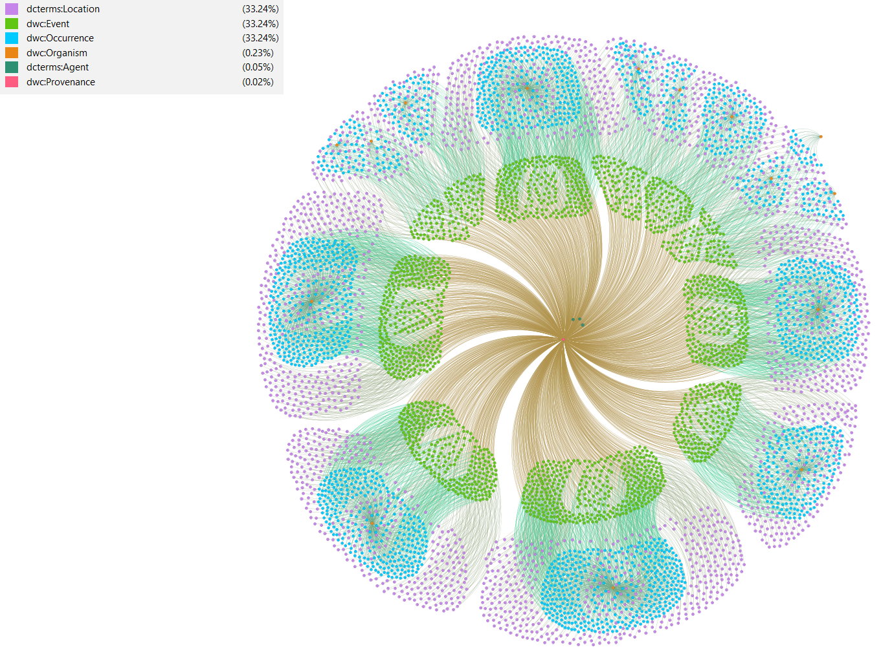

- **Lessons learned**: Individual movement data map naturally to the DwC-OWL ontology when each tracked animal is represented as its own instance of `dwc:Organism`. These data will become increasingly important as global networks, such as [Move-BON](https://geobon.org/move-bon/), expand efforts to standardize, aggregate, and share animal tracking information.

## Value of revisiting datasets

The crop-flower-visit dataset was originally published as an sampling event dataset on GBIF, and was registered on September 1st 2023. As it is, the dataset has information not only on insect visitors, but also on several other entities, such as the plants they visited, `dwc:Assertions` about these plants (the sex of the plant), and the nature of the relationship itself, which is a type of `dwc:OrganismInteraction`. However, the entirety of this information is provided as free-form text in the data property such as `dwc:OccurrenceRemarks`.

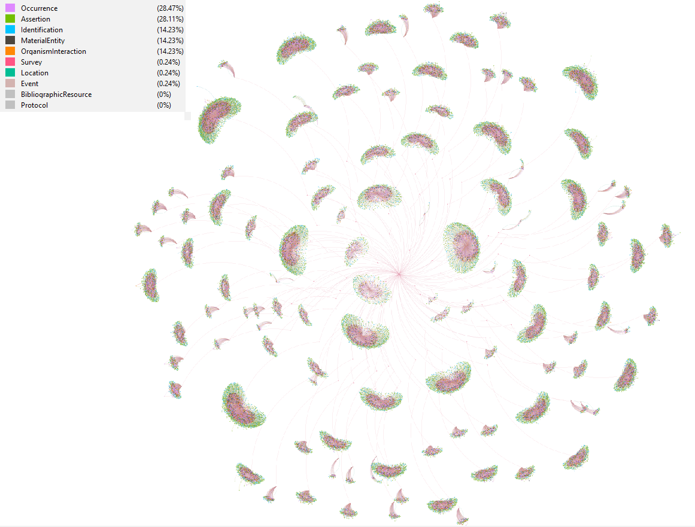

Extraction of this information and updating of the dataset using DwC-DP terms and the DwC-OWL ontology leads to a richer and more expressive dataset. It also leads itself more readily to analyses and querying. For example, a SPARQL query can now target occurrences of insects but only on male Japanese persimmon trees (*Diospyros kaki*). Before, this would have required laborious regexing of the text. Consequently, the use of DwC-DP terms and the DwC-OWL ontology should not be seen only as something that should be used from now on, but also as something that researchers can use to make previously published datasets more expressive.
